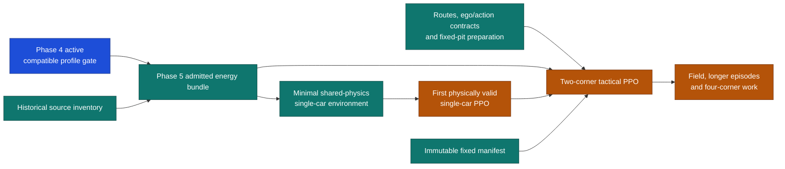

# Parallel route to Network 2

## Purpose

Network 2 is the recurrent PPO policy that chooses a masked manoeuvre and electrical deployment.
The quickest supported route is first a physically admitted single-car energy curriculum, then a
minimal two-corner tactical policy. The earlier bounded Neural ODE is a required Phase 5
power-response comparison, not Network 2 and not a substitute for PPO training.

The structural roadmap is implemented through the Phase 5–7 fail-closed scaffolds. Phase 4 mechanics
is stable and its provisional profile admission is frozen, so Phase 5 offline experiments may proceed. Runtime
energy and physical policy work still require their evidence admissions. Completing a route, buffer
or curriculum slice does not complete Phase 6 or Phase 7.

Phase 4 stays active and independent. The retained earlier speed-only/two-sample baseline is not
continuous dynamics evidence. A compatible admitted numerical profile may support the first
curriculum without waiting for a Phase 4 neural improvement; synthetic fixtures and PPO smoke runs
remain structural evidence only.

## Critical path and parallel lanes

| Workstream | Runnable now | Gate before it affects training or runtime |
|---|---|---|
| Phase 4 | Stable mechanics and provisional profile admission `87daf272...871c2`. | Preserve the exact profile/checkpoint/evidence binding; full physics claims remain separate. |
| Phase 5 interface | Contracts, exclusive source boundary and disabled tests. | Interface-stable evidence. |
| Phase 5 evidence | Historical rule/source inventory and independent accounting evidence preparation. | Each frozen evidence gate; no fabricated caps, line maps or private state. |
| Phase 5 experiments | Response, accounting and rules may run in parallel after their relevant frozen interfaces and evidence gates. | Joint energy-bundle admission after all physical gates. |
| Phase 6 | Route, ego, action and replay-only world contracts; fixed-pit manifest preparation. | Supported geometry and immutable manifest before integrated tactical training. |
| Phase 7 | Feature/action schemas, masks, recurrent buffer and checkpoint scaffolds. | No physical policy training until the required energy bundle and supported scenario exist. |

One integration owner controls shared physics, contracts and related tests. Parallel implementation
uses isolated worktrees. Do not run competing training or large suites together. Terra writes each
approved slice, Luna measures checks, and Sol is used only when failed evidence needs judgement.

## Immediate work

### Phase 5

Keep the implemented interface scaffold as the only early shared-mechanics edit. Now that it is stable, response
comparison, signed accounting and historical rule work can proceed independently from their frozen
source interfaces. Their results join only at energy-bundle admission.

The required Phase 5 sequence is numerical ICE-first baseline, algebraic versus finite response,
then one bounded Neural ODE residual comparison under matched evidence and boundaries. It is not an
actor, does not control tactics, and a worse or unsupported residual is rejected.

### Independent evidence lanes

| Lane | Planned paths | Acceptance |
|---|---|---|
| Historical sources | `sources/rules_inventory.py`, `contracts/rules.py`, `tests/test_rules_snapshot.py` | Every candidate document has hash, event/date/session applicability and an explicit missing-coverage result. |
| Fixed pits | `pits/manifest.py`, `contracts/pits.py`, `tests/test_fixed_pit_manifest.py` | Immutable allowed fields and source origins are recorded. It prepares context; it does not optimise or execute stops. |
| Route evidence | `geometry/routes.py`, `contracts/route.py`, `tests/test_route_contracts.py` | Two connected corners and rule-line distances are supported, or the route refuses. |

These lanes may audit and prepare data while Phase 4 runs. They may not manufacture geometry,
historical constraints, storage capacity, fuel state or opponent hidden state.

## Phase 6: minimal world slice

This phase does not need a complete N+1 battle world before the single-car curriculum. It provides
the smallest route, ego and action contracts needed for a later two-corner policy. A shortest
supported scenario may avoid pit execution only when its window contains no pit events; the
immutable fixed manifest is still prepared before integrated policy training.

### Commit 1: route and scenario contracts

| Planned path | Change |
|---|---|
| `src/poweshift_backend/contracts/route.py`, `contracts/scenario.py` | Define supported two-corner route, origin/mask and scenario termination fields. |
| `src/poweshift_backend/geometry/routes.py` | Resolve connected routes and refuse unavailable geometry or line maps. |
| `tests/test_route_contracts.py` | Check connectivity, units, masks and unsupported-route refusal. |

Acceptance: a supported two-corner route can be represented without invented geometry.

### Commit 2: ego and action boundary

| Planned path | Change |
|---|---|
| `src/poweshift_backend/contracts/action.py`, `contracts/observation.py` | Define masked manoeuvre, requested fraction, observed origin and previous delivered action. |
| `src/poweshift_backend/simulation/ego.py` | Add one independent ego state that advances through shared admitted physics. |
| `tests/test_ego_contract.py` | Check action-mask refusal, state ownership and energy-bundle compatibility. |

Acceptance: the ego can receive an admissible request without privileged opponent state or a second
physics path.

### Commit 3: replay-only single-car wrapper

| Planned path | Change |
|---|---|
| `src/poweshift_backend/simulation/replay_env.py` | Provide reset, step, event and termination records for a supported single-car scenario. |
| `src/poweshift_backend/pits/manifest.py` | Prepare immutable fixed-pit context; do not execute a pit in no-pit windows. |
| `tests/test_replay_env.py` | Check event preservation, true termination versus truncation and no-pit-window refusal. |

Acceptance: replay-only scaffolding runs a supported single-car scenario. It is not PPO evidence.

### Commit 4: executable two-corner interaction world

| Planned path | Change |
|---|---|
| `src/poweshift_backend/simulation/encounter.py`, `simulation/occupancy.py`, `physics/wake.py` | Advance ego and N+1 reference identity through supported occupancy, wake and grip interactions. |
| `src/poweshift_backend/contracts/encounter.py` | Define persistent defence, abort, reference-motion and unsupported-interaction states. |
| `tests/test_interaction_world.py` | Check identity preservation, shared physics, defence/abort persistence, wake/grip bounds and supported continuation. |

Prerequisite: supported route, admitted energy bundle and frozen interaction evidence. Scaffolding
may start earlier, but this implementation is gated. Acceptance: an executable supported two-corner
world preserves N+1 identity and reference motion through a persistent defence/abort and into a
supported continuation. A synthetic fixture does not validate tactical behavior.

## Phase 7: Network 2 initial slice

Phase 7 begins with structural diagnostics, then a physically admitted single-car PPO curriculum,
then minimal two-corner tactical training. Neither a forward/backward diagnostic nor the curriculum
completes the phase.

### Commit 1: schema and recurrent rollout scaffold

| Planned path | Change |
|---|---|
| `src/poweshift_backend/policy/schema.py`, `policy/buffer.py`, `policy/model.py` | Define feature/action masks, recurrent fragments, sampled/issued/delivered records, terminated/truncated markers and the recurrent actor/critic shape. |
| `src/poweshift_backend/policy/checkpoint.py` | Define schema, action-transform and recurrent-state compatibility. |
| `tests/test_policy_buffer.py`, `tests/test_policy_checkpoint.py` | Check original sampled joint probability is retained; delivered/clipped action is never relabelled as sampled; check recurrence and termination handling. |

Acceptance: an earliest structural forward/backward diagnostic can run on a synthetic fixture. It
establishes neither physical learning nor real policy quality.

### Commit 2: first physically valid single-car PPO

| Planned path | Change |
|---|---|
| `src/poweshift_backend/policy/train.py` | Gate finite recurrent PPO on the admitted single-car environment; optimization waits for admission. |
| `src/poweshift_backend/policy/reward.py` | Define the single-car energy curriculum outcome and failure labels. |
| `tests/test_policy_training.py` *(proposed)*, `tests/test_policy_environment.py` *(proposed)* | Check masks, sampled/issued/delivered accounting, recurrent burn-in, terminated/truncated bootstrap and energy-rule compatibility. |

Prerequisite: a Phase 5 admitted energy bundle, supported continuous profile and shared-physics
single-car environment. Acceptance: finite optimization produces a checkpoint that can replay with
valid sampled actions; the frozen held-out curriculum measure and its criteria were declared before
training. No performance improvement is guaranteed. This is the first physically valid PPO
curriculum, not two-corner tactics, local/tail quality, field behavior or real validation.

### Commit 3: two-corner tactical PPO

| Planned path | Change |
|---|---|
| `src/poweshift_backend/simulation/tactical_env.py` | Gate admitted energy physics, two-corner encounter and immutable pit context. |
| `src/poweshift_backend/policy/reward.py` | Add non-overlapping local and supported continuation-tail targets. |
| `src/poweshift_backend/policy/evaluate.py` *(proposed)* | Evaluate attack, defence, abort and unsupported scenarios with frozen schema. |
| `tests/test_tactical_env.py`, `tests/test_policy_evaluation.py` *(proposed)* | Check continuous state across both corners, no false tail from short episodes, action masks and matched alternatives. |

Prerequisite and acceptance: the executable Phase 6 interaction world, supported continuation
beyond the second corner, fixed-pit manifest and Phase 5 admission. A trained policy may be
assessed as a minimal two-corner tactical network only after frozen physical and temporal evaluation.
Synthetic fixtures remain tests, not real validation.

### Commit 4: admission report and handoff

| Planned path | Change |
|---|---|
| `src/poweshift_backend/policy/report.py`, `reconstruction/evidence.py` | Record model, schema, physics, rules, fixed-pit and scenario compatibility. |
| `docs/PHASE_7_HANDOFF.md` | Record delivered scope, checks, limitations and later field/four-corner gates. |
| `tests/test_policy_report.py` | Refuse incompatible artifacts and unsupported claims. |

Acceptance: produce a reviewable handoff. Field, full race, four-corner, API, news and strategy
work remain separate future slices.

`PHASE_8_PLAN.md` preserves this policy ownership while preparing fixed-pit execution and the
one-update real PPO preflight required before the bounded physical-policy smoke.

## Refusal and fallback

| Blocker | Required behavior |
|---|---|
| No compatible profile or Phase 5 bundle | Do not start physical PPO; retain schema diagnostics only. |
| Missing route, rules, pit context or continuation | Refuse the affected tactical scenario. |
| Pit event in a no-pit window | Refuse the shortcut; do not skip pit execution. |
| Missing recurrent/action record | Refuse the update rather than reconstruct a likelihood. |
| Failed physical evidence | Keep runtime disabled and escalate only the failed evidence to Sol. |

## Boundaries after the first neural network

The first neural forward/backward diagnostic is structural. The first admitted single-car PPO is a
physical curriculum. The first two-corner tactical PPO is the earliest tactical-network milestone.
None proves real vehicle accuracy, full-field behavior, full-race strategy, four-corner support,
API readiness or news integration.

Future code work must consult Context7 for every framework or library API before edits. If it is
unavailable, use official documentation or established project usage and record the uncertainty.
Comments and docstrings stay short and contain no planning identifiers.
