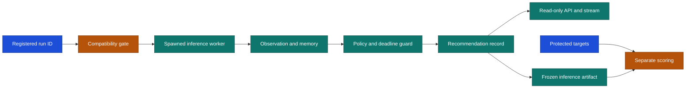

# Phase 10 Recommendation API and Weekend Inference Plan

## Feature request brief

The backend has training, policy and physical contracts, but no single control plane can load a
compatible checkpoint, run it over a sealed weekend input, publish recommendations and preserve an
independent scoring boundary. Today those pieces cannot be exercised as one backend workflow.

Phase 10 adds the assembly layer. It accepts registered artifact identifiers, runs policy inference
outside route handlers, produces expiring recommendation records, exposes run state through a local
API and keeps protected targets closed until a separate scoring step.

## Functional requirements

- Register immutable policy, source, news and protected-target artifact identities.
- Reject a run before inference when schema, profile, energy, physics, rules, pit or scenario IDs differ.
- Load a policy checkpoint once and preserve recurrent memory only for accepted results.
- Produce deterministic recommendation frames from sealed validation or final-test observations.
- Use a finite hold fallback for late, invalid or incompatible inference.
- Write sequenced recommendation records before any protected target is opened.
- Score only a frozen completed inference artifact against its registered target hash.
- Expose run creation, status, control, latest recommendation, stream and final report locally.
- Accept strict 4 Hz live observation frames and emit 5 Hz decisions using the latest held input.
- Serve the immutable diagnostic report tree read-only to explicit local frontend origins.
- Keep route handlers free of physics, training, downloads and model fitting.

## Non-functional requirements

- Use bounded queues and a spawned worker for each run.
- Bind the API to localhost by default and accept registered IDs only.
- Record monotonic inference timing without claiming hard real-time behavior.
- Persist explicit failure and unsupported states instead of a universal success flag.
- Do not compete with the active training process during verification.

## Scope

### In

- Validation and final-test inference manifests.
- Resident recurrent policy inference, deadline guard and recommendation projection.
- Local run supervisor, persistent JSON artifacts and read-only API stream.
- Separate protected-target scoring entry point.

### Deferred

- External live timing transport and real-car actuation.
- Closed-loop full-field claims beyond the admitted world supplied by phase 8.
- Production authentication, remote deployment and multi-host scheduling.

| Not doing | Why |
|---|---|
| Uploading checkpoints or paths | Registered local artifacts are the trust boundary. |
| Opening targets during inference | It would leak the answer into the run. |
| Calling training from the API | Training is a separate authorised job. |
| Claiming a 200 ms guarantee | The target still needs sustained measurement on the target Mac. |

## Process flow

## Exact planned changes

| Area | Change |
|---|---|
| Runtime contracts | Add observation, run, inference, recommendation and report records. |
| Inference and recommendations | Add resident checkpoint loading, recurrent action selection and fallback. |
| Runtime and evaluation | Add registered manifests, worker supervision, incremental outputs and separate scoring. |
| API | Add local FastAPI routes and a read-only sequenced WebSocket. |
| Live input | Add a registered duplex WebSocket with explicit 4 Hz input and 5 Hz decision sequencing. |
| Frontend seam | Add local CORS and read-only diagnostic report routes without changing report contents. |
| Command line | Add serve, infer and score entry points. |
| Tests and docs | Check compatibility, target isolation, fallback, API behavior and handoff limits. |

Blast radius: four new package families, dependency lock, command line, focused tests and existing docs.

## Testing cases

| Test group | Why it matters |
|---|---|
| Artifact compatibility | Prevents a checkpoint from running in the wrong world. |
| Recurrent inference | Prevents late or invalid results from advancing memory. |
| Target firewall | Proves inference completes without reading protected outcomes. |
| Supervisor and API | Proves one registered run can be created, inspected and streamed. |
| Live cadence | Proves ordered 4 Hz inputs, held-source flags and 5 Hz decision output. |
| Separate scoring | Preserves honest validation and final-test evaluation. |
