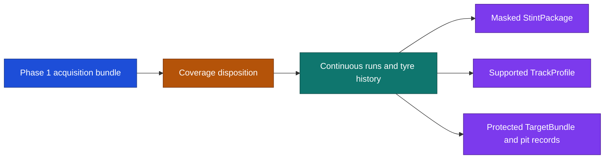

# Phase 2 handoff

## Delivered scope

Four commits. Preparation/evaluation contracts and the bundle-bound coverage admission gate;
continuous runs, tyre history, masked stint packages, frozen training-fitted transforms and the
event timeline; supported planar geometry with target and pit-source firewalls; reproducible
manifests, protected directories and the phase-end evidence report.



## Coverage and limits

The reviewer admitted every entry Phase 1 did not exclude, on all six days, with the existing
exclusions standing. Admitted/excluded by day: 11 Feb 18/4, 12 Feb 15/7, 13 Feb 17/5, 18 Feb 21/1,
19 Feb 16/6, 20 Feb 16/6. The disposition is bound to the bundle's SHA-256, so it cannot be reused
against different evidence.

Preparation limits come from Test 1 records only, frozen before any held-out inspection: gap
limit 1.160 s (99.9th percentile of 7,408,522 consecutive within-entry car-telemetry sample
intervals), smoothing limit 0.440 s (95th percentile of the same distribution), window limit
190.761 s (median duration of 5,781 continuous training runs), staleness limit 0.240 s (median of
the same interval distribution, recorded but not consumed by any preparation function this phase).

## Checks and commands

144 tests pass. Reproducibility was checked at real scale: the command below, run twice into the
same evidence root, produced a byte-identical evidence manifest hash, with the Phase 1 evidence
root's 115 files unchanged. Phase 1's bundle still records `downstream_ready=false`, a pending
coverage review and an inactive proposed split; Phase 2 did not alter it.

```sh
uv run python -m poweshift_backend.prepare \
  --bundle-path data/acquisition_verified_d22e9c4/acquisition_bundle.json \
  --evidence-dir data/preparation_verified_698aaed \
  --reviewer "coverage-reviewer" --recorded-on 2026-09-12
```

This produced 17,239 stint packages, 570 timeline events, 7,128 lap-time target records (4,618
valid, 1,305 no-time, 1,205 unavailable; no deleted laps in this bundle), 2,695 pit-source
records, and one track profile built from the fastest clean admitted training lap (entry 12, 13
February, lap 15, 93.669 s, 361 position samples).

## Limits and decisions

Review corrected three defects: a synthesised tyre-set identity manufactured from the `FreshTyre`
boolean was removed (no field in this source identifies a physical tyre set); garage-stop
detection originally paired pit-in/pit-out on the same lap row and found 26 stops, but the columns
sit on separate rows (pit-out starts its lap, pit-in ends it), so corrected pairing finds 189
stops with 18 unpaired trailing in-laps, one per entry; and curvature edge samples were emitted as
measured values before the validity mask was added.

Pending for the next reviewer: the gap limit breaks a run at roughly a five-sample dropout, giving
a median run near two Bahrain laps, so a prepared run is a telemetry segment, not a programme run
— a looser limit may be wanted. The staleness limit is recorded but unused and describes a
sampling interval rather than a staleness meaning. Live-progress targets were not built, since a
trustworthy version needs nearest-point track-position mapping, judged out of scope; nothing was
fabricated in its place. The track profile comes from one entry's fastest lap, not an approved
survey.

This is preparation only. It does not establish profile prediction, car differentiation, energy
accuracy, ranking, strategy quality, race readiness or live timing. Bahrain testing records are
not qualifying or race targets.

## Next decision

Approve or reject the preparation limits and pending decisions above before any performance
fitting or Phase 3 work. The temporary approval document has been retired after this durable
handoff.
