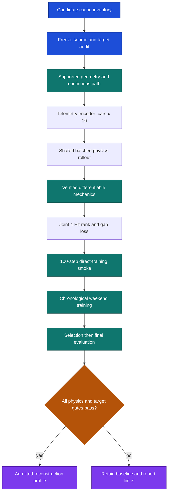

# Phase 4: weekend reconstruction before energy

## Planning status

Implementation is in progress under the approved revision. It replaces the rejected speed-only and
teacher-only proposal with direct neural reconstruction from audited real weekend observations.
Source acquisition and audit work may proceed. The final Japan profiles are provisionally promoted
under the recorded 6% progress/crossing rule; full physics admission remains gated by the evidence below.

The immediate goal is evidence about relative order and signed timing gaps while requiring motion
to remain physically credible. It does not claim absolute vehicle physics, energy accuracy or a
valid strategy result. Phase 5 remains the separate energy, power-response and rule-constraint
phase; Phase 7 remains the separate policy-benefit phase.



## What is known now

| Evidence | Measured or inventoried state | Consequence |
|---|---|---|
| Historical Phase 4 result | A prior 213-test run retained the numerical baseline after weak propulsion-only 80-teacher Entry 1 NLL selection intervals. | It is historical reconstruction evidence, not physics, rank, gap, energy or strategy validation. |
| Admitted active evidence | Six 2026 Bahrain test days supply only within-entry lap-time targets. | They cannot establish race gaps, classification or weekend physics. The immutable February split remains development-only. |
| Archive inventory | 86 sessions: 57 exact qualifying sessions from 2024-26 and 29 practice or sprint-qualifying sessions. The immutable archive has no race cache. | An inventory is not an admitted corpus. Race acquisition and an audit are required before race targets exist. |
| Isolated race acquisition | Ten permitted 2026 races from Australia through Belgium have sealed export-v2 provenance and coverage records. | The corrected source audit admits 36 sessions; sources alone do not establish continuous trajectory support. |
| Audited weekend source | Source audit v9 and target artifact v3 bind the 36 sessions, 3,817 qualifying pairs and 73,888 race checkpoint gaps. Hungary, Dutch and Italy remain unopened. | Qualifying batches reach mechanics preflight but currently fail tyre support; full-race geometry remains pending. |

## Included work

- Freeze an expanded weekend manifest and source audit before any optimization.
- Directly train a compact latent model through a verified canonical mechanics path, using the
  session targets below rather than numerical teachers as the main objective.
- Make relative order and signed timing-gap accuracy primary, while making supported continuous
  motion and parameter-intervention sanity mandatory admission tests.
- Run a 100-step direct-training smoke before the fixed-budget training run.
- Keep fuel, tyre, weather, track phase, driver execution and initial-state uncertainty explicit
  context or masks. Do not present them as identified car parameters.

## Deferred or excluded work

| Not doing | Reason |
|---|---|
| Energy balance, source response or historical rule constraints | Those require the separate Phase 5 evidence and controls. |
| Strategy or policy benefit | Phase 7 must prove it independently. A reconstructed trajectory is not a decision result. |
| Treating one observed trajectory as counterfactual proof | Matching observations does not establish energy or intervention accuracy. |
| Reusing 2024 or 2025 as default training evidence | Older seasons may be a separately approved transfer experiment, never a substitute for the 2026 boundary. |
| Equating a 2024 car identity with a 2026 car identity | Identity is year and car specific. |
| Entry-ID embeddings or target-derived shortcuts | They can memorise results rather than learn an evidence-supported physical profile. |
| Future controls or future targets in a forecast | Recorded controls are allowed only for labelled reconstruction; forecasts use declared controllers and initial assumptions. |

## Evidence and split proposal

The manifest is frozen before training and records source hash, retrieval state, session kind,
participants, coverage, timestamps, target availability, exclusions, geometry support and every
mask. An audit must prove that final-weekend files were unopened by training and selection. A
missing stream, incomplete lap coverage or unresolved timing semantics refuses that target instead
of silently filling it.

| Partition | Proposed 2026 completed weekends | Boundary |
|---|---|---|
| Training | Australia through Britain | Only audited, completed sessions and labels available at each reconstruction cutoff. |
| Selection | Belgium | Fixed-budget candidate and latent-size choice only. |
| Final evaluation | Hungary and Dutch | Both remain unopened until selection freezes, then each is scored once with an independent non-use audit and no tuning. |
| Reserved | Italy | Unused until a later explicit audit and decision. |

The immutable February Bahrain split remains available for development diagnostics only. It cannot
be renamed an untouched confirmation set. The proposed train, selection and final weekends are
subject to the source audit; no cached file becomes admitted merely because it appears in the
inventory.

## Target and mask contract

| Session | Direct target | Required comparison and mask policy |
|---|---|---|
| Practice | Valid lap and stint timing. | Compare only same-context valid laps or stints. Mask unmatched tyre, fuel-unknown, weather, track phase, traffic, pit, red/yellow/SC/VSC and coverage changes. |
| Qualifying | Q1, Q2 or Q3 valid timed-lap order and signed lap-time gap. | Compare only entrants validly timed in the same segment. Deleted laps, no-time outcomes and non-participants are excluded from both order and gap targets. |
| Race | Cumulative along-track progress at a common 4 Hz wall time, completed-lap status and same-checkpoint timing deficit. | Use completed-lap cutoffs and pit/SC/VSC/red-flag context masks. Compare progress only at supported common wall times and timing only where both entries cross an equivalent source-linked checkpoint. Retain lap deficit as status, never fabricated seconds. |

Raw race-position numbers are not timing gaps. Instantaneous progress order at a common wall time
is distinct from arrival order at a common checkpoint, especially through pits, safety cars and
lapping. Official whole-race classification is external validation until a supported rules/world
model exists. Starting grid, pit sequence, safety-car state, tyre and fuel uncertainty, weather,
track evolution, driver execution and timing availability are observed context, unknown context or
explicit masks. They are not evidence of an isolated car-only parameter.

## Proposed model and objective

The proposed encoder starts with latent dimension 16. It may use 32 only if a matched,
fixed-budget Belgium selection run improves the approved selection measure; no larger search is
implicit. It receives only data available at the labelled reconstruction cutoff and declared session
context. Year-and-car identity is manifest metadata for grouping, splitting and reporting, not an
encoder feature. It has no entry-ID embedding shortcut and no future target, controller or outcome
input.

The telemetry encoder maps one whole logical field batch to `[cars, 16]` latent profiles. Each profile
decodes bounded physical parameters into the shared, batched canonical mechanics path; recorded
controls, initial state and static source geometry then generate an internal continuous state. At the
common 4 Hz loss clock, rank and gap losses use that predicted trajectory and jointly backpropagate
through every car. The admissible trajectory never resets from observed state at telemetry, lap or
stint boundaries, and a detached rank head cannot count as physics evidence.

Admissible race reconstruction carries one predicted state across the complete race. The geometry pipeline
records unwrapped source progress at the common clock; pit, event and missing-path intervals are
explicit unsupported coverage. A race with such an interval fails its full-race trajectory gate rather
than being assembled from separately anchored laps.

The bounded Australia diagnostic uses one optimizer update per shuffled 30-second whole-field batch.
Every batch contains all cars with complete 4 Hz position, speed and two-second control brackets in
that window; a car with an occasional skip is discarded from that window. Each window starts from its
observed state so gaps do not contaminate adjacent data. This supplies race-wide error and coverage
evidence but cannot satisfy the continuous full-race gate or promote a profile.

For each comparable timing pair, let `G_ij = T_i - T_j` in seconds; negative means entry `i` is
faster. The train-only scale `s_family` standardizes its target family: `g = G/s_family` and
`mu = Ghat/s_family`. The timing order label is `y = 1[g < 0]`; ties are excluded. For a race
progress pair, `y = 1[progress_i > progress_j]` at its common wall time and the rank logit uses the
matching shared-path standardized progress difference. Timing and progress labels are never treated
as universally interchangeable.

For comparable timing pairs, `q_symmetric` is the same when pair direction is reversed and
`v = softplus(q_symmetric) + 1e-4` is a variance. The proposed normalized losses are:

```text
rank NLL = mean_valid_pairs[-y log sigmoid(z/tau)
                            -(1-y) log sigmoid(-z/tau)]
gap NLL  = mean_valid_timing_pairs[0.5*((g-mu)^2/v + log(v) + log(2*pi))]
total    = 1.0 * rank NLL + 1.0 * gap NLL
```

Here `z = -mu` for timing and is the standardized predicted progress difference for a race-progress
pair. The fixed proposed temperature is `tau = 1`. The pair losses share one latent-conditioned
mechanics path, so their weighted sum is an objective, not an assumed independent likelihood. Dense
4 Hz rows are correlated supervision, not independent new qualifying labels; race timing gaps still
need source-linked common checkpoint crossings. Before the smoke, the run record must freeze each
train-only target-family scale, progress standardization, eligible-pair denominator, calibration
handling, variance floor and loss weight. No motion-loss weight is added. Motion instead has hard
admission constraints and parameter-intervention sanity checks.

A recorded-control reconstruction is context-conditioned and does not establish inherent car
capability. A separately declared same-controller, same-boundary diagnostic may compare model
variants, but its standardized policy timings must not be represented as historical observed gaps.
Race lap deficits remain a separate status and coverage result.

## Physics and training stop gates

The current SciPy mechanics are not differentiable training evidence. Direct training cannot start
until an implemented gradient path is independently verified against the canonical reference on
smooth, fixed-active-set supported segments. It must compare finite difference and JVP over every
normalized parameter basis at fixed `1e-4` perturbation: each output state passes at 5% relative
norm error, or at normalized near-zero floor `1e-6` it passes `5e-8` absolute normalized error and
is labelled absolute. Reference parity and refinement use separate state floors. It must also prove
convergence, declared event and clipping treatment, and refusal outside support. Automatic
differentiation alone does not validate hybrid-system sensitivities.

Both mechanics paths solve load transfer with Newton steps bounded by positive loads and lateral
grip, falling back to bracket midpoints. The 0.1 N residual tolerance and 32-iteration cap remain.
The tensor path differentiates the converged equation implicitly; root-search branches carry no
gradient. Unbracketed roots still refuse, and the existing near-boundary gradient gates remain.

Continuous weekend motion uses native irregular telemetry to derive source-linked 4 Hz labels with
bounded interpolation, provenance and a derived-label mask; the native control clock remains the ODE
input clock. The 4 Hz loss grid is not an ODE step. Position and road labels retain the 1.1-second
bound. Controls may use declared linear interpolation only inside a 2.0-second recorded bracket and
carry an inferred-control mask; a wider bracket, event boundary or unsupported curvature refuses the
interval. Full
supported trajectories, not repeated anchored short windows, must separately meet: speed RMS error
divided by `max(observed speed RMS, 0.1 m/s)`, progress-displacement RMS error divided by
`max(observed displacement RMS, 1 m)`, and endpoint elapsed error divided by
`max(observed duration, 1 s)`. Each is at most 5%; fuel is deferred from motion admission.
Parameter interventions must preserve declared bounds and produce directionally sane response under
named physics fixtures. Future ego ICE and battery deployment may replace recorded actuation only in
Phase 5. It is a future proposal: no Phase 5 interface, energy execution, accounting or historical-rule
path is approved, built or validated here.

The first 100-step smoke may use qualifying full timed laps and same-segment finish gaps while the race
route/pit path is still being completed. It is a mechanics smoke, not race validation. It uses cached
audited tensors, the frozen schema, split and approved objective.
It must show finite loss and gradients, target learning, cutoff enforcement, no rank-head bypass,
source coverage, wall time, peak memory and checkpoint round-trip. The full run uses reshuffled
whole-field batches with exactly one optimizer update per batch while preserving joint same-clock car
comparisons. The 100-step qualifying smoke predates this one-update rule. The pre-run
record states batch count and measured throughput before the full run. No optimization may alter
mechanics parity. A failure stops the phase before the full run, which cannot choose new weights,
thresholds, masks, latent size, support rules or targets after inspection.

## Frozen and pending run details

| Decision | Proposed starting point | Must be frozen before training |
|---|---|---|
| Weekend sources | 2026 chronology above, subject to audit | Exact session files, source hashes, coverage and non-use proof. |
| Target schema | Practice, qualifying and race contract above | Checkpoint and common-wall-time definition, availability time, pair eligibility, status treatment and every mask. |
| Split | Training Australia-Britain, selection Belgium, final Hungary and Dutch | Exact chronological cutoff, final non-use proof and treatment of any unavailable session. |
| Objective | Equal 1.0 rank and gap weights; `tau = 1`; Gaussian variance floor `1e-4` | Train-only scales, progress standardization, pair denominator, calibration treatment and all loss constants. |
| Motion admission | Separate speed, progress and elapsed full-trajectory checks at 5% | Source interpolation bound, support masks and failure rule. |
| Model budget | Latent 16; 32 only on matched selection improvement | Architecture, one update per whole-field batch, seed count and improvement rule. |
| Mechanics | Differentiable path matched to canonical reference and every normalized parameter basis | Fixed `1e-4` finite-difference step, per-state floors and event/support boundary. |

## Planned changes in four commits

### Commit 1: freeze audited weekend sources and targets

| Planned area | Change |
|---|---|
| `src/poweshift_backend/sources/cache_audit.py`, `data/` | Record the source audit, chronological manifest and non-use audit. |
| `src/poweshift_backend/contracts/representation.py`, `src/poweshift_backend/targets/bundle.py` | Record session targets, masks and cutoffs. |
| `tests/test_target_firewall.py`, `tests/test_coverage.py` | Refuse unproven source coverage, future data, incompatible pairs and invalid timing statuses. |

Blast radius: offline source and target evidence only. Bahrain artifacts and prior manifests stay
immutable.

### Commit 2: admit the continuous differentiable mechanics path

| Planned area | Change |
|---|---|
| `src/poweshift_backend/geometry/alignment.py`, `src/poweshift_backend/physics/integrate.py`, `src/poweshift_backend/physics/reference_solver.py` | Add the approved continuous-path correction and gradient-capable canonical path. |
| `tests/test_geometry_alignment.py`, `tests/test_physics_convergence.py`, `tests/test_physics_integration.py` | Check parity, finite-difference/JVP gradients, convergence, events, intervention sanity and support refusal. |

Blast radius: offline reconstruction mechanics. Energy accounting and controllers remain untouched.

### Commit 3: direct reconstruction smoke and fixed-budget training

| Planned area | Change |
|---|---|
| `src/poweshift_backend/representation/inputs.py`, `models.py`, `training.py`, `run.py` | Encode cutoff-safe context, decode bounded parameters and train directly through shared mechanics. |
| `src/poweshift_backend/representation/evaluation.py`, `src/poweshift_backend/reconstruction/losses.py` | Report rank/order, signed-gap, motion and coverage results by session and target kind. |
| `tests/test_representation_experiment.py`, `test_representation_models.py`, `test_representation_evaluation.py` | Check the smoke, target learning, latent-16 record, no head bypass and training-selection isolation. |

Blast radius: offline reconstruction only. No profile is promoted by this commit.

### Commit 4: evaluate admission and record the handoff

| Planned area | Change |
|---|---|
| `src/poweshift_backend/representation/evaluation.py`, `promotion.py`, `src/poweshift_backend/reconstruction/report.py` | Apply frozen selection and one final evaluation; retain the baseline whenever a gate fails. |
| `docs/TRACKSHIFT_FULL_REVISED_ARCHITECTURE_v05.md`, `docs/PHASE_4_HANDOFF.md` | Record results, exclusions, source coverage, limitations and the next decision. |
| `tests/test_representation_evaluation.py`, `test_representation_promotion.py` | Check final-window isolation, no-improvement retention, run coverage and refusal of unsupported trajectories. |

Blast radius: evidence reporting and profile admission. Phase 5 and Phase 7 stay disabled.

## Acceptance evidence

| Test group | What is checked | Why it matters |
|---|---|---|
| Source and split | Provenance, completeness, chronological cutoffs, final-window non-use and audit refusal. | A cache listing cannot become training evidence by accident. |
| Target semantics | Practice, qualifying and race masks; Q segment, deleted-lap, pit, SC/VSC, 4 Hz geometry, checkpoint and lap-deficit rules. | Relative labels stay meaningful without invented seconds. |
| Gradient mechanics | Finite-difference/JVP gradients, reference parity, convergence, event/clipping treatment and unsupported-regime refusal. | Direct optimization has a verified physical path. |
| Motion | Full supported trajectory speed, progress and absolute elapsed-time thresholds plus parameter-intervention sanity. | Rank alone cannot conceal bad dynamics. |
| Objective | Pair ordering, signed-gap sign/unit, mean gap MAE, sign accuracy, position error, variance calibration and sharpness. | Relative errors and uncertainty cannot hide common-mode error. |
| Training | 100-step finite smoke, target learning, latent-16 record, fixed budget, wall time, peak memory, checkpoint round-trip and no detached-head bypass. | Training tests the proposed route before expensive work. |
| Falsification | Shuffled latent, label and identity controls plus target-time leakage checks. | A score cannot come from memorisation or future information. |
| Evaluation | Same-information numerical baseline with the same simulator, controller boundaries and budgets; per-session coverage, selection isolation, final non-use and no-improvement retention. | A score cannot hide extra information, a weaker baseline or unobserved policy changes. |

## Resume point

Implementation is in progress. Source audit v9 and targets v3 are sealed. Australia 55's earlier
artifact retains 33 source gaps at the original 1.1-second control bound; the active control rule now
permits source-bracket interpolation through 2.0 seconds with an inferred mask. Australia Q has a
source-bound closed static route and masked 4 Hz labels, but its strict shared finish-crossing support
admits source-bounded qualifying laps after its closed-seam check. The bounded-root fix resolves the original oscillating braking state and passes
reference and gradient regressions. Diagnostic v8 completed 100 updates only after zeroing curvature,
mapping Boolean brake-on to 0.2 effective demand and clamping throttle to its declared range. Its
output measures pipeline throughput but is not admission eligible.

Race diagnostic v2 used the v8 checkpoint, 164 shuffled 30-second whole-field batches and one update
per batch. Four batches used rank-only fallback because predicted checkpoint crossings were missing;
the final report retains those misses. It covers 4,920 race-clock seconds and 322,707 car-observation
rows. Rank accuracy is 98.924%; signed-gap MAE is 1.327 seconds on 8,512 of 8,615 requested pairs.
The 17.008% speed, 5.493% progress and 5.743% crossing normalized errors miss the original 5% target,
and crossing coverage is 99.321%. These Australia vectors remain intermediate evidence. Restore
source geometry, continuous state and an estimated historical brake demand before admissible training.

China and Japan race artifacts were prepared before either additional run, then trained sequentially
from Australia to China to Japan. China completed all 185 updates with 78 rank-only timing fallbacks.
Its rank accuracy is 95.679%, signed-gap MAE is 2.013 seconds, and speed, progress and crossing
normalized errors are 23.567%, 7.469% and 7.008%. Japan completed 173 of 174 updates with 102
rank-only fallbacks; one window refused a negative speed or fuel state. Its rank accuracy is 97.379%,
signed-gap MAE is 1.586 seconds, and normalized errors are 18.643%, 5.620% and 5.580%.

The final Japan checkpoint was replayed without updates on Australia and China. On Australia it
retains 99.028% rank accuracy, 1.336-second gap MAE, and 15.964%, 5.005% and 5.445% normalized
errors. On China it retains 95.451% rank accuracy, 2.177-second gap MAE, and 22.738%, 7.307% and
7.585% normalized errors. This is evidence that optimization executes and some improvements transfer,
but it is not convergence: no weekend passes all three 5% motion limits and China gap and crossing
errors regress after Japan.

The final Japan vectors are provisionally promoted for downstream contract use under a user-approved
6% rule applied to progress and crossing errors. The 18.643% speed error is waived because the run
uses zero curvature, an estimated Boolean-brake demand and clamped throttle. Immutable registry
`promoted_profiles_v1.json` activates 22 entry profiles and binds checkpoint, training report,
profile source and both retention reports under admission ID
`87daf272e8ec8f275fae47cade4c71f3c6815c617726b3a9756562ae208871c2`.
This promotion is defensible as an optimization proof with declared priors. It is not full physics
admission, energy accuracy or strategy evidence; those claims retain their own gates.
