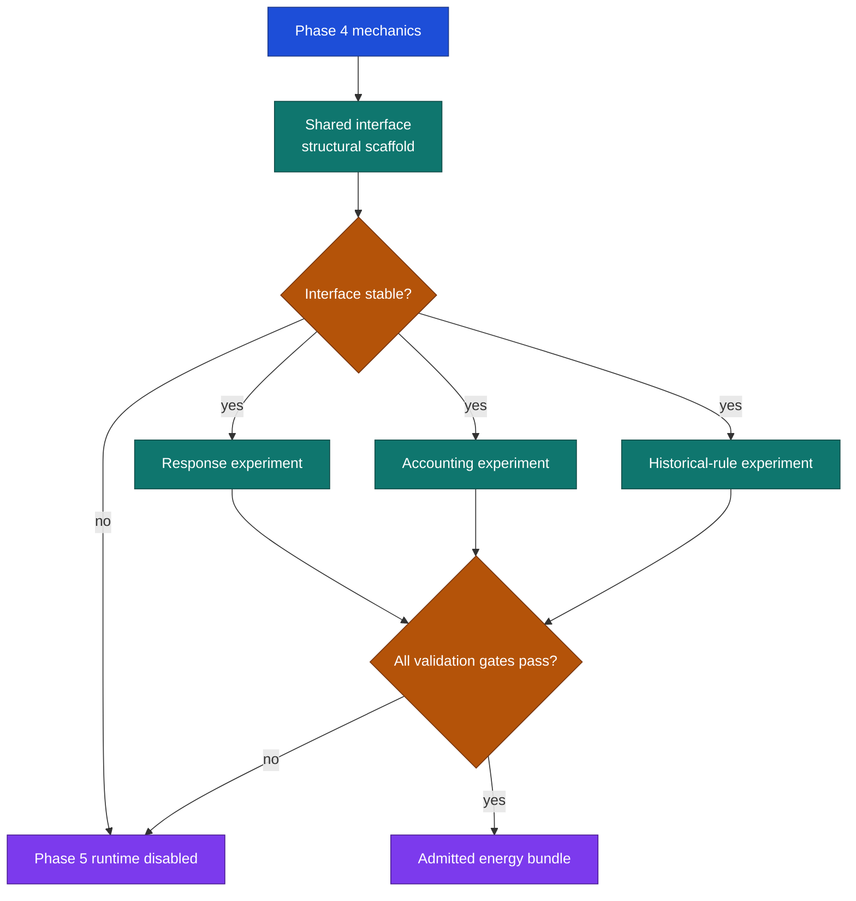

# Phase 5: energy-ready powertrain and historical rules

## Planning status

Phase 4 reconstruction is in qualifying smoke training and its mechanics interface is stable for
downstream offline work. The shared ICE, battery, fuel, charge, module and contract boundary is
implemented. Phase 5 response, accounting and historical-rule experiments may proceed against the
bound Phase 4 training artifact and provisional profile admission
`87daf272e8ec8f275fae47cade4c71f3c6815c617726b3a9756562ae208871c2`. Runtime remains disabled until
all Phase 5 physical-validation gates pass. This work does not alter Phase 4 training or reopen its
held-out windows.

The existing effective propulsion and simple fuel-burn policy are reconstruction assumptions, not an
energy model. Later work decides whether real evidence supports response, accounting and applicable
historical rules.

## Shared boundary

| Item | Contract meaning |
|---|---|
| ICE input | Requested and delivered shaft contribution, sign, unit, origin and availability. |
| Electrical input | Requested and delivered machine contribution with shaft-to-DC boundary; positive motor DC means motoring. |
| Fuel state | The existing `fuel_mass_kg` mechanics state. Fuel rate does not create a second fuel state. |
| Storage state | Stored energy, usable-capacity reference and state-of-charge interpretation, separate from recharge throughput. |
| Bus/store result | Positive terminal power drains storage; stored-energy rate is negative terminal power minus named store losses. Each loss has one boundary. |
| Allocation | ICE, motor, wheel and axle contributions; unmet demand; signs, units, origins and support status. |
| Rules input | Historical snapshot provenance, applicability, measurement boundaries, line maps and unsupported modes. |

Known telemetry, source-derived values and assumptions retain labels. Missing capacity, map, rule
source, line map, response state or measurement boundary makes a mode unsupported.

## Gates

### Interface-stable gate

- Numerical and differentiable Phase 4 mechanics accept the same complete structural payload on
  supported fixed-active-set fixtures and retain parity evidence.
- One convention defines signs, units and boundaries. Signed axle force is counted once.
- Fuel mass and stored energy each have one owner; recharge throughput cannot replace present
  storage or state of charge.
- Effective propulsion and an admitted source allocation are mutually exclusive. A fixture proves
  no double propulsion.
- Unsupported states refuse with provenance. Existing Phase 4 replay remains energy-disabled.

Passing this gate permits isolated experiments after their evidence gate. It does not admit runtime
energy execution, validate physical values or enforce a rule.

### Evidence gates for isolated experiments

Freeze each relevant evidence set before its experiment, without tuning on Phase 4 held-out
windows:

- Training and inner-validation stints, source hashes, coverage, target availability and every
  observed, inferred or assumed input label.
- Response evidence fixes ICE-first scope, boundaries, signs, units, and the numerical, algebraic,
  finite and one bounded Neural ODE candidates.
- Accounting evidence fixes loss locations, initial fuel/storage policy, capacity interpretation and
  unsupported modes.
- Rule evidence fixes historical documents, event/date/session applicability, source hashes,
  measurement boundaries, line maps, transition treatment and missing-coverage refusal.
- Comparison measures, acceptance criteria, fixtures and failure rules. Values remain open until
  frozen before experiments; this plan invents no thresholds.

## Four commits

### Commit 1: parallel structural scaffold

Prerequisite: Phase 4 mechanics remain the active path. No physical evidence is required.

| Planned path | Change |
|---|---|
| `src/poweshift_backend/contracts/powertrain.py` | Define labelled ICE, electrical, bus, store and allocation payloads. |
| `src/poweshift_backend/contracts/rules.py` | Define historical-snapshot provenance, applicability and unsupported modes. |
| `src/poweshift_backend/physics/state.py`, `physics/forces.py`, `physics/differentiable.py` | Add one exclusive allocation boundary while preserving existing fuel ownership and parity. |
| `tests/test_powertrain_contracts.py`, `tests/test_powertrain_interface.py`, `tests/test_differentiable_mechanics.py` | Check units, signs, capacity, refusal, no double propulsion and Phase 4 parity. |

Acceptance: the interface-stable gate passes and all energy/rule execution paths still refuse.

### Commit 2: gated ICE-first response comparison

Prerequisite: interface-stable and response evidence gates pass. This enables isolated offline
experiments, not runtime admission.

| Planned path | Change |
|---|---|
| `src/poweshift_backend/powertrain/maps.py`, `powertrain/response.py` | Implement the ICE-first numerical map and matched algebraic and finite response candidates. |
| `src/poweshift_backend/powertrain/residual.py` | Implement one bounded Neural ODE residual for one named missing mechanism. |
| `src/poweshift_backend/powertrain/experiment.py` | Run frozen-evidence comparisons with matched integrator and boundary conditions. |
| `tests/test_powertrain_response.py`, `tests/test_powertrain_residual.py` | Check source boundaries, low-speed/shift refusal, response limits and matched residual comparison. |

Acceptance: candidates produce retained comparison evidence. A worse or unsupported neural
candidate is rejected, not deployed.

### Commit 3: gated signed energy accounting and integration

Prerequisite: interface-stable and accounting evidence gates pass. It may proceed in parallel with
the response comparison after both use the frozen shared interface. This enables isolated common
replay only, not runtime admission.

| Planned path | Change |
|---|---|
| `src/poweshift_backend/energy/accounting.py`, `energy/state.py` | Implement signed fuel, bus, store and throughput accounting using the shared boundary. |
| `src/poweshift_backend/physics/integrate.py`, `physics/reference_solver.py` | Split energy saturation and supported source transitions at event stages. |
| `src/poweshift_backend/reconstruction/replay.py` | Permit a separately selected offline energy replay and retain its provenance. |
| `tests/test_energy_accounting.py`, `tests/test_energy_integration.py` | Check event-stage saturation, fuel mass once, no free recharge, boundary loss ownership and unsupported transition refusal. |

Acceptance: the source replay demonstrates signed accounting without free energy or double
propulsion. It remains unavailable to runtime consumers.

### Commit 4: gated historical rules, readiness and handoff

Prerequisite: interface-stable and historical-rule evidence gates pass. It may proceed in parallel
with response and accounting work after their independent evidence gates. Joint admission waits for
all three. This is the only commit eligible to request runtime admission.

| Planned path | Change |
|---|---|
| `src/poweshift_backend/rules/resolve.py`, `rules/state.py`, `rules/crossings.py` | Resolve snapshots and enforce supported power, recharge and transition constraints. |
| `src/poweshift_backend/reconstruction/evidence.py` | Report model, rules, assumptions, unsupported modes and readiness provenance. |
| `docs/TRACKSHIFT_FULL_REVISED_ARCHITECTURE_v05.md`, `docs/PHASE_5_HANDOFF.md` | Record durable decisions and the end-of-phase evidence, limits and pending work. |
| `tests/test_rules_snapshot.py`, `tests/test_rules_integration.py` | Check snapshot compatibility, source applicability, line-map refusal and consumer enforcement. |

Acceptance: every supported consumer enforces its applicable snapshot; unsupported historical
coverage refuses. Produce the handoff and request runtime admission only if the full readiness gate
passes.

## Full Phase 5 readiness gate

Runtime remains disabled until all four acceptances hold and frozen validation evidence shows:

- ICE-first source, algebraic/finite response and bounded Neural ODE comparison used matched
  evidence and boundaries.
- The retained model has required physical and actuation evidence; runnable output alone does not
  promote it.
- Fuel and storage accounting are signed, event-safe and source-provenanced; fuel mass is consumed
  once, recharge does not create energy, and each loss has one boundary.
- Applicable historical snapshots match the selected event/date/session and constrain supported
  consumers. Missing coverage refuses; a later rule edition does not fill a gap.
- Replay, numerical reference and differentiable mechanics retain required compatibility evidence.
  No double propulsion or free energy occurs.

## Scope held back

| Not doing | Reason |
|---|---|
| Policy benefit or strategy ranking | Phase 7 requires independent decision evidence. |
| Factory maps or complete certification | Telemetry and source support do not establish them. |
| Unsupported low-speed, charging, shift or transition modes | A named refusal is more honest than invented behavior. |

## Open decisions to freeze

- Audited stints able to identify each mechanism without treating driver or programme effects as
  car parameters.
- Historical documents, measurement boundaries and line maps for each supported session.
- The one missing mechanism the bounded Neural ODE may correct.
- Comparison measures and acceptance values for the frozen evidence.
