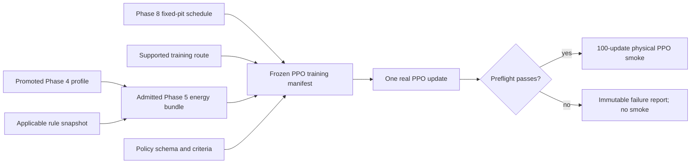

# Phase 8 Fixed-Pit Readiness and First Real PPO Implementation Plan

> **For agentic workers:** REQUIRED SUB-SKILL: use `superpowers:executing-plans` and execute inline. Steps use checkbox syntax for tracking.

**Goal:** Prepare fixed-pit execution and make the first source-bound physical PPO optimizer update pass before starting the bounded policy smoke.

**Architecture:** Phase 7 continues to own recurrent PPO. Phase 8 continues to own the immutable fixed-pit schedule and its physical execution. One source-bound runner joins them at the training boundary with a one-update preflight followed by a separately gated 100-update smoke.

**Tech stack:** Python 3.11, PyTorch 2.8, immutable dataclasses, JSON evidence records, pytest.

**Spec:** `docs/TRACKSHIFT_FULL_REVISED_ARCHITECTURE_v05.md` and `docs/PARALLEL_POLICY_PLAN.md`.

**Summary:** `docs/TRAINING_AND_INFERENCE_SUMMARY.md`.

## Global constraints

- Keep Phase 7 as policy learning and Phase 8 as fixed-pit execution; do not renumber either phase.
- Use only training-partition source records. Selection, final-evaluation and reserved contents stay unopened.
- Use provisional Phase 4 profile admission `87daf272e8ec8f275fae47cade4c71f3c6815c617726b3a9756562ae208871c2`; physical PPO still requires a compatible admitted Phase 5 energy bundle.
- Freeze the source binding, policy schema, action transform, physics, rules, profile, pit schedule, scenario, measure and criteria before the first update.
- The policy samples a manoeuvre and conditional electrical fraction. ICE throttle, braking, gears and pit timing remain outside its action space.
- Preserve sampled, issued and delivered actions separately. PPO likelihood always uses the original sampled action.
- Load checkpoints with restricted state-dict deserialization. Never load executable objects.
- Keep numerical settings and PPO coefficients in the run manifest; do not add hidden defaults.
- Consult Context7 before editing any PyTorch or Pydantic call. If unavailable, use official documentation and established repository usage and record the fallback.
- Comments and docstrings stay within two short lines and never cite plan identifiers.
- Run training and the complete test suite serially. Do not compete with another training process.
- Do not commit or push unless the user requests it.

## Current verified boundary

- Phase 4 diagnostic v8 passed one optimizer update and then 100 updates over ten source-bound Australia qualifying batches.
- The 100-update smoke took 892.04 seconds and produced a round-tripped checkpoint. It remains non-admissible because the diagnostic adapter uses zero curvature, simplified braking and clamped throttle.
- The later Japan race profiles are provisionally promoted under the 6% progress/crossing rule. Their admission identity is `87daf272e8ec8f275fae47cade4c71f3c6815c617726b3a9756562ae208871c2`; physics admission remains false.
- Phase 5 has powertrain, accounting, rule and admission scaffolds without a real admitted bundle; Phase 6 has route, ego, replay and encounter scaffolds without an admitted interaction world.
- Phase 7 now has a recurrent PPO update and immutable runner; Phase 8 has paired fixed-pit scheduling and stop execution.
- Implementation tasks 1–5 pass the complete backend suite. The real preflight remains blocked until a compatible Phase 5 bundle is admitted.
- A separate non-admission diagnostic ran 100 qualifying updates and ten race laps with a 20% additive electric prior and 5 MJ fallback harvest cap. Its report remains diagnostic evidence only.
- The race reward now normalises traffic value per lap, prices early energy more heavily and penalises reserve shortfall. Ten updates reduced requested deployment slightly but did not prevent store exhaustion, so convergence remains unvalidated.
- A resumable diagnostic curriculum then carried one policy and optimizer through all 8,069 admitted Test 1 preseason packages, 157 Australia qualifying traces and 53 complete Australia race laps. Selection and final partitions remained unopened.
- The 53-lap race stage reduced evaluated requested deployment from 65.35% to 57.06% and improved late training reward, but the store still finished empty. This is reward-direction evidence, not race-energy convergence or physical admission.
- Sixty-eight admitted zero-duration singleton packages were retained by repeating their measured row once at the diagnosed 0.24 s training cadence; the immutable report records this approximation.
- A later Japan diagnostic restored the same post-qualifying checkpoint for each of 22 promoted profiles, then ran 810 chronological lap-level PPO updates containing 325,326 native 4 Hz source ticks. Its withheld 20% contains 209 laps and 79,076 untouched source ticks.
- Race reward is now action-aware: ATTACK and DEFEND gain their traffic weight only under the matching causal condition, while missed conditions and unsupported tactical paths carry separate declared costs.
- Each grid-P23 scenario advances the original 22 fitted ICE profiles from past-only source controls with no tactical policy or electrical deployment. Only the additional ego uses its learned profile policy at 5 Hz while holding the latest 4 Hz field state.
- Across 574,222 P23 decisions, every ego scenario ended at proxy P19 and final progress differed by 1,152.59 m. Profile 23 took 25 of 61 attack episodes and 5 of 86 defence episodes, exhausted its store, and first selected ATTACK outside a classified opportunity. These are reward and controller diagnostics, not overtake or full-race validation.
- The continued curriculum restored all 22 Japan checkpoints and processed Miami, Canada, Monaco, Barcelona, Austria and Britain in chronological practice-before-race order. It completed 9,054 cumulative profile updates; each race held out its final chronological 20% of complete profile laps and protected sources produced zero updates.
- Practice permits deployment and harvesting but masks tactics to `HOLD`. The declared energy prior is 20% additive electric wheel power, a 5 MJ usable store and a 5 MJ/lap fallback harvest cap with 0.95 motor and 0.8 harvest efficiency.
- Runtime qualifying reports cover nine training replays plus the protected Madring test. Madring contains 112 accurate laps and 45,426 4 Hz ticks for 19 profiles; entries 6, 18 and 87 lack complete accurate laps, and the race was unavailable when acquired. The v2 attainable-time field is bounded by the delivered additive-power ratio and remains an idealised diagnostic proxy, not a lap-time prediction.
- Full-race P23 reports were generated for Miami, Barcelona, Austria and Britain. Canada and Monaco are explicitly unavailable because no source tick contains all 22 required fixed references; no missing controls were invented.
- The four complete race reports bind source yellow, safety-car, red and VSC events to the nearest 5 Hz decision and retain every attack/defence opportunity, selected path, uncalibrated action probability, power, deployment, harvest, battery, final proxy position and gap.
- All four complete race sets finished with median proxy P20 and empty stores. Attack selection varied sharply by circuit and defence was usually missed. This is direct evidence that the current diagnostic reward/controller has not converged to credible race intelligence.
- The local duplex inference path accepts strict 4 Hz observation frames and emits 5 Hz recommendations using the latest held input. Diagnostic checkpoints cannot be registered until compatible physics and energy identities are admitted.
- The complete suite passes 421 tests with one non-contiguous `torch.searchsorted` performance warning. Context7 was unavailable; established repository use and official FastF1/FastAPI documentation were used for the affected calls.



## Launch gate

| Input | Required state before the first update |
|---|---|
| Phase 4 | Active continuous profile with admission identity and compatible physics identity. |
| Phase 5 | Admitted energy bundle containing the same profile, physics, rules, response and accounting identities. |
| Route and scenario | Source-supported training-only single-car window with continuous geometry and explicit termination. |
| Fixed pits | Immutable schedule prepared before training; a no-pit window is allowed only when the schedule proves it contains no stop. |
| Information | Frozen feature and action masks with no future non-pit observations. |
| Evaluation | Held-out measure and pass criteria registered before training; their observations remain unopened. |
| Runtime | No other training process active; output directory does not already contain the requested report. |

Phase 4 smoke completion alone must leave the launcher blocked. Once every row above is admitted, no further code or design decision should be required to run the preflight.

### Task 1: Freeze the physical PPO run contract

**Files:**

- Create: `src/poweshift_backend/contracts/policy_training.py`
- Modify: `src/poweshift_backend/policy/train.py`
- Create: `tests/test_policy_training_manifest.py`

**Interfaces:**

```python
@dataclass(frozen=True)
class PpoRunConfig:
    learning_rate: float
    discount: float
    gae_lambda: float
    clip_ratio: float
    value_weight: float
    entropy_weight: float
    maximum_gradient_norm: float

@dataclass(frozen=True)
class PolicyTrainingManifest:
    run_id: str
    mode: Literal["preflight", "smoke"]
    seed: int
    updates: int
    source_partition: Literal["training"]
    training_source_sha256: str
    code_revision: str
    config_sha256: str
    schema_id: str
    energy_bundle_id: str
    continuous_profile_id: str
    physics_id: str
    rules_id: str
    pit_manifest_id: str
    route_id: str
    scenario_id: str
    held_out_measure_id: str
    acceptance_criteria_id: str
    config: PpoRunConfig

def require_policy_training_ready(
    manifest: PolicyTrainingManifest,
    gate: PhysicalTrainingGate,
) -> PolicyTrainingManifest: ...
```

- [x] Write tests proving preflight permits exactly one update, smoke permits exactly 100, all identities must match the admitted energy bundle, and non-training source bindings refuse.
- [x] Run `.venv/bin/pytest -q tests/test_policy_training_manifest.py` and confirm the new contract is missing.
- [x] Implement the immutable contract and extend the existing physical gate without creating a second admission path.
- [x] Run the focused test and `tests/test_policy_training.py`; both must pass.
**Acceptance:** One manifest fully describes the physical and evaluation boundary. Missing or mismatched identities fail before an environment or optimizer is created.

### Task 2: Complete the fixed-pit schedule and execution boundary

**Files:**

- Modify: `src/poweshift_backend/contracts/pits.py`
- Modify: `src/poweshift_backend/pits/manifest.py`
- Create: `src/poweshift_backend/pits/execution.py`
- Create: `tests/test_pit_schedule.py`
- Create: `tests/test_pit_execution.py`

**Interfaces:**

```python
class PitMappingMode(str, Enum):
    LAP_RELATIVE_FIXED = "lap_relative_fixed"

@dataclass(frozen=True)
class PitVisit:
    lap: int
    entry_time_s: float
    exit_time_s: float
    serviced_items: tuple[str, ...]

@dataclass(frozen=True)
class PitCrossing:
    lap: int
    time_s: float

@dataclass(frozen=True)
class PitSourceBinding:
    source_id: str
    source_sha256: str
    visits: tuple[PitVisit, ...]
    allowed_future_fields: tuple[str, ...]

@dataclass(frozen=True)
class FixedPitSchedule:
    schedule_id: str
    mapping_mode: PitMappingMode
    visits: tuple[PitVisit, ...]

@dataclass(frozen=True)
class PitExecutionState:
    visit_index: int
    stage: Literal["track", "entry", "transit", "service", "wait", "exit", "merge"]

@dataclass(frozen=True)
class PitExecutionResult:
    state: PitExecutionState
    conflict: str | None

def build_fixed_pit_schedule(source: PitSourceBinding) -> FixedPitSchedule: ...

def advance_fixed_pit(
    state: PitExecutionState,
    crossing: PitCrossing,
    rules: RegulatoryRuleSnapshot,
) -> PitExecutionResult: ...
```

- [x] Test source visit pairing, approved future-field allowlisting, stable hashing, missing visit halves and chronological refusal.
- [x] Test lap-relative reachability, rule conflicts, transit/service separation, no double travel delay and updates only to declared serviced items.
- [x] Test that fuel, stored energy, vehicle identity and recurrent policy memory are never reset by a pit visit.
- [x] Implement schedule preparation and the finite entry, transit, service, wait, exit and merge state machine.
- [x] Run the two new test files plus `tests/test_fixed_pit_manifest.py`.
**Acceptance:** The fixed schedule is source-bound, immutable and executable without choosing an alternative stop. The first no-pit PPO window still loads this schedule and proves no visit lies inside the episode.

### Task 3: Build the source-bound single-car policy environment

**Files:**

- Create: `src/poweshift_backend/policy/observation.py`
- Create: `src/poweshift_backend/simulation/policy_env.py`
- Modify: `src/poweshift_backend/simulation/replay_env.py`
- Create: `tests/test_policy_environment.py`

**Interfaces:**

```python
@dataclass(frozen=True)
class AvailableContext:
    values: dict[str, float]
    available_fields: frozenset[str]
    available_at_s: float

@dataclass(frozen=True)
class PolicyStep:
    observation: torch.Tensor
    feature_mask: torch.Tensor
    action_mask: ActionMask
    action: ActionRecord | None
    reward: float
    terminated: bool
    truncated: bool

def build_policy_observation(
    state: EgoState,
    context: AvailableContext,
    schema: PolicySchema,
) -> tuple[torch.Tensor, torch.Tensor, ActionMask]: ...

class PhysicalPolicyEnvironment:
    def reset(self) -> PolicyStep: ...
    def step(self, sampled: ActionRequest) -> PolicyStep: ...
```

- [x] Test that the observation contains only schema-declared, currently available fields and masks every missing source value.
- [x] Test sampled-to-issued-to-delivered transformation, electrical saturation reasons and preservation of the sampled action record.
- [x] Test signed storage and fuel movement through the admitted bundle, true termination, truncation bootstrap and deterministic seeded replay.
- [x] Test that a pit event in the selected window routes through fixed execution or refuses; it can never be skipped.
- [x] Implement the adapter over the existing ego, energy, rules, route and fixed-pit boundaries. Do not add a second physics implementation.
- [x] Run `tests/test_policy_environment.py`, `tests/test_replay_env.py`, `tests/test_energy_integration.py` and `tests/test_rules_integration.py`.

**Acceptance:** A real training-only episode emits complete recurrent rollout steps from shared admitted physics without future non-pit information.

### Task 4: Implement one recurrent PPO optimizer update

**Files:**

- Modify: `src/poweshift_backend/policy/model.py`
- Modify: `src/poweshift_backend/policy/buffer.py`
- Create: `src/poweshift_backend/policy/ppo.py`
- Modify: `src/poweshift_backend/policy/train.py`
- Modify: `tests/test_policy_buffer.py`
- Modify: `tests/test_policy_training.py`

**Interfaces:**

```python
@dataclass(frozen=True)
class RecurrentFragment:
    steps: tuple[RolloutStep, ...]
    burn_in: int

@dataclass(frozen=True)
class AdvantageBatch:
    advantages: torch.Tensor
    returns: torch.Tensor

@dataclass(frozen=True)
class PpoUpdateRecord:
    total_loss: float
    actor_loss: float
    value_loss: float
    entropy: float
    gradient_norm: float
    parameter_delta_norm: float
    sample_count: int

@dataclass(frozen=True)
class EvaluatedActions:
    joint_log_probability: torch.Tensor
    entropy: torch.Tensor
    values: torch.Tensor

def evaluate_sampled_actions(
    model: RecurrentActorCritic,
    fragment: RecurrentFragment,
) -> EvaluatedActions: ...

def compute_recurrent_advantages(
    fragment: RecurrentFragment,
    next_value: torch.Tensor,
    config: PpoRunConfig,
) -> AdvantageBatch: ...

def ppo_update(
    model: RecurrentActorCritic,
    optimizer: torch.optim.Optimizer,
    fragment: RecurrentFragment,
    config: PpoRunConfig,
) -> PpoUpdateRecord: ...
```

- [x] Test categorical plus conditional Beta joint likelihood using the original sampled action, including a delivered action clipped to a different value.
- [x] Test recurrent burn-in, feature and manoeuvre masks, termination without bootstrap and truncation with bootstrap.
- [x] Test clipped actor loss, value loss and entropy terms independently against small hand-calculated tensors.
- [x] Test refusal of nonfinite loss, nonfinite gradients, empty informative gradients and unchanged parameters.
- [x] Implement one optimizer step and return losses, gradient norm, parameter-delta norm and sample count.
- [x] Run `tests/test_policy_training.py` and `tests/test_policy_buffer.py`.

**Acceptance:** A deterministic fixture completes one finite optimizer update, changes policy parameters and retains exact action and recurrent provenance. This is structural evidence until Task 6 uses admitted real inputs.

### Task 5: Freeze the real preflight artifact and immutable runner

**Files:**

- Create: `src/poweshift_backend/policy/artifact.py`
- Create: `src/poweshift_backend/policy/run.py`
- Create: `src/poweshift_backend/policy/__main__.py`
- Create: `data/policy_phase8/run_first_real_ppo.py`
- Create: `tests/test_policy_artifact.py`
- Create: `tests/test_policy_run.py`

**Interfaces:**

```python
@dataclass(frozen=True)
class TrainingScenarioCandidate:
    scenario_id: str
    starts_at_utc: str
    source_partition: Literal["training"]
    source_sha256: str
    compatible: bool

@dataclass(frozen=True)
class PolicyTrainingArtifact:
    artifact_sha256: str
    manifest: PolicyTrainingManifest
    scenario_id: str

@dataclass(frozen=True)
class PolicyTrainingReport:
    status: Literal["passed", "failed"]
    updates: int
    artifact_sha256: str
    records: tuple[PpoUpdateRecord, ...]
    failure: str | None

def build_policy_training_artifact(
    candidates: tuple[TrainingScenarioCandidate, ...],
    manifest: PolicyTrainingManifest,
    output: Path,
) -> PolicyTrainingArtifact: ...

def run_policy_training(
    artifact: Path,
    source_binding: Path,
    output: Path,
    *,
    mode: Literal["preflight", "smoke"],
) -> PolicyTrainingReport: ...
```

- [x] Select the earliest chronological compatible training-only single-car no-pit window before reading outcome metrics. Refuse zero or ambiguous compatible candidates.
- [x] Hash the exact source binding, admitted artifacts, schema, run config and scenario into the training artifact.
- [x] Test immutable output refusal, source-hash mismatch, admission mismatch, seed reproducibility and failure-report persistence.
- [x] Make preflight execute exactly one update and save a restricted state-dict checkpoint plus JSON report.
- [x] Make smoke require a passed preflight with identical bindings, then execute exactly 100 updates into a new immutable output directory.
- [x] Round-trip the checkpoint and replay the stored sampled actions before either mode reports `passed`.
- [x] Run `tests/test_policy_artifact.py`, `tests/test_policy_run.py` and `tests/test_policy_checkpoint.py`.

**Acceptance:** Once admission files exist, these are the only launch commands required:

```bash
.venv/bin/python data/policy_phase8/run_first_real_ppo.py preflight
.venv/bin/python data/policy_phase8/run_first_real_ppo.py smoke
```

The smoke command refuses unless the preflight report passed and every compatibility hash is unchanged.

### Task 6: Run the first real PPO preflight and hand off training

**Files:**

- Modify: `docs/PHASE_7_HANDOFF.md`
- Modify: `docs/PHASE_8_PLAN.md`
- Modify: `docs/TRACKSHIFT_FULL_REVISED_ARCHITECTURE_v05.md`
- Modify: `docs/PARALLEL_POLICY_PLAN.md`

- [x] Record the promoted provisional Phase 4 profile identity without treating the diagnostic smoke checkpoint as the admission artifact.
- [ ] Confirm the Phase 5 bundle is admitted and binds the same profile identity.
- [ ] Build the source-bound policy training artifact without opening selection, final-evaluation or reserved contents.
- [ ] Run all focused policy, environment, energy, rule and pit tests.
- [ ] Run the complete backend suite with no training process active.
- [ ] Run the one-update preflight and inspect its immutable report and checkpoint round trip.
- [ ] Require finite total, actor and value losses; finite nonzero gradient and parameter-delta norms; valid sampled likelihoods; complete recurrence; signed energy accounting; and exact compatibility identities.
- [ ] On failure, retain the report and stop. Do not tune on held-out measures or launch smoke.
- [ ] On pass, update the handoffs with measured evidence and start the 100-update smoke using the unchanged artifact.

**Acceptance:** The first real PPO optimizer update passes on admitted physical inputs. The repository is ready for the bounded policy smoke without another code change.

## Execution order

Tasks 1–5 are implementation work that can complete before physical admission. Task 6 is evidence-gated. Within Task 6, the order is fixed:

```text
promoted Phase 4 profile
-> admitted Phase 5 energy bundle
-> frozen Phase 8 pit schedule and training artifact
-> focused and complete tests
-> one-update real PPO preflight
-> unchanged 100-update PPO smoke
```
