# TrackShift
## Full Revised Architecture: Energy & Overtake Intelligence

**Document version:** 0.5 | **Scope baseline:** latest user corrections and architecture v0.4  
**Date:** 12 September 2026 | **Backend:** Python | **Target machine:** MacBook Air M4, 16 GB  
**Recommendation cadence:** 5 Hz | **End-to-end cycle target:** 200 ms

> **Product purpose:** Recommend how much finite electrical energy to deploy and whether to prepare, attack, defend, hold or abort. Prioritise opportunities over the next two connected corners, expandable to four, while retaining the consequences for the remaining race and enforcing supported physical and rule constraints.

**Status:** A consolidated build specification, not an implementation or validation report. User-approved choices are identified as requirements. Detailed schemas, model sizes, module names and runtime defaults are implementation proposals unless already fixed. Physical maps, risk settings and acceptance thresholds remain evidence-dependent. No application code is included; fenced blocks contain Mermaid only.

**Source precedence:** Latest explicit user corrections take priority over the v0.4 architecture, physics/pit companions and retained earlier decisions. Older adaptive-pit, DP/ECMS-control and six-action passages are historical. This document preserves their useful physics without reviving their removed optimisation scope. [P1-P5]

## Contents

1. Product boundary and decisions
2. Overall technical architecture
3. Runtime lifecycle and inference sequence
4. Ownership, state and artifact versioning
5. Information policy and data acquisition
6. Common typed contracts
7. Network 1: reconstruction, updating and validation
8. Shared physics and independent energy actuation
9. Track geometry, attack and defence
10. Reference field and additional ego
11. Fixed pit strategy and its future-information exception
12. Flags, Overtake entitlement and rule enforcement
13. Network 2: recurrent hybrid PPO
14. Local-priority objective and risk-reward outputs
15. Technical news and chronological learning
16. Python services, API and repository responsibilities
17. Phase-by-phase implementation flows
18. Verification, release gates and unresolved settings
19. Research and source register

---

## 1. Product boundary and decisions

### 1.1 What the user receives

The primary artifact at runtime is an expiring **RecommendationFrame**. It identifies a manoeuvre, target or threat, deployment fraction, local window, physical limits, estimated consequences and evidence status. A simulated classification is an evaluation output, not a replacement for the recommendation product. [P1 §§1-3]

| Product question | Required answer |
|---|---|
| What should we do now? | A supported attack, defence, hold/conserve or abort recommendation. |
| How much electrical energy should we request? | A continuous deployment fraction represented to four decimal places, with a named DC-power interpretation. |
| Why now rather than at the next corner? | Local setup/exit context, current limits and available, validated outcome estimates. |
| What does it cost? | Gross deployment, recovery, net battery change and remaining reserve over a named horizon, estimated or measured as explicitly labelled. |
| What could go wrong? | Supported downside estimate, unavailable information, geometric feasibility and assumptions. |
| How does it affect the race? | A nonzero remaining-race contribution conditional on the fixed pit schedule and forecast non-pit conditions. |

**Recommendation and execution are distinct.** In the demonstration, an accepted recommendation controls the independent simulated ego. An advisory interface can expose the same output without issuing commands to a real car. Advisory use requires a compatible current-state input; it cannot silently replace missing real battery state with simulator truth.

### 1.2 Retained requirements and removed scope

| Retained | Explicitly excluded |
|---|---|
| Individual entry profiles; shared encoder weights; one active profile per entry. | Identified factory specifications or guaranteed driver-independent car physics. |
| Numerical reconstruction baseline; recurrent-versus-Transformer comparison; required numerical-versus-Neural-ODE energy experiment. | DP and ECMS controllers, benchmarks, training teachers, value tables or energy-price methods. |
| Recurrent hybrid-action PPO, direct runtime action selection. | Online tactical search as a competing action owner; imported MPC/game solvers. |
| Connected two-corner tactical context, later four; explicit ego defence. | Unrestricted steering or globally optimised racing lines. |
| Shared axle-aware physics, energy accounting and event-specific rules. | Full multibody/CFD/tyre-contact simulation or complete FIA certification. |
| Fixed prerecorded pit schedule and physical stop execution. | Pit timing, compound, undercut or extra-stop optimisation. |
| Current telemetry/flags plus the narrow approved future-pit manifest. | Future weather, flags, Safety Car releases, opponent motion or result rows as decision inputs. |
| Required technical news and later chronological 2026 learning. | Automatic headline-to-power bonuses or 2025 performance carry-over. |
| N reference entries plus one additional synthetic ego. | A claim that the unchanged field reproduces all reactions to ego. |
| Python, local files, 5 Hz target on the specified Mac. | A claimed measured deadline, calibrated risk or trained-model result. |

### 1.3 Core requirements versus proposed mechanisms

The fixed strategy, local priority, defence and removal of DP/ECMS roles are user decisions. Eight named manoeuvres, Beta-distributed deployment, local/tail auxiliary heads, episode-pinned artifacts and lap-relative ego pit execution are proposed implementations of those decisions. They must be represented in configuration and tested; their appearance here is not a new empirical result.

---

## 2. Overall technical architecture

The system has an **evidence/learning path**, a **deadline-critical recommendation path**, and optional **isolated diagnostic work**. Only the world worker writes the executing ego state. [P1 §§2-3; P5 §§1-5]

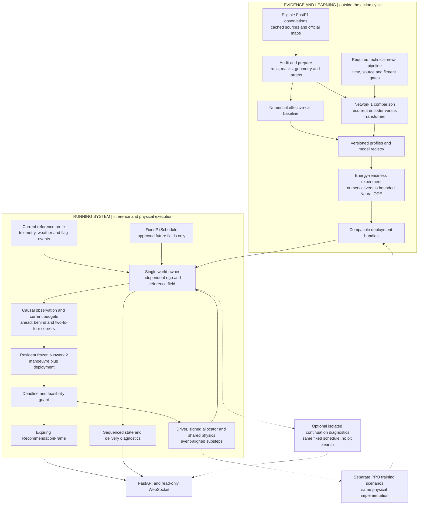
```mermaid
flowchart TB
    subgraph Offline["EVIDENCE AND LEARNING | outside the action cycle"]
        Data["Eligible FastF1 observations<br/>cached sources and official maps"] --> Prepare["Audit and prepare<br/>runs, masks, geometry and targets"]
        Prepare --> Baseline["Numerical effective-car baseline"]
        Prepare --> N1["Network 1 comparison<br/>recurrent encoder versus Transformer"]
        News["Required technical-news pipeline<br/>time, source and fitment gates"] --> N1
        Baseline --> Registry["Versioned profiles and model registry"]
        N1 --> Registry
        Registry --> Energy["Energy-readiness experiment<br/>numerical versus bounded Neural ODE"]
        Energy --> Bundles["Compatible deployment bundles"]
    end
    subgraph Live["RUNNING SYSTEM | inference and physical execution"]
        Prefix["Current reference prefix<br/>telemetry, weather and flag events"] --> World["Single world owner<br/>independent ego and reference field"]
        Fixed["FixedPitSchedule<br/>approved future fields only"] --> World
        Bundles --> World
        World --> Observation["Causal observation and current budgets<br/>ahead, behind and two-to-four corners"]
        Observation --> Actor["Resident frozen Network 2<br/>manoeuvre plus deployment"]
        Actor --> Guard["Deadline and feasibility guard"]
        Guard --> Advice["Expiring RecommendationFrame"]
        Guard --> Plant["Driver, signed allocator and shared physics<br/>event-aligned substeps"]
        Plant --> World
        World --> Outcome["Sequenced state and delivery diagnostics"]
    end
    Advice --> API["FastAPI and read-only WebSocket"]
    Outcome --> API
    World -.-> Review["Optional isolated continuation diagnostics<br/>same fixed schedule; no pit search"]
    Review -.-> API
    Plant -.-> PPO["Separate PPO training scenarios<br/>same physical implementation"]
    PPO -.-> Bundles
```

The diagram's learning arrows do not run on each tick. Phase 4 produces an effective profile before independent energy control exists. Energy readiness and compatible vehicle dynamics are separate admission gates. The research simulator can test synthetic cases before real-entry predictive gates pass, but cannot turn those tests into evidence of real car accuracy.

---

## 3. Runtime lifecycle and inference sequence

### 3.1 What runs when

| Component | Trigger | Runtime input → output | Does it train? |
|---|---|---|---|
| Run loader | Before execution | Registered scenario and bundles → compatible resident artifacts and initial state. | No. |
| Network 2 actor | Each logical 200 ms cycle | Current observation and accepted recurrent memory → action, candidate next memory and supported auxiliary estimates. | No. |
| Driver and physics | Required numerical/event substeps | Current state, held request and current restrictions → demand, allocation and next state. | No. |
| Selected neural energy residual | Within physical evaluations, only if retained | Supported operating state → a bounded correction in one declared mechanism. | No. |
| Fixed pit executor | Schedule/context updates and physical crossings | Immutable strategy and current state → prescribed stop progress and serviced-item changes. | No; it never searches stops. |
| Network 1 inference | Eligible real stint completed | Previous latent, completed evidence and accepted news → candidate profile. | No weight update. |
| News preparation | Eligible article available | Source text and timestamps → reviewed structured context. | No automatic performance fit. |
| Continuation diagnostics | Named evaluation trigger, optional and bounded | Snapshot copy plus fixed strategy and forecasts → labelled outcome estimates. | No; no live-state mutation. |
| Training jobs | Separate authorised work | Historical permitted evidence or simulator episodes → candidate weights and reports. | Yes, outside the fast path. |

### 3.2 Before the first recommendation

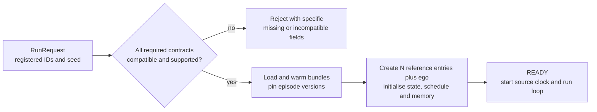
```mermaid
flowchart LR
    Request["RunRequest<br/>registered IDs and seed"] --> Check{"All required contracts<br/>compatible and supported?"}
    Check -->|"no"| Reject["Reject with specific<br/>missing or incompatible fields"]
    Check -->|"yes"| Load["Load and warm bundles<br/>pin episode versions"]
    Load --> Init["Create N reference entries plus ego<br/>initialise state, schedule and memory"]
    Init --> Ready["READY<br/>start source clock and run loop"]
```

Startup must validate profile/decoder/energy/policy/feature/action-schema compatibility; supported track and routes; relevant historical rules; fixed-pit allowlist; fuel/battery/tyre initial values; ego placement and termination rule; timing mode; and numerical failure treatment. No file path or executable model is accepted merely because a client supplied it.

One active **entry profile** is selected from validated support. A donor may supply capability and a fixed pit sequence, but it remains a separate observed reference entry. Ego does not inherit future donor motion or hidden states. Starting last remains a declared scenario direction; exact starting speed, spacing and route are mandatory inputs, not an invented universal position number.

### 3.3 One complete inference cycle

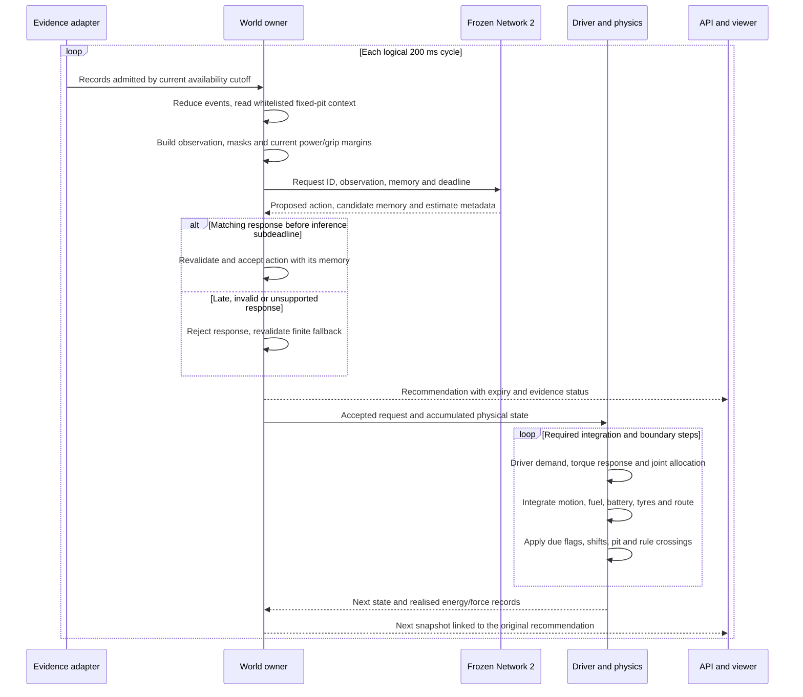
```mermaid
sequenceDiagram
    participant Feed as Evidence adapter
    participant World as World owner
    participant Infer as Frozen Network 2
    participant Plant as Driver and physics
    participant UI as API and viewer
    loop Each logical 200 ms cycle
        Feed->>World: Records admitted by current availability cutoff
        World->>World: Reduce events, read whitelisted fixed-pit context
        World->>World: Build observation, masks and current power/grip margins
        World->>Infer: Request ID, observation, memory and deadline
        Infer-->>World: Proposed action, candidate memory and estimate metadata
        alt Matching response before inference subdeadline
            World->>World: Revalidate and accept action with its memory
        else Late, invalid or unsupported response
            World->>World: Reject response, revalidate finite fallback
        end
        World-->>UI: Recommendation with expiry and evidence status
        World->>Plant: Accepted request and accumulated physical state
        loop Required integration and boundary steps
            Plant->>Plant: Driver demand, torque response and joint allocation
            Plant->>Plant: Integrate motion, fuel, battery, tyres and route
            Plant->>Plant: Apply due flags, shifts, pit and rule crossings
        end
        Plant-->>World: Next state and realised energy/force records
        World-->>UI: Next snapshot linked to the original recommendation
    end
```

A recommendation sent before simulation advancement cannot contain the future interval's actual delivered energy. It carries requested/currently reachable quantities and forecasts. The later **DeliveryRecord** carries realised output and is linked by request and state sequence IDs.

### 3.4 Scheduling and deadline semantics

The initial proposed mode is **lockstep retrospective replay with PIT_FOREKNOWLEDGE_ONLY**. A logical action step advances 0.2 simulation seconds under the selected request or fallback. Source records are released at their specified simulation availability times. A separate monotonic clock measures the real end-to-end 200 ms target. This does not establish actual transport latency or actuation delay in a real vehicle.

The actor receives an earlier subdeadline, leaving measured time for guard/fallback, integration and publication. Exact subdivisions are not fixed without profiling. A wall-clock overrun is recorded; the system must not skip dynamics, discard rule events or backdate a command to hide it.

A late response cannot advance accepted policy memory. On a miss, preserve the last accepted memory, expose the actual fallback and elapsed time in the next observation, and continue only through a supported finite transition. Repeated misses or an impossible fallback cause a degraded/suspended state according to the declared runtime policy. macOS/Python execution is a measured target, not certified hard real time.

---

## 4. Ownership, state and artifact versioning

### 4.1 State ownership

| State | Meaning | Sole writer / update boundary |
|---|---|---|
| `z_car` | Persistent effective entry representation. | Network 1 candidate update; registry promotion controls activation. |
| `x_dynamic` | Ego motion, source response, fuel, battery, tyres, route and transitions. | World worker through the shared physics/event transition. |
| `h_policy` | Recurrent decision memory, not car identity or network weights. | World worker accepts matching actor results atomically. |
| `c_context` | Available weather, track, driver/programme evidence, traffic and quality. | Evidence reducer with cutoff and origin metadata. |
| `race_control_state` | Global session mode and independently scoped restrictions. | Event/rules reducer. |
| `overtake_state` | Pending detection, enabled/active status and ledger eligibility. | Crossing-aware rules module. |
| `encounter_state` | Target/threat, finite manoeuvre, clearance and opponent-defence counter. | Encounter state machine. |
| `pit_execution_state` | Next fixed stop and its physical execution stage. | Fixed schedule executor in the world worker. |
| `model_weights` | Shared encoder/decoder, selected residual and policy parameters. | Separate training/fitting and promotion jobs. |

### 4.2 Four different kinds of change

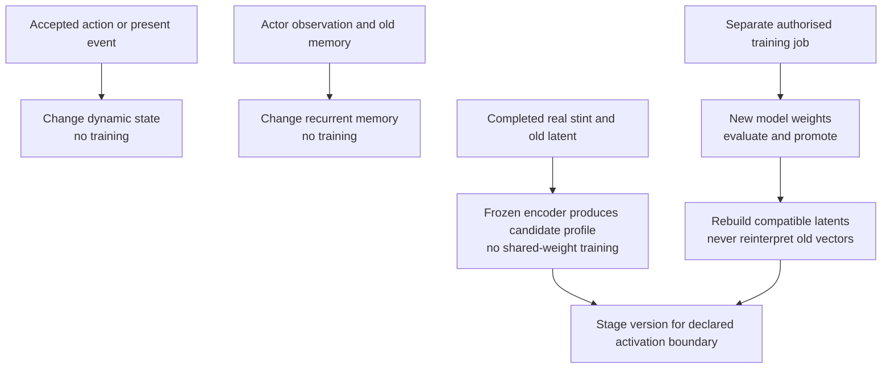
```mermaid
flowchart TB
    Physical["Accepted action or present event"] --> X["Change dynamic state<br/>no training"]
    Observation["Actor observation and old memory"] --> H["Change recurrent memory<br/>no training"]
    Stint["Completed real stint and old latent"] --> Z["Frozen encoder produces candidate profile<br/>no shared-weight training"]
    Dataset["Separate authorised training job"] --> Weights["New model weights<br/>evaluate and promote"]
    Weights --> Rebuild["Rebuild compatible latents<br/>never reinterpret old vectors"]
    Z --> Stage["Stage version for declared activation boundary"]
    Rebuild --> Stage
```

**Proposed initial deployment rule:** pin the complete profile, energy model, actor and preprocessing bundle for the episode. Real-stint updates can stage newer profiles for subsequent episodes. Mid-run replacement is not silently supported: it needs an explicit state-preserving compatibility and fairness rule. No update refills energy or substitutes the donor's physical state.

Profile, powertrain and actuator schemas must declare capabilities independently. `energy_control_ready=true` cannot be inherited merely because a previous latent or source entry had that flag. Adding response states, defence actions or new observation features invalidates old bundles unless a tested compatibility path is named.

### 4.3 Common envelope and numerical conventions

Every artifact carries `schema_version`, `artifact_id`, `created_at_utc`, `source_hashes`, `code_revision`, `config_hash`, `assumption_ids` and `evidence_status`. Models also carry training cutoff, preprocessing/feature/decoder IDs, support limits and validation report references. Profiles separately carry their observation cutoff.

SI internal units: metres, seconds, kilograms, newtons, watts, joules and radians/second. Display conversions to km/h, kW and MJ are explicit. Physics reference arithmetic is CPU float64; neural arithmetic is FP32. Four-decimal deployment is interface resolution, not four-decimal physical accuracy.

Null observations require a missing reason. Tensor fillers require independent validity, padding and origin masks. Allowed origins are reported, library-derived, pipeline-derived, fitted, assumed and unavailable. Confidence is not origin; a confident inference never becomes a measured field.

---

## 5. Information policy and data acquisition

### 5.1 Three separated data lanes

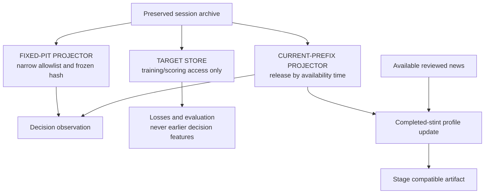
```mermaid
flowchart TB
    Archive["Preserved session archive"] --> Prefix["CURRENT-PREFIX PROJECTOR<br/>release by availability time"]
    Archive --> Pit["FIXED-PIT PROJECTOR<br/>narrow allowlist and frozen hash"]
    Archive --> Targets["TARGET STORE<br/>training/scoring access only"]
    Prefix --> Features["Decision observation"]
    Pit --> Features
    Targets --> Evaluation["Losses and evaluation<br/>never earlier decision features"]
    News["Available reviewed news"] --> Profile["Completed-stint profile update"]
    Prefix --> Profile
    Profile --> Staged["Stage compatible artifact"]
```

| Information | Network 1 reconstruction | Network 2 decision |
|---|---|---|
| Earlier eligible telemetry and context | Permitted within the profile/model cutoffs. | Current derived state/context only. |
| Completed input stint | Permitted after completion. | Indirectly through the permitted profile version. |
| Known track geometry | Permitted development/reference geometry. | Upcoming geometry is known, not future opponent behaviour. |
| Published applicable rules | Source-resolved context. | Versioned restrictions and current entitlement. |
| Prerecorded future pit fields | Not an earlier reconstruction feature or hidden target. | Permitted only through `FixedPitSchedule`. |
| Future non-pit motion, controls, weather or flags | Not an input to an earlier forecast. | Forbidden. |
| Final classifications/gaps | Loss/scoring targets under the experimental split. | Not available before their outcome/availability time. |
| Technical news | Published/available by cutoff and applicability-gated. | Indirect profile context; not a live power command. |

Changing a permitted pit timestamp may change advice. Changing a hidden future flag must not. The fixed schedule can nevertheless indirectly reflect later events, so masking flags does not make this experiment wholly causal. All outputs retain the retrospective-pit disclosure. [P3 §§4-6]

### 5.2 Acquisition scope

Start with the six recorded 2026 Bahrain test days. Use only eligible cached source observations from the previous repository. New code regenerates preparation, fitted curves, scalers, embeddings and derived states. Later 2026 weekends are separately versioned adaptation/retraining/evaluation evidence. No 2025 performance data or inherited car-performance weights enter the initial learning corpus. [P1; P5]

Retain native car and position streams separately, all available laps, tyre context, weather, session/track status and race-control messages. Acquisition first preserves records; task-specific fitting then chooses eligible windows. Source cache reuse is an optimisation of downloading, not authority to reuse an old fitted battery label.

### 5.3 Flag and pit interface status

The pinned FastF1 3.8.3 source was rechecked for this consolidation. Its public Session properties expose `track_status`, `session_status` and `race_control_messages`; the first two load with laps and messages are separately requested. The parser distinguishes clear, yellow, red, SC, VSC deployed and VSC ending. Pit and tyre fields require pairing and provenance. These are interface facts, not this project's acquisition results. [F1-F2]

| Coverage report field | Required treatment |
|---|---|
| Stream result | Present, verified empty, missing or failed; do not conflate them. |
| Time coverage | First/last times, gaps, out-of-order events and UTC/session alignment. |
| Scope coverage | Optional sector/entry/message fields, unresolved mappings and contradictions. |
| Source quality | Parser-generated records, suspected defaults, corrections and availability assumptions. |
| Output provenance | Source/config hashes, parser version and row-level traceability. |

No full six-day or race-weekend coverage report was supplied in the reviewed package. Official VSC reference deltas, a surveyed SC trajectory, every yellow subtype and exact transport latency are not promised by these interfaces. Coarse code `7` remains VSC ending; it is not unrestricted green. [P3 §§1-2]

### 5.4 Preparation and target isolation

Split complete runs before fitting transforms. Native elapsed times remain explicit; neither a 5 Hz actor nor interpolated coordinates creates new measured information. No interpolation across garage stops, red flags, tyre replacements, excessive gaps or dataset splits. Apply past-only joins for chronological use and mark retrospective archive corrections.

The initial inherited split is Test 1 for training, 18 February for model selection and 19-20 February for final evaluation, subject to a coverage review before performance inspection. Later weekends use an explicit expanding chronological manifest. A weekend subsequently used for training is not untouched evidence for that model.

FP/qualifying classification, comparable lap-time gaps, live race progress and final race outcomes are distinct targets. A target contract must preserve Q-segment eligibility, deleted/no-time outcomes, lap deficits and penalty treatment. Never assign convenient seconds to a categorical no-time or disqualification result. A preseason testing session does not support race-gap or classification targets; a non-valid status such as deleted, no-time, disqualified, lap deficit or penalty can never carry a time value.

---

## 6. Common typed contracts

The following are exact required field families for the proposed backend. Feature widths and map sizes are resolved in manifests; symbolic dimensions are not permission to change tensor order without versioning. Boundary objects use strict Pydantic models; numerical inner loops use validated arrays/tensors.

### 6.1 Evidence and profile contracts

| Contract | Required payload |
|---|---|
| `AcquisitionBundle` | Session identity; separate table/stream artifact references; parser version; per-stream coverage; export hashes; roster discrepancies. |
| `StintPackage` | Entry/session/run IDs; start/end and completed cutoff; `X: float32[T,F]`; `valid: bool[T,F]`; `origin: uint8[T,F]`; `dt_s: float64[T]`; `padding: bool[T]`; feature order; tyre context (`Compound`, `TyreLife`, `FreshTyre`; no field identifies a physical tyre set, so tyre-set identity stays unknown); programme/quality context; split; source-row references. Initial anchor dt is zero; later valid intervals are positive. |
| `TargetBundle` | Target kind; roster or entry pair; timing/classification values; units; observed availability time; comparison masks; Q-segment/valid-lap rules; lap-deficit/status fields; source references. A preseason testing session cannot supply race-gap or classification targets, and a non-valid status (deleted, no-time, disqualified, lap deficit, penalty) never carries a time value. |
| `TrackProfile` | Coordinate transform (a decimetre-to-metre scale on FastF1 position X/Y, not an identity transform); reference progress and actual distance; curvature with an explicit validity mask. Grade, width, corner boundaries, connected routes, pit branch and rule-line mappings have no approved source in this bundle and stay unavailable. |
| `CarProfile` | Entry and version; latent and latent-valid flag; encoder/decoder/scaler/feature IDs; effective maps; reference mass/condition; support limits; driver/tyre model IDs; actuation semantics; readiness flags; calibration/uncertainty status. |
| `PowertrainMap` | Torque-map axes and boundary units; gear/final-drive ratios; radius; shaft connection; motor and engine maps; response/shift/loss IDs; supported modes and assumption provenance. |
| `ChassisModel` | Reference-mass inclusion convention; CG and wheelbase; aero balance/force locations; selected load-transfer, grip and road-frame model IDs; supported conditions. |
| `NewsPrior` | Article/span/source IDs; publication and known availability; effective date; component and claim type; fitment status; entry applicability; extraction/reviewer version; bounded context and uncertainty. |

A curve records its axis, monotonically ordered axis values, aligned finite values, units, interpolation, support and extrapolation policy. Multi-axis maps record the grid and shape explicitly. No endpoint clamping outside observed support is silently presented as validated extrapolation. Curvature's one-sided edge differencing understates the true value: measured on a known 500 m arc, the first and last samples read half the true curvature, which is why `TrackProfile` marks them invalid rather than presenting them as measured.

### 6.2 World, physical and rule contracts

| Contract | Required payload |
|---|---|
| `DynamicState` | Simulation time; route/lap/progress; actual path distance; speed and offset; fuel; storage energy; tyre set/age/condition; mass derived from the mass convention; powertrain, aero, encounter and pit substates. |
| `PowertrainState` | Gear/shift stage; effective engine-availability state; shaft-speed state or derivation; transfer factor; previous demands and transition timers. |
| `GripBudget` | Front/rear normal and lateral loads; permitted signed longitudinal ranges; tyre support and utilisation; load-solve convergence; overspeed/infeasibility flags. |
| `DriverDemand` | Route/mode; wheel-demand ceiling; braking demand; gear/shift request; lift/recovery mode; preview endpoint and validity. |
| `PowerBudget` | Steady/requested/reachable ICE; feasible signed motor DC set; shaft/wheel mappings; rear grip and wheel-demand headroom; storage/throughput limits; binding reasons. |
| `AllocationResult` | Accepted fraction; delivered ICE/motor shaft and wheel values; signed axle forces; friction and regen contributions; losses; fuel rate; unmet demand; admissibility status. |
| `RulesSnapshot` | Event/date/session/issue IDs; source hashes; applicability; power/torque/energy rules with measurement boundaries; line maps; transition IDs; supported/approximate/unsupported modes. |
| `RaceControlEvent` | Source/event IDs; event time and known availability or archive assumption; type and global/local scope; optional sector/entry; original text and mapping quality. |
| `FixedPitSchedule` | Immutable stop IDs; original timing/lap/order; supported tyre/service context; allowlist/hash; source precision; donor-to-ego execution policy; conflict treatment. |

### 6.3 Inference and output contracts

| Contract | Required payload |
|---|---|
| `PolicyObservation` | Profile features/latent mask; ego state; current power/grip/braking margins; ordered corners `[4,C]` with 2 or 4 active; ahead/behind neighbours `[K,O]`; masks/origins/ages; eight-action mask; current events/entitlement; fixed pit context; preceding issued/delivered action; elapsed inference time; feature and information-policy IDs. |
| `InferenceRequest` | Run/tick/request ID; observation sequence; profile/policy/schema versions; accepted memory version; observation and recurrent memory; monotonic subdeadline. |
| `InferenceResult` | Matching tags; proposed action; candidate memory; inference timing; supported auxiliary estimates with their horizon and version. |
| `ActionRequest` | Manoeuvre enum; deployment fraction in `[0,1]`; target/threat and template mapping; policy/observation version; expiry. Four-decimal issuance uses one saved transform. |
| `RecommendationFrame` | Intent; route and target/threat; requested/currently reachable power; local window; benefit/cost/downside estimates and status; binding constraints; expiry; model/rules/pit provenance; retrospective and reference-field disclosures. |
| `DeliveryRecord` | Request and interval IDs; actual delivered powers/energy; clipping/rejection reasons; force/energy closure; resulting state sequence. This is realised output, not a forecast. |
| `SimulationSnapshot` | Entire restorable ego and discrete state; accepted memory; current reference prefix and cursor; clocks/RNG states; original/augmented order; action/delivery links; pinned artifact IDs. |
| `EvaluationReport` | Source/split/config versions; profile, physics, local/race, calibration and timing results; failures/exclusions; information-policy label; no collapsed universal success flag. |

Derived tensor dimensions, array order, target conventions and memory shape are frozen in `FeatureSchema`, `ActionSchema` and `PolicyManifest`. An observation with a mismatched schema is rejected before inference, not silently reshaped.

---

## 7. Network 1: reconstruction, updating and validation

### 7.1 Why this layer exists

Network 1 supplies a compatible **effective entry profile** to the energy/tactical system. It is not a classifier that assigns a permanent capability from the leaderboard. Unresolved driver execution, fuel and programme effects remain limitations rather than identified factory parameters. [P1 Phase 4; P5]

The mathematical baseline first fits supported effective propulsion, resistance, braking and grip components. It adjusts bounded curve values and coefficients, not neural weights. Braking and cornering are investigated in Phase 3; unresolved components can be researched in Phase 4, but full-lap strategic claims wait for supported complete dynamics.

### 7.2 Offline comparison

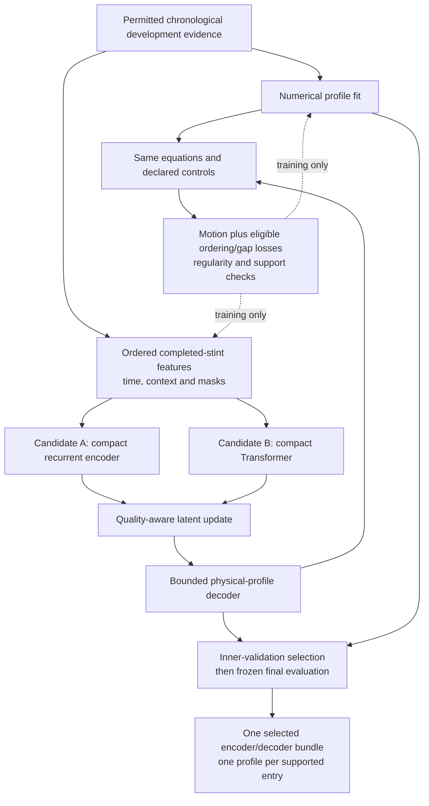
```mermaid
flowchart TB
    Split["Permitted chronological development evidence"] --> Base["Numerical profile fit"]
    Split --> Windows["Ordered completed-stint features<br/>time, context and masks"]
    Windows --> GRU["Candidate A: compact recurrent encoder"]
    Windows --> Transformer["Candidate B: compact Transformer"]
    GRU --> Update["Quality-aware latent update"]
    Transformer --> Update
    Update --> Decoder["Bounded physical-profile decoder"]
    Base --> Plant["Same equations and declared controls"]
    Decoder --> Plant
    Plant --> Loss["Motion plus eligible ordering/gap losses<br/>regularity and support checks"]
    Loss -.->|"training only"| Base
    Loss -.->|"training only"| Windows
    Decoder --> Select["Inner-validation selection<br/>then frozen final evaluation"]
    Base --> Select
    Select --> Bundle["One selected encoder/decoder bundle<br/>one profile per supported entry"]
```

**Inherited prototype candidates, not empirically chosen sizes:** latent dimension 16; 64-wide window representation; two-layer 64-wide GRU versus two Transformer blocks with width 64, four heads and 128-wide feed-forward layer. Use separate matched training runs and one operational winner. The model manifest, not a prose default, fixes the actual experiment sizes.

The decoder emits the common profile contract with explicit axis units, bounds, reference condition and support. Initially it can emit effective-total propulsion while `energy_control_ready=false`. Later energy compatibility requires a selected map/response/loss contract; a richer latent cannot bypass this step.

### 7.3 Completed-stint inference and change handling

At completion of an eligible real stint, freeze the input cutoff, apply the saved transforms and evaluate the selected encoder with the previous latent. Decode a candidate profile; assess support, schema and energy compatibility; record its previous version and update reason; then stage it for the declared activation boundary.

Use gradual quality-aware updates with a change detector and controlled resets. A new fuel load, worn tyre or yellow flag is not itself a new car. Sustained eligible residual shifts or supported configuration changes can justify a new profile version. Thresholds and news influence are development choices. A gate value is not automatically calibrated confidence.

**Exactly one active profile exists per supported entry.** Archived versions support auditing. Isolated physical-parameter sensitivity tests do not create several competing operational car identities. Entries with insufficient evidence are excluded from validated-profile/ego selection; they can remain observed reference opponents without fabricated hidden parameters.

### 7.4 Training objectives and what constitutes improvement

The preserved objective families are masked motion error, contextual entry ordering, signed timing-gap error, physical/state regularity and controlled latent drift. No fixed numeric weights are approved. [P1 §§5,9; P5]

$$
\mathcal L_{N1}=\lambda_v\mathcal L_{motion}+\lambda_g\mathcal L_{gap}
+\lambda_o\mathcal L_{ordering}+\lambda_r\mathcal L_{regularity}.
$$

This is a loss-family specification, not proof that the physical variables can be separated. For comparable timing targets, `G_ij = T_i - T_j`; negative means entry i is faster for that target. Keep FP/qualifying lap-time gaps separate from race elapsed gaps and lap deficits. A differentiable ordering surrogate may train the model; exact session-aware metrics evaluate it.

Known-input reconstruction may receive recorded target controls but must be labelled accordingly. A pre-run forecast uses its declared driver and initial-state assumptions without target-future controls. Continuous lap evaluation cannot be manufactured by summing repeatedly anchored short windows.

Evaluate both frozen profiles and predict-score-update profiles, sequential primary. Shared weights remain fixed inside each adaptation experiment. Later shared-weight retraining uses completed authorised weekends and is scored on later evidence. The numerical baseline receives the same permitted evidence when the corpus expands. Neural improvement is required for promotion, not guaranteed or created by weakening the comparator.

No future pit manifest is supplied to Network 1's earlier reconstruction input. Required news is first evaluated against a clean telemetry-only comparison. Synthetic ego experience trains decision behaviour; it never becomes measured evidence for the real donor.

---

## 8. Shared physics and independent energy actuation

### 8.1 Fidelity and research boundaries

The proposed physical model is **route-constrained, quasi-steady by axle, with dynamic longitudinal motion, source response, fuel, battery, tyres and finite gear/aero transitions**. This restores the original backend's physical distinctions without restoring its DP/ECMS algorithms, calibrated constants or claimed results. [P2 §§3-7]

Detailed equations below reproduce the explicit reduced conventions of the supplied physics specification [P2]. They are not asserted as a complete vehicle model. Parameter maps and omitted mechanisms are named in the model manifest. Papers motivate particular mechanisms; no older MGU-H architecture, paper-specific controller or confidential parameter set is imported. [R1-R5]

### 8.2 One physical path for all consumers

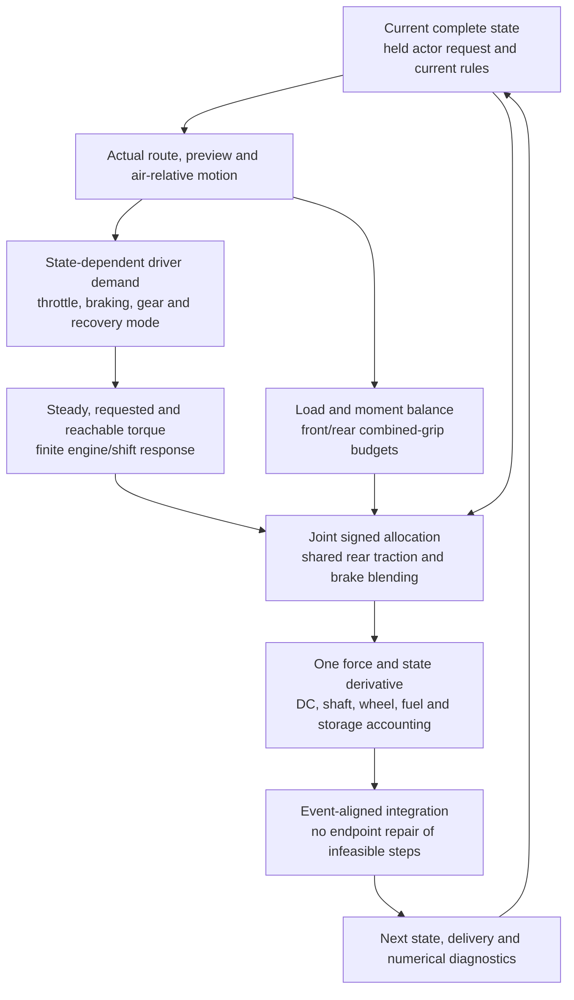
```mermaid
flowchart TB
    State["Current complete state<br/>held actor request and current rules"] --> Geometry["Actual route, preview and air-relative motion"]
    Geometry --> Demand["State-dependent driver demand<br/>throttle, braking, gear and recovery mode"]
    Demand --> Source["Steady, requested and reachable torque<br/>finite engine/shift response"]
    Geometry --> Axles["Load and moment balance<br/>front/rear combined-grip budgets"]
    Source --> Allocate["Joint signed allocation<br/>shared rear traction and brake blending"]
    Axles --> Allocate
    State --> Allocate
    Allocate --> Derivative["One force and state derivative<br/>DC, shaft, wheel, fuel and storage accounting"]
    Derivative --> Integrator["Event-aligned integration<br/>no endpoint repair of infeasible steps"]
    Integrator --> Output["Next state, delivery and numerical diagnostics"]
    Output --> State
```

Execution, reconstruction replay, RL episodes and isolated continuation diagnostics invoke the same force functions and physical conventions. An independent integrator can cross-check those equations, but agreement between two solvers does not prove the equations themselves; analytic fixtures are also required.

### 8.3 Road speed is not engine power

For a locked clutch, known gear and negligible wheel slip:

$$
\omega_e=\frac{i_g i_f}{r_w}v,\qquad P_{ICE,shaft}=T_{ICE}\omega_e.
$$

The gear/final-drive ratio, effective radius, load and source state are required. A single road speed does not identify the engine's power. Neutral, slipping clutch, shifts and launch require separate supported branches. The nominal 400 kW reference retained in the plan is a declared ICE prior anchor, not a universal delivered engine output.

Maintain four distinct quantities: steady available capability, requested output, currently reachable output and actual delivered output. A proposed effective response model is:

$$
\dot T_{env}=\operatorname{clip}\left(\frac{T_{env,target}-T_{env}}{\tau},-R_{down},R_{up}\right),\quad \tau>0.
$$

Here `T_env` is an effective availability state; actual torque still obeys demand, supported cuts, drivetrain and transition constraints. Response constants are assumptions/fits requiring evidence, not values recovered from an arbitrary speed sample. Compare an algebraic response baseline with the finite-response hypothesis. Carry shift stage and transfer factor across ticks; do not assume an independently wheel-connected motor can always fill a gearshift gap. [P2 §4.1; R1]

### 8.4 ICE-first does not mean immediate ICE delivery

ICE-first remains a **reference-allocation preference**. In positive-propulsion mode, the deterministic driver establishes route-feasible demand. The ICE is commanded toward its supported contribution; the current response and drivetrain determine what is actually available. Electrical headroom is calculated after that delivered contribution, not after an imaginary already-delivered steady maximum.

For positive speed, a simplified wheel-side headroom relation is:

$$
P_{K,w}^{headroom}=\max\left(0,\min(P_w^{demand},vF_{x,R}^{max})-P_{ICE,w}^{delivered}\right).
$$

The allocator resolves this jointly with axle loads, torque/power limits, source losses and admissible transitions. Infeasible ICE output is constrained too. Both sources share the driven-axle budget; neither bypasses it.

The actor's held fraction selects additional feasible positive DC output. **A zero request does not receive unrequested automatic torque fill.** At substeps, changing battery, grip or rules changes the feasible delivered power even if the fraction is unchanged. If the admissible set is discontinuous, apply the declared projection rule rather than assume every fraction of a scalar maximum is legal.

Substitution of reachable ICE with electrical power purely to trade fuel against battery is a different joint-allocation experiment, not an implied new actor action. The current actor chooses deployment; transient assistance does not require adding an ICE throttle head. [P2 §4.2]

### 8.5 The three speed relationships

| Quantity | Relation | Conditions |
|---|---|---|
| Added-power acceleration | `Δa = ΔP_w / (m v)` | Same positive speed, mass and resistance; no new saturation. |
| Aerodynamic power | `P_D = ½ ρ C_DA v³` | Still air and fixed coefficient/density. |
| Local time-integrand sensitivity | `∂(1/v)/∂E_k = -1/(m v³)` | Fixed mass and `E_k = ½ m v²`. |

The inverse-cube expression is not a motor or ICE deployment law. At 150 km/h, hypothetical 200 kW ICE plus an additional 100 kW motor, both defined at the wheels, adds at most 2,400 N before saturation. With illustrative mass 800 kg, that is an instantaneous increment of 3 m/s². Replacing 100 kW ICE with 100 kW motor at the same state does not add wheel force. Transient response, losses and future energy can differ. These are analytic examples, not F1 measurements. [P2 §2; O1; R4]

### 8.6 Aero, wake and dynamic mass

The initial aligned-flow branch uses signed longitudinal relative airspeed `u_air`:

$$
F_D=\tfrac12\rho C_DA\,u_{air}|u_{air}|\,r_D,
\qquad D_f+D_r=\tfrac12\rho C_LA\,u_{air}^2\,r_L.
$$

The translation-power term is `F_D v`, not automatically the cube of airspeed under wind. Crosswind/yaw or reverse-flow maps require separate support. Aero state evolves through finite transitions in supported zones. Drag/downforce maps and their balance are assumptions or fits, not supplied by a rule limiting wing geometry. [P2 §4.3; O1]

Use one shared wake mapping of supported gap, lateral offset, speed and aero context. Its drag and downforce effects are linked, not independent policy switches. Apply wake to supported aerodynamic contributions; do not reduce mechanical grip by an aerodynamic factor or add an extra arbitrary dirty-air delay. Multi-car wake combination needs a declared rule, not multiplication of unrelated tow bonuses. [P2; R3]

$$
m=m_{reference,no\ fuel}+m_{fuel}+\Delta m_{tyres}.
$$

Reference mass records included driver, ballast and reference tyres. Add fuel once and preserve fitted-force scale when dynamic fuel changes. Numerical tyre-material mass change remains disabled under its named assumption until supported. A mass-derived coefficient cannot be rescaled so additional fuel cancels its own inertia effect.

### 8.7 Axle loads and combined grip

Solve the selected force/moment balance with explicit geometry and assumptions. The following is only the supplied **flat-road, zero-pitch-acceleration illustration**, with axle-equivalent downforce and omitted drag-height moment:

$$
F_{z,F}=mg\frac{b}{L}+D_f-\frac{m\dot v h}{L},
\qquad F_{z,R}=mg\frac{a}{L}+D_r+\frac{m\dot v h}{L},\quad L=a+b.
$$

CG-to-front/rear distances are `a` and `b`. Grade, aerodynamic force application heights and other pitch effects must be included in the chosen model or explicitly omitted with a support restriction. Do not present this illustrative equation as the general road-frame solution. Loads depend on acceleration and delivered forces, so use a bounded deterministic consistency solve; report non-convergence rather than accepting arbitrary loads.

At each axle, the reduced combined-grip envelope is:

$$
\left(\frac{F_{x,j}}{\mu_{x,j}F_{z,j}}\right)^2+
\left(\frac{F_{y,j}}{\mu_{y,j}F_{z,j}}\right)^2\leq1,\qquad F_{z,j}>0.
$$

Lateral shares satisfy the selected quasi-steady force/yaw balance. Drive is rear-only; friction braking can use both axles; engine braking and regeneration share their actual driven path. Lateral demand and brake bias reduce available longitudinal headroom. These envelopes are reduced modelling assumptions, not full tyre laws. [P2 §4.4; R2]

**Never replace excessive lateral demand with the grip limit and silently proceed.** If the selected path is infeasible at the current speed, record that condition. Prevention comes from reachable braking preview, not an instantaneous speed repair.

### 8.8 Driver preview and brake blending

The driver module owns throttle demand, braking, lifting, gear and recovery behaviour. Rules/parameters are frozen for an evaluation, but outputs respond to current simulated motion, route and tyre condition. No target-future throttle or brake trace configures an autonomous forecast.

Construct a route-specific backward reachable braking envelope from supported corner, pit and stop constraints, then integrate the actual chosen motion forward. Constant-deceleration expressions are only simple checks; production preview uses the same varying speed, grip, mass and aero assumptions as execution. The stopping preview may extend beyond two/four corners when required by safe reachability.

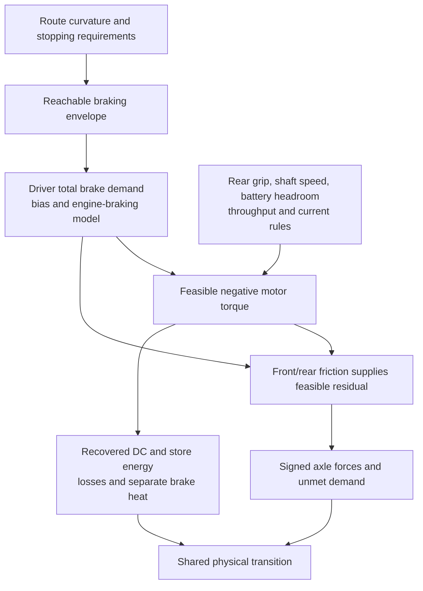
```mermaid
flowchart TB
    Route["Route curvature and stopping requirements"] --> Preview["Reachable braking envelope"]
    Preview --> Demand["Driver total brake demand<br/>bias and engine-braking model"]
    Demand --> Regen["Feasible negative motor torque"]
    Limits["Rear grip, shaft speed, battery headroom<br/>throughput and current rules"] --> Regen
    Regen --> Blend["Front/rear friction supplies feasible residual"]
    Demand --> Blend
    Blend --> Force["Signed axle forces and unmet demand"]
    Regen --> Energy["Recovered DC and store energy<br/>losses and separate brake heat"]
    Force --> Step["Shared physical transition"]
    Energy --> Step
```

When storage is nearly full, regeneration can decrease while friction supplies the remaining supported braking demand. Do not remove all braking when recovery is unavailable. Do not count negative motor torque as both regeneration and an extra full braking force.

Engine-driven charging is a named supported-or-disabled mode. Positive engine torque can drive a negative generator load, which reduces net wheel output and consumes fuel. It is not necessarily deceleration or free recharge. Its behaviour remains the deterministic recovery module's responsibility, not an undeclared PPO action. [P2 §4.5]

### 8.9 Signed power, fuel and storage accounting

Positive motor power denotes motoring. At the named machine boundary:

$$
P_{K,dc}=P_{K,shaft}+P_{loss,K},\qquad P_{loss,K}\geq0.
$$

For the selected reduced bus/store convention:

$$
P_{ES,term}=P_{K,dc}+P_{aux}+P_{bus,loss},
\qquad \dot E_{store}=-P_{ES,term}-P_{store,loss}.
$$

Each loss belongs to one boundary. Do not combine a whole-chain efficiency with all its component losses again. The mapping from internal stored energy to any regulatory usable-state convention is separately named. An ideal-store baseline sets an assumed internal loss to zero; it does not assert zero real loss or measured cell capacity.

Cumulative recharge throughput is distinct from present storage. An increased recharge allowance does not immediately credit the battery. Initial full usable energy is a forward-scenario choice under the resolved rule profile, with any tactical reserve inside the cap. Neither a pit stop nor Overtake entitlement resets energy.

Fuel flow comes from a named operating map. `P_ICE,shaft = η_ICE m_dot_f LHV` is an operating approximation, not an all-mode formula for idle, fuel cut or engine braking. A fuel-energy-flow restriction is not a mechanical engine-power curve. [P2 §4.6]

### 8.10 Motion and event integration

Signed tyre forces count drive, regen, engine braking and friction once:

$$
m\dot v=F_{x,F}+F_{x,R}-F_D-F_{rr}-mg\sin\theta-F_{scrub}.
$$

Keep actual travelled distance `ℓ` separate from common reference progress `s`. For a template with `r(s)=dℓ/ds>0`:

$$
\dot\ell=v,\qquad\dot s=v/r(s).
$$

Rolling resistance uses a named mass-based or normal-load law. Changing the law changes the interpretation of its coefficient. Optional scrub/load-sensitive grip, rotating inertia and thermal models remain gated; inactive effects are explicitly omitted, not silently zero measurements.

Use CPU float64 reference integration, initially fixed-step RK4 with event splitting. Substep size, root tolerances and tie-event precedence are configured from convergence tests. Every stage respects storage, motion and source admissibility. At zero/low speed use supported torque-to-force branches rather than dividing power by a fictitious clamped speed.

Process shifts, aero transitions, storage saturation, line crossings, pit events and newly available restrictions at their appropriate times. Restart derivatives after discontinuities. No endpoint clipping can erase an infeasible path or recover energy spent before an empty-battery event.

### 8.11 Required Neural ODE comparison

Run a numerical baseline and a bounded Neural ODE/UDE candidate for one declared missing mechanism, such as a torque-map residual or effective response-rate correction. Do not simultaneously grant unrestricted force, torque, loss and battery corrections. Numerical and neural candidates receive matched evidence, integrator and boundary conditions.

A retained residual is a frozen function during inference, evaluated inside the physical model. It is not a second actor or a repeated online fit. Promotion requires prespecified inner-validation improvement and physics/actuation checks. The comparison is required; deployment of a worse or unsupported neural model is not. [P2 §§4.1,5; R5]

The differentiable training implementation must document treatment of algebraic consistency, active-set boundaries and event discontinuities. Validate smooth-segment derivatives numerically; do not claim that automatic differentiation establishes correct hybrid-system sensitivities. Real-data identification remains limited even when simulated gradient checks pass.

---

## 9. Track geometry, attack and defence

### 9.1 Connected tactical window

The detailed window begins at the current approach and ends after the second connected corner's meaningful exit, later after the fourth. It includes linking straights, entry positioning, finite route changes, braking, exit speed, possible repass and relevant rule-line locations. It does not guarantee that each corner has a passing route.

Known future geometry is permitted. Future opponent intent, actual weather or future restrictions are not. The model may follow through corner one to create a better attack at corner two, or spend energy defending an exit rather than attacking the car ahead. [P1 §§5-6]

`CornerSequence` requires ordered IDs, distances to entry/apex/exit, route candidates and connectivity, curvature/path length, supported widths, preview feasibility, rule-line distances and validity masks. The tensor has capacity for four corners; training initially activates two. It must later be trained/evaluated with four before that mode is claimed supported.

### 9.2 Proposed eight-action schema

| Manoeuvre | Physical meaning |
|---|---|
| `FOLLOW_ALIGNED` | Continue feasible reference/aligned running; UI may label HOLD or CONSERVE from context. |
| `FOLLOW_OFFSET_LEFT` | Move to a supported left offset without committing to pass. |
| `FOLLOW_OFFSET_RIGHT` | Move to a supported right offset without committing to pass. |
| `PASS_LEFT` | Attempt the supported left passing route against the resolved forward target. |
| `PASS_RIGHT` | Attempt the supported right passing route. |
| `DEFEND_LEFT` | Use a supported left defensive route against an identified following threat. |
| `DEFEND_RIGHT` | Use a supported right defensive route. |
| `ABORT` | Use a supported finite transition out of the current attempt/positioning action. |

The actor selects the manoeuvre, not steering at arbitrary coordinates. Defend/pass labels do not establish right-of-way. Current overlap, occupancy, route support and applicable restrictions can mask them. A valid finite continuation must remain available; if none exists, suspend the unsupported interaction rather than allow an invalid action.

**Proposed initial target resolution:** before inference, deterministically resolve the nearest eligible forward attack target and the most imminent supported rearward threat using route, closing and overlap criteria frozen in configuration. Attach targets to action/template candidates. The actor chooses among those candidates; no unselected target-selection network is assumed. All nearby relevant footprints still constrain feasibility even if only one is the primary target. Exact ranking/retention thresholds remain pending.

### 9.3 Finite routes and encounter state

`ManeuverTemplate` records actual path mapping, curvature, entry/exit conditions, width/support, transition duration, occupancy, dimensions/clearance, allowed successor routes and aborts. Future route connectivity cannot reset speed, lateral offset, tyre condition or source response to favourable values.

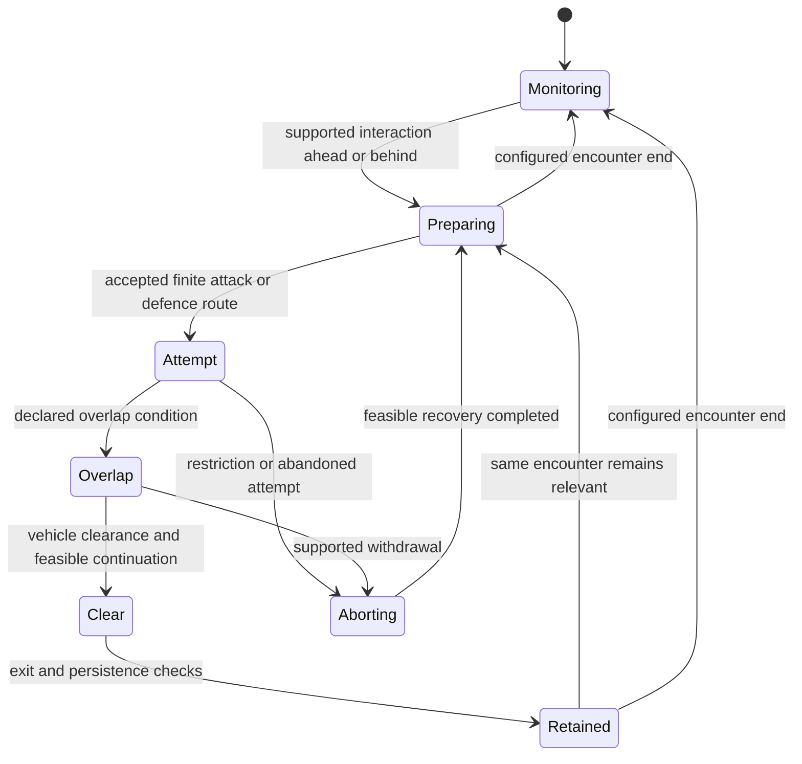
```mermaid
stateDiagram-v2
    [*] --> Monitoring
    Monitoring --> Preparing: supported interaction ahead or behind
    Preparing --> Attempt: accepted finite attack or defence route
    Attempt --> Overlap: declared overlap condition
    Overlap --> Clear: vehicle clearance and feasible continuation
    Clear --> Retained: exit and persistence checks
    Attempt --> Aborting: restriction or abandoned attempt
    Overlap --> Aborting: supported withdrawal
    Aborting --> Preparing: feasible recovery completed
    Retained --> Preparing: same encounter remains relevant
    Preparing --> Monitoring: configured encounter end
    Retained --> Monitoring: configured encounter end
```

The diagram shows state progression, not a guarantee that every transition is physically available. Failed/unsupported geometry is recorded separately from successful abort or completion.

The opponent's one-successful-active-defence cap persists across corners, retries and policy ticks within the same encounter. After the cap, ordinary corridor following remains; ego is not guaranteed a pass. The cap does not automatically restrict ego to one defensive action. Calibration of response mixtures and encounter reset remains required. [P1 §6; P3]

---

## 10. Reference field and additional ego

All N original entries remain; ego is a separate N+1 entry, even when it uses a real entry as profile donor. Original observations and augmented simulated classification are stored separately. Original opponents retain their mutual recorded longitudinal performance and ordering. Ego can change their displayed augmented rank, not their reference histories. [P1 §§2-3,6]

The replay archive can contain the full event internally, but its adapter only releases non-pit records at the permitted availability cutoff. Between source observations, any short-horizon projection is marked derived/estimated and limited by the frozen staleness policy; it cannot interpolate from a future observation unavailable to the actor.

Ego's battery, tyres, speed, source response and route state evolve from its own actions. Neither new reference observations nor donor profile updates overwrite these states. Original opponents' entitlement evidence remains tied to the original field; inserting ego does not silently recalculate their historical deployment.

### Reference-field defence limitation

Local lateral reactions can represent a limited response while original longitudinal pace stays exogenous. If a genuine block requires the opponent to brake or incur delay, the reference-field model cannot claim that reaction occurred. If no feasible joint continuation exists at retained reference pace, mark `UNSUPPORTED_INTERACTION` rather than manufacture success, collision-free overlap, a hidden slowdown or later snapback.

This restriction applies to both ego attacks and ego defence. Report unsupported-interaction frequency and its location; otherwise a favourable result could be produced by excluding difficult battles without disclosure. State-dependent response weights remain assumptions until supported by evidence, not calibrated real-driver probabilities.

Exact ego spawn and finish/classification rules remain scenario fields. An augmented finishing order can be computed only under a declared termination rule handling lap deficits, non-finishers and events. Do not assume that a standing start is supported because rolling-lap physics passed.

---

## 11. Fixed pit strategy and its future-information exception

### 11.1 No pit optimisation

`FixedPitSchedule` imports the original stop sequence and available configuration as a preselected strategy. The policy can change energy and tactical choices around those stops. It cannot move a stop, select another compound, add a stop, predict a better undercut or choose a different inventory. There is no adaptive pit planner or search worker. [P1 §4, Phase 8; P3]

### 11.2 Projection and physical execution

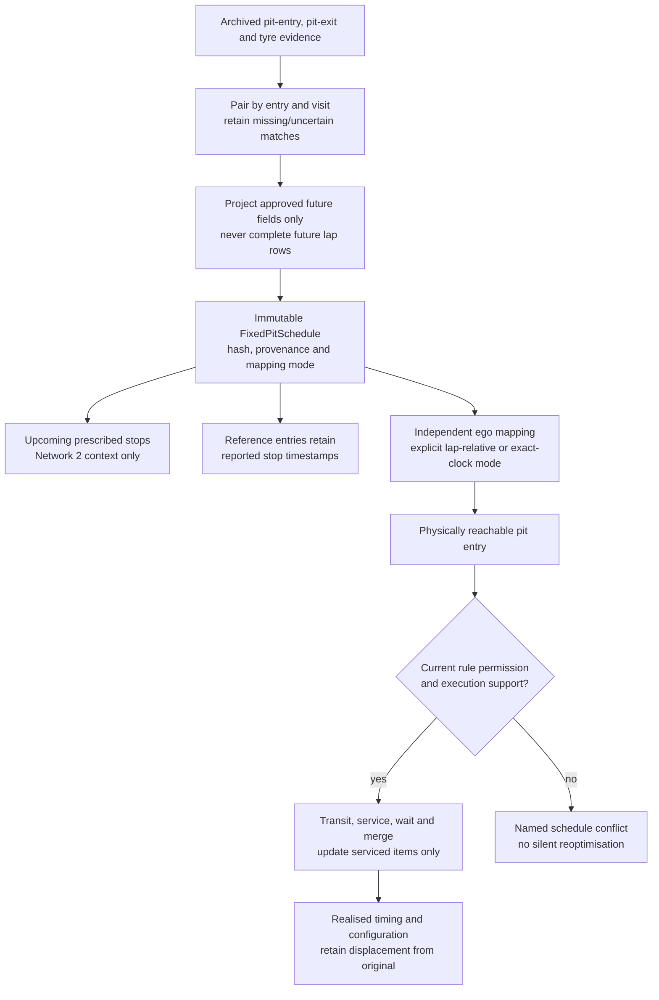
```mermaid
flowchart TB
    Records["Archived pit-entry, pit-exit and tyre evidence"] --> Pair["Pair by entry and visit<br/>retain missing/uncertain matches"]
    Pair --> Project["Project approved future fields only<br/>never complete future lap rows"]
    Project --> Fixed["Immutable FixedPitSchedule<br/>hash, provenance and mapping mode"]
    Fixed --> Context["Upcoming prescribed stops<br/>Network 2 context only"]
    Fixed --> Ref["Reference entries retain<br/>reported stop timestamps"]
    Fixed --> Ego["Independent ego mapping<br/>explicit lap-relative or exact-clock mode"]
    Ego --> Reach["Physically reachable pit entry"]
    Reach --> Permission{"Current rule permission<br/>and execution support?"}
    Permission -->|"yes"| Transit["Transit, service, wait and merge<br/>update serviced items only"]
    Permission -->|"no"| Conflict["Named schedule conflict<br/>no silent reoptimisation"]
    Transit --> Log["Realised timing and configuration<br/>retain displacement from original"]
```

Supported future fields are recorded stop lap/order, pit-entry/exit times and available compound/age/freshness/service context. Retain precision and source labels. The exception does not establish actual battery, fuel, tyre pressure, wing settings, exact physical set identity or complete mechanical configuration.

### 11.3 Original timing versus ego timing

Reference opponents retain the reported times. For independent ego, source timestamps do not establish physical reachability after altered driving.

**Proposed first execution mode: `LAP_RELATIVE_FIXED`.** Keep the donor's prescribed stop lap, stop order and supported tyre sequence. Ego stops on its own physically reached crossing of pit entry on that lap. Log original target and realised times. This is fixed scheduling, not optimisation.

An optional `EXACT_CLOCK_FIXED` experiment must check that ego can reach the entry at the specified time. Failure is `UNREACHABLE_SCHEDULE`; no teleportation, time rescaling or overwritten historical motion is allowed. This mode and any waiting convention require explicit scenario selection. The user fixed the strategy; these mapping details remain proposed technical choices.

### 11.4 Duration, configuration and conflicts

Entry-to-exit occupancy is not automatically stationary service. When service data exists, use it with simulated transit. Otherwise use a named occupancy/transit/service approximation with bounds and provenance. If the reported occupancy is less than required simulated transit, record a model/source conflict instead of negative service time. Never charge both full occupancy and the same transit again.

Approach, entry, controlled transit, service, exit waiting and merge are physical stages. Update only declared serviced items. Do not refill fuel/battery, reset engine identity or rewrite recurrent history at a pit visit. Used tyres remain used unless evidence or an explicit initial-state assumption says otherwise.

Current restrictions still apply. A prescribed stop that conflicts with current pit permission causes `SCHEDULE_RULE_CONFLICT`. The selected protocol can suspend or apply a predetermined non-optimising contingency; the contingency and departure from the original strategy are logged. No unspecified fallback is silently selected for convenience.

### 11.5 Label the information advantage

Every policy observation and result carries `information_policy_id=PIT_FOREKNOWLEDGE_ONLY`, schedule hash, source status and future-field allowlist. Future flag/SC release/weather/speed/result rows stay hidden. The completed schedule can indirectly reflect later events, so results are **pit-schedule-informed retrospective results**, not demonstrated fully causal live strategy.

Policy training and evaluation enforce the same allowance. Network 1's earlier reconstruction task remains isolated from this future-pit input. [P3 §§4-7]

---

## 12. Flags, Overtake entitlement and rule enforcement

### 12.1 Observation is not rule authority

FastF1 events indicate what was reported. A separate versioned `RulesSnapshot` defines the supported consequence for the selected event/date/session. Missing historical coverage does not fall back to the latest rule edition. Exact numerical caps and private control details are not invented in this consolidation. [P1; F1-F2]

Keep global race/session mode, independent local restrictions, ordinary passing permission, pit permission, active-aero state, Overtake enabled/active/pending state and energy-ledger eligibility separate. None belongs inside persistent car identity.

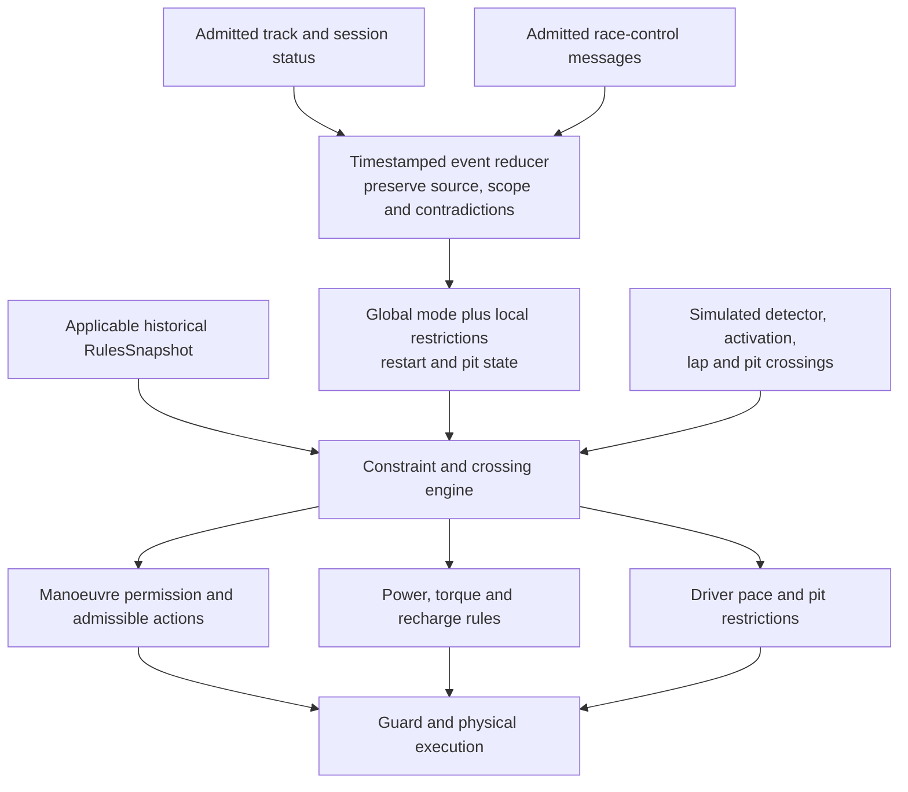
```mermaid
flowchart TB
    Status["Admitted track and session status"] --> Timeline["Timestamped event reducer<br/>preserve source, scope and contradictions"]
    Messages["Admitted race-control messages"] --> Timeline
    Timeline --> State["Global mode plus local restrictions<br/>restart and pit state"]
    Documents["Applicable historical RulesSnapshot"] --> Rules["Constraint and crossing engine"]
    State --> Rules
    Crossing["Simulated detector, activation,<br/>lap and pit crossings"] --> Rules
    Rules --> Mask["Manoeuvre permission and admissible actions"]
    Rules --> Power["Power, torque and recharge rules"]
    Rules --> Pace["Driver pace and pit restrictions"]
    Mask --> Execution["Guard and physical execution"]
    Power --> Execution
    Pace --> Execution
```

### 12.2 Required behaviour

| Event/condition | Implementation requirement |
|---|---|
| Local yellow/double yellow | Apply the supported scope and distinct caution behaviour; missing scope remains explicit. |
| VSC deployed | Use a supported timing/pace approximation; not a universal invented speed limit. |
| VSC ending | Keep a transition state until the applicable release, not instant unrestricted running. |
| Safety Car | Apply ego's declared causal queue/pace approximation without instantaneous gap collapse. |
| Red flag | Return/suspend/resume through supported transitions; no unrestricted progress or free energy while stopped. |
| Current stop prohibition | Reject or handle the fixed-schedule conflict through the selected non-optimising policy. |
| Unknown/contradictory state | Do not silently interpret as GREEN or unrestricted passing. |
| Unsupported wet/low grip | Use labelled conservative fallback or suspend performance claims. |

Reference observations already include their actual caution slowing. Do not slow those traces a second time. Ego still follows its own constrained evolution.

### 12.3 Overtake versus tactical intent

Detection, pending eligibility, activation and any disabling event follow the resolved rule profile and event geometry. A convenient gap elsewhere on the lap cannot create a detector result. A rounded displayed gap is not a precise legal comparison. Process boundaries inside integration steps, not only on actor ticks.

Overtake entitlement changes an admissible envelope; it is neither the tactical ATTACK intent, an extra motor, a Boost synonym nor automatic battery credit. Storage, power, torque, traction and control transitions continue to bind. Conditional recharge eligibility and energy-lap resets are separate events where required by the selected rules.

The actor may conserve despite entitlement or select a supported pass without it. Defence labels similarly provide no sporting permission. Supported public constraints remain binding even in a labelled approximation scenario; unresolved private details are disclosed rather than called complete compliance.

---

## 13. Network 2: recurrent hybrid PPO

### 13.1 Model responsibility and observation

Network 2 directly selects the instantaneous manoeuvre and electrical request. It does not control ICE throttle, gear, braking, pit timing or rule entitlement. It operates on a partially observed, history-dependent problem: current response, previous actions, recent traffic and source age matter even when speed/battery values coincide. [P1 Phase 7; P2 §5]

The observation builder supplies compatible decoded profile features, optional valid latent, independent ego state, current reachable-power deficit, axle grip and braking margins, ahead/behind threats, connected corners, current event/entitlement state, fixed pit context and previous actual action/delivery. Every estimate has validity and origin; opponent hidden state is not privileged truth.

`K` neighbours, `C` corner features, `O` opponent features and all scalar orderings are manifest-defined. The first schema must reserve rear threats rather than consume every slot with cars ahead. Neighbour ordering and identity tracking must be deterministic or explicitly encoded; recurrent memory cannot interpret changing slot identities as the same car.

### 13.2 Proposed network structure

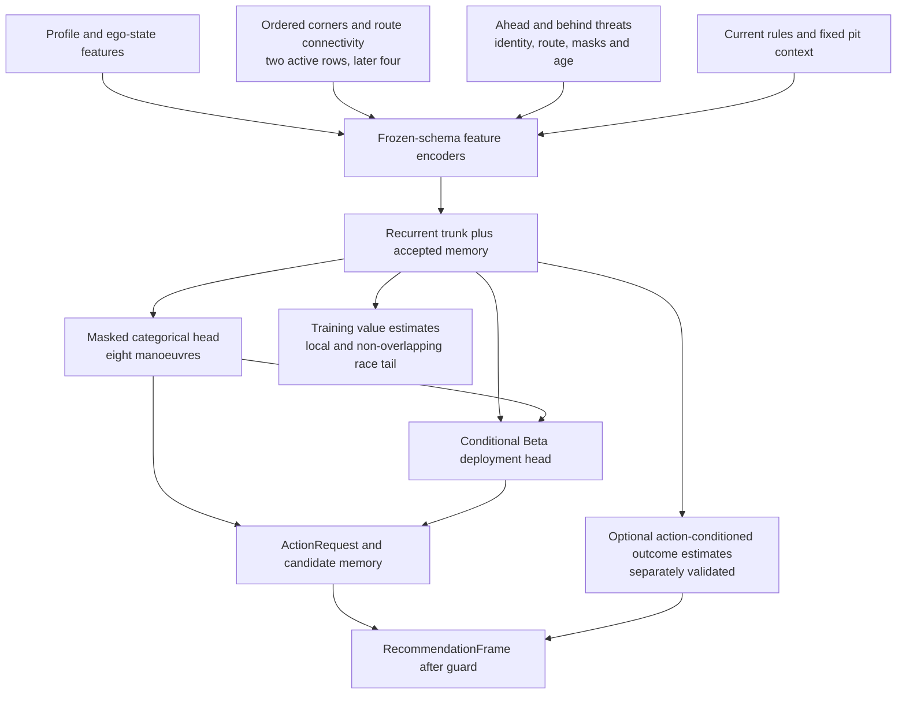
```mermaid
flowchart TB
    Profile["Profile and ego-state features"] --> Embedding["Frozen-schema feature encoders"]
    Corners["Ordered corners and route connectivity<br/>two active rows, later four"] --> Embedding
    Traffic["Ahead and behind threats<br/>identity, route, masks and age"] --> Embedding
    Rules["Current rules and fixed pit context"] --> Embedding
    Embedding --> GRU["Recurrent trunk plus accepted memory"]
    GRU --> Move["Masked categorical head<br/>eight manoeuvres"]
    GRU --> Power["Conditional Beta deployment head"]
    Move --> Power
    Move --> Issued["ActionRequest and candidate memory"]
    Power --> Issued
    GRU --> Critics["Training value estimates<br/>local and non-overlapping race tail"]
    GRU --> Estimates["Optional action-conditioned outcome estimates<br/>separately validated"]
    Issued --> Product["RecommendationFrame after guard"]
    Estimates --> Product
```

**Inherited prototype:** one 128-wide GRU trunk, masked categorical manoeuvre head and manoeuvre-conditioned Beta parameters. Model size is a starting proposal, not a promised fit within the runtime budget. Shared value and optional outcome/risk heads remain within Network 2; there is no third core racing network.

Training samples a manoeuvre and its conditional continuous fraction. The proposed deterministic demonstration selects the highest-scoring permitted manoeuvre and its conditional Beta mean, then applies the saved four-decimal transform. Stochastic evaluation is a separately named mode. Do not treat stochastic and deterministic policy results as the same experiment.

### 13.3 Issuance and delivery are not training samples

For the proposed distribution, the joint log probability is the categorical manoeuvre log probability plus the conditional deployment log probability. Preserve the original sampled continuous action and old joint log probability in the rollout record. Rounding and physical allocation form part of the environment transform and must be identical during training and execution.

Do not compute a likelihood of the clipped/delivered action as though it had been sampled directly from the original policy. Invalid/missing action masks are errors. Guard overrides, fallback, interrupted manoeuvres and their realised costs remain recorded.

The held deployment fraction refers to the current admissible positive motor DC allowance after demand/traction and source-boundary conversion. Its delivered kW changes with the physical state and rules. Positive propulsion can be zero during braking even if the preceding fraction was high. Regeneration is supplied by the declared recovery rule, not negative values from this positive-deployment head.

### 13.4 Training process

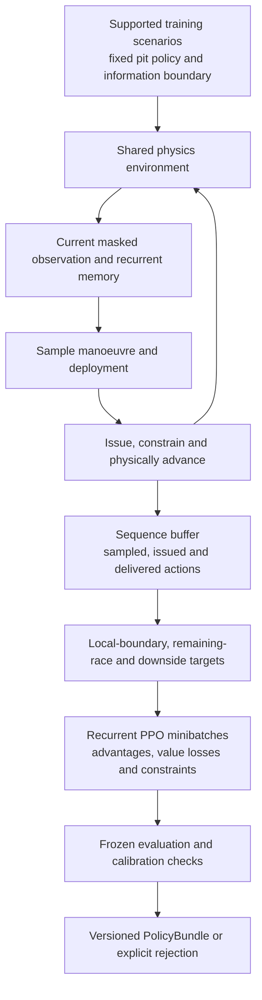
```mermaid
flowchart TB
    Scenario["Supported training scenarios<br/>fixed pit policy and information boundary"] --> Episode["Shared physics environment"]
    Episode --> Observation["Current masked observation and recurrent memory"]
    Observation --> Sample["Sample manoeuvre and deployment"]
    Sample --> Step["Issue, constrain and physically advance"]
    Step --> Record["Sequence buffer<br/>sampled, issued and delivered actions"]
    Step --> Episode
    Record --> Returns["Local-boundary, remaining-race and downside targets"]
    Returns --> Update["Recurrent PPO minibatches<br/>advantages, value losses and constraints"]
    Update --> Evaluate["Frozen evaluation and calibration checks"]
    Evaluate --> Promote["Versioned PolicyBundle or explicit rejection"]
```

Train first on single-car energy behaviour, then two-corner attacks/defence, then the reference field with fixed pits and longer episodes, and finally the four-corner mode. No DP/ECMS teacher labels, controller comparison or imitation requirement exists. A synthetic profile can use decoded physical features with a latent-valid mask; it must not be assigned an invented learned embedding.

Use recurrent sequence minibatches, declared burn-in, hidden-state carry and distinct terminated/truncated markers. A buffer fragment is not the end of the race. Bootstrap unresolved continuation at computational truncation according to the saved value-target definition; true scenario termination ends the objective. A configuration failure is not automatically a successful terminal outcome.

Freeze data/schema/model/risk/solver versions for each run. The actor learns only from observations available under its information policy, even though completed simulator episodes supply future outcomes as training targets. Actual future opponent rows cannot appear in its current features through the simulator wrapper.

---

## 14. Local-priority objective and risk-reward outputs

### 14.1 Two horizons, one physically continuous state

Let `t` be the decision anchor, `H` the designated exit of the second/fourth corner, and `T` the declared race termination. Define non-overlapping local and tail utilities. The current design requires:

$$
J_t=w_L\,\mathbb E[\widehat U_{t:H}]+w_R\,\mathbb E[\widehat U_{H:T}]
-\lambda\,\mathcal R_{t:T},\qquad w_L>w_R>0.
$$

This is the preserved objective **contract**, not a selected set of coefficients. Normalise utility scales on development evidence and freeze them before final evaluation. `w_L > w_R` is meaningful only after normalisation. No arbitrary 70/30 ratio is implied. [P1 §5]

State at H includes accumulated fuel, energy, tyres, speed, source response, route and encounters. A pass at the first corner that is lost at the second is not equivalent to a retained pass. A successful defence can be locally beneficial yet too costly for the remaining race. A fixed imminent opponent stop can reduce the value of attacking now without being a pit decision variable.

### 14.2 Required RewardSpec and implementation caveat

| Required definition | Why it must be explicit |
|---|---|
| Local boundary and corner identity | A moving/receding window must not quietly change target semantics within a stored example. |
| Local utility | Defines treatment of retained/lost order, time/progress, failed attack, defence and aborted transitions. |
| Tail utility | Measures consequences after H, including final performance under the same fixed strategy. |
| Normalisation | Makes position, seconds, energy and costs comparable without treating units as interchangeable. |
| Discounting | Names simulation-time versus step discounting and how variable H enters targets. |
| Downside definition | Defines the adverse tail/cost, allowed constraint and scenario-weight provenance. |
| Failure treatment | Separates physically infeasible, unsupported, late and genuinely poor-but-feasible outcomes. |
| Estimator target | Separates critic baselines from action-conditioned forecasts used in the product. |

**Unresolved implementation detail:** the sources select recurrent PPO and this local/tail objective family, but do not supply a final tested advantage estimator or reward-scale set. A proposed implementation trains separate local and tail heads using non-overlapping returns for each saved anchor, with a weighted actor-update surrogate and explicit downside cost. Its treatment of receding boundaries and truncation must be documented and tested; merely adding two critics is not proof that standard PPO exactly optimises the desired rolling objective.

A full revised architecture therefore exposes this as an implementation gate instead of inventing a validated training formula. The same applies to CVaR: it is a candidate downside measure, not a fixed tail level or a calibrated probability model.

### 14.3 What the viewer may claim

| Output | Origin and admissible wording |
|---|---|
| Current budget and binding limit | Deterministic current-state calculation under the named model/rules. |
| Requested fraction and route | Direct actor output, accepted or rejected by the guard. |
| Realised energy and time | Integrated result over an interval that has already completed. |
| Predicted local/tail outcome | A validated action-conditioned head or timestamped isolated rollout; label horizon, error/calibration status and assumptions. |
| Predicted pass/defence probability | Only if its probability target and calibration are demonstrated; otherwise a labelled scenario fraction or unavailable. |
| Counterfactual advantage | Only if a matched alternative was actually evaluated; a categorical score alone is not a time/energy benefit. |

State-only PPO value heads estimate continuation for learning. They do not automatically provide calibrated per-action passing probabilities. Product outcome heads require their own labels and evaluation. A local time-gain estimate cannot be fabricated from the actor's softmax.

Recommended reason codes include `REAR_TRACTION_LIMIT`, `ICE_RESPONSE_SHORTFALL`, `STORAGE_LIMIT`, `BRAKING_PREVIEW`, `PASSING_RESTRICTED`, `UNSUPPORTED_ROUTE`, `REAR_THREAT`, `FIXED_STOP_APPROACHING`, `STALE_INPUT` and `MODEL_SUPPORT_LIMIT`. They must reference actual observed/modelled inputs or constraint calculations. They describe the decision context, not a guaranteed causal explanation of network internals.

### 14.4 Optional diagnostic continuation

A bounded worker may evaluate an isolated continuation of the selected action with the same frozen policy/physics and prescribed pit sequence. It may also generate matched alternative-action evidence for analysis or auxiliary training. It cannot select the executed action, alter the stop strategy or mutate live state/memory. It uses forecasts for future non-pit movement/events, not the unreleased archive.

A diagnostic result carries snapshot, action, model, schedule and information-policy IDs, plus expiry/state-drift checks. If it arrives too late, retain it only in the historical report. The fast recommendation remains available without blocking for an entire race rollout. Remove this worker from the first executable slice if it prevents meeting resource limits; required forecast fields then remain explicitly unavailable until a supported estimator is supplied.

---

## 15. Technical news and chronological learning

Technical news remains a **required supporting workstream before the complete MVP demonstration**. It does not displace the energy/overtake product or the clean telemetry-only initial comparison. [P1 Phase 9]

The inherited extraction proposal uses HTTPX, Beautiful Soup/lxml, deterministic component/claim rules and a human-review queue. No hosted LLM or separately trained news model is selected. Extraction produces source spans and structured context, not numerical performance truth.

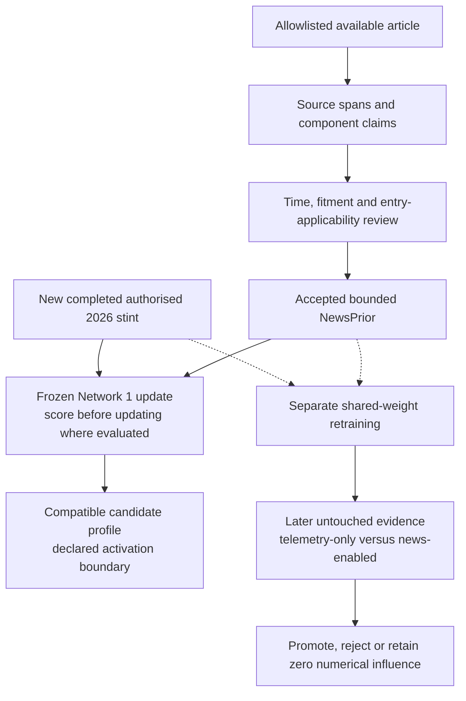
```mermaid
flowchart TB
    Article["Allowlisted available article"] --> Extract["Source spans and component claims"]
    Extract --> Review["Time, fitment and entry-applicability review"]
    Review --> Prior["Accepted bounded NewsPrior"]
    Stint["New completed authorised 2026 stint"] --> Inference["Frozen Network 1 update<br/>score before updating where evaluated"]
    Prior --> Inference
    Inference --> Candidate["Compatible candidate profile<br/>declared activation boundary"]
    Stint -.-> Retrain["Separate shared-weight retraining"]
    Prior -.-> Retrain
    Retrain --> Test["Later untouched evidence<br/>telemetry-only versus news-enabled"]
    Test --> Promotion["Promote, reject or retain zero numerical influence"]
```

Separate planned, tested, fitted, quoted/expected and uncertain claims. Team news may apply to only one entry. Publication does not force a profile reset; telemetry can contradict the claimed benefit. A later recap cannot become a prior for the event it describes. Unknown historical availability is excluded or explicitly labelled as retrospective.

Shared weights remain frozen during profile adaptation. After a separate retraining job, rebuild compatible latents with permitted history; do not use old latent vectors with an incompatible new decoder. Keep preseason-only, transferred, adapted, retrained and news-enabled results distinct.

Required pipeline delivery can honestly produce no supported predictive benefit. In that case the integration, context display and evaluation remain delivered, while numerical influence is zero for that model version. This is not permission to manufacture performance because news was required.

---

## 16. Python services, API and repository responsibilities

### 16.1 Stack

These are inherited or proposed implementation bindings, not a newly tested dependency lock. Python 3.11 and FastF1 3.8.3 remain reproducibility choices; other exact versions are resolved and frozen on the target machine after compatibility tests. [P1 §8; P5]

| Layer | Selected baseline | Requirement |
|---|---|---|
| Environment | Python 3.11, uv, pyproject.toml, uv.lock | Native macOS environment; new project code. |
| Acquisition | FastF1 3.8.3; HTTPX for permitted documents | Public interfaces; source hashes and per-stream outcomes. |
| Tables | pandas, NumPy, PyArrow; Parquet and JSON | Native timestamps, immutable parsed snapshots, versioned preparation. |
| Boundary contracts | Pydantic v2 strict models | Generated schemas, finite values, version/shape and unknown-field checks. |
| Numerical fitting | SciPy bounded least squares | Common physical model, robust loss and explicit assumptions. |
| Physics/networks | PyTorch and torchdiffeq RK4 prototype | One canonical dynamics implementation; CPU float64 physical reference, FP32 networks. |
| Solver cross-check | SciPy independent integration | Same equation/event conventions plus independent analytic fixtures. |
| RL | Gymnasium; project-owned recurrent hybrid PPO | Eight-action masks, continuous issuance, recurrent sequence buffers and explicit risk implementation. |
| Backend | FastAPI, Uvicorn | Localhost I/O/control plane; no physics in route handlers. |
| Processes | Python multiprocessing with spawn; bounded IPC | World owner, resident actor, API and optional diagnostic process. |
| News | HTTPX, Beautiful Soup/lxml; rule/span extraction and review | Outside the action path, source-attributed context only. |
| Tests/quality | pytest, Hypothesis, Ruff, mypy, psutil | Contracts, physics, leakage, reproducibility and sustained runtime checks. |
| Audit | JSONL events; Parquet diagnostics; JSON manifests | Requested/reachable/delivered separation and restorable snapshots. |

CPU is the reference execution path. Optional Apple MPS FP32 training is an experiment requiring parity and memory tests, not a runtime prerequisite or promised acceleration. No cloud, database server, distributed queue, Julia, MATLAB, CFD engine or added control solver is required by this architecture.

### 16.2 Processes and communication

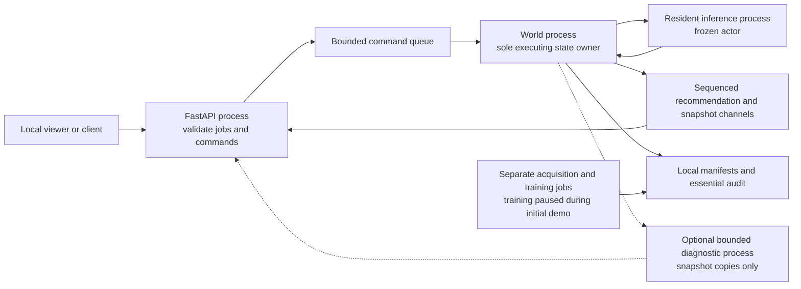
```mermaid
flowchart LR
    Client["Local viewer or client"] --> API["FastAPI process<br/>validate jobs and commands"]
    API --> Commands["Bounded command queue"]
    Commands --> World["World process<br/>sole executing state owner"]
    World --> Actor["Resident inference process<br/>frozen actor"]
    Actor --> World
    World --> Output["Sequenced recommendation and snapshot channels"]
    Output --> API
    World --> Store["Local manifests and essential audit"]
    World -.-> Diagnostic["Optional bounded diagnostic process<br/>snapshot copies only"]
    Diagnostic -.-> API
    Jobs["Separate acquisition and training jobs<br/>training paused during initial demo"] --> Store
```

Actor IPC is not HTTP. The inference worker cannot block the world worker's fallback while finishing a late call. No pit search process exists. Episode models are loaded once, not reloaded per request. Frame queues are coalesced to the newest snapshot; essential rule/control/audit events are not silently discarded. If essential logging or required state continuity fails, suspend/report the unsupported run instead of presenting an unauditable success.

Exact per-module time and memory budgets remain to measure on M4/16 GB. Limit concurrent diagnostics, use chunked evidence and bounded rollout buffers, and pause shared-weight training in the initial interactive demonstration. Numerical consistency roots inside physics are allowed physical calculations, not prohibited tactical optimisation.

### 16.3 API contracts

| Interface | Request/response meaning |
|---|---|
| `POST /jobs` | Start a named acquire, prepare, fit, train, evaluate or news task from registered configuration. |
| `GET /jobs/{id}` | Persistent state, progress, error and output artifact IDs. |
| `GET /profiles/{entry_id}` | Active/candidate profile metadata, support and evidence status. |
| `POST /runs` | Validate immutable scenario, fixed schedule and bundle IDs; initialise one extra ego. |
| `GET /runs/{id}` | Current run mode, state sequence, versions and status. |
| `POST /runs/{id}/control` | Pause/resume/stop through the world command queue. |
| `GET /runs/{id}/recommendation` | Latest valid or explicitly expired recommendation. |
| `WS /runs/{id}/stream` | Read-only sequenced advice, outcomes and availability/gap indicators. |
| `GET /runs/{id}/report` | Immutable final report, or explicit not-ready state. |

Use registered IDs, finite schema-validated values and explicit errors. Do not load executable uploads, untrusted pickles or arbitrary filesystem paths from requests. An idempotency key can deduplicate run/job creation. Reconnect returns the latest state plus the available sequence position; it does not rerun physics in the viewer.

### 16.4 Required Python module boundaries

All paths below are relative to the proposed new `src/trackshift/` package. They specify responsibilities, not supplied application code.

| Package / module family | Owns |
|---|---|
| `contracts/` | Evidence, profile, state, rules, pit, observation, recommendation and report schemas. |
| `sources/fastf1_loader.py`, `cache_audit.py` | Exact session resolution and eligible-cache provenance. |
| `data/export.py`, `quality.py` | Immutable exports, hashes and actual coverage. |
| `prepare/normalise.py`, `runs.py`, `windows.py` | Time/units, run/tyre continuity and masked windows. |
| `events/timeline.py`, `information/projector.py` | Availability gate, event reduction and future-pit-only projection. |
| `geometry/reference.py`, `templates.py`, `corners.py` | Coordinate mapping, route support, finite templates and corner sequence. |
| `targets/bundle.py` | Isolated `TargetBundle` records, kept separate from reconstruction inputs. |
| `reconstruction/baseline.py`, `losses.py` | Numerical effective-profile fitting and matched losses. |
| `representation/gru.py`, `transformer.py`, `decoder.py`, `update.py` | Network 1 candidates, physical contract and versioned latent updates. |
| `powertrain/maps.py`, `transients.py`, `transmission.py` | Source boundaries, response and gear coupling. |
| `physics/aero.py`, `axle_loads.py`, `grip.py`, `forces.py`, `integrate.py` | Canonical loads, tyre budgets, force derivative and event integration. |
| `driver/preview.py`, `controller.py`; `tyres/condition.py` | Fixed-rule state-dependent demands and selected shared tyre model. |
| `energy/allocator.py`, `recovery.py`, `ledgers.py`, `residual.py` | Signed allocation/charging, loss bookkeeping and bounded neural experiment. |
| `rules/resolve.py`, `state.py`, `crossings.py` | Applicable documents, constraints and crossing/event state. |
| `pits/extract.py`, `manifest.py`, `mapping.py`, `execute.py` | Fixed stop evidence, allowed foreknowledge and physical execution only. |
| `simulation/world.py`, `reference.py`, `encounters.py`, `classification.py` | Independent ego, reference prefix and continuous encounter state. |
| `simulation/gym_env.py` | Training wrapper around the same transition and information gate. |
| `policy/observation.py`, `network.py`, `distribution.py`, `buffer.py`, `ppo.py`, `risk.py` | Network 2, recurrent training and exact issued-action semantics. |
| `recommendations/frame.py`, `estimates.py`, `reasons.py` | Expiring product output, estimate origins and deterministic evidence-linked reasons. |
| `news/fetch.py`, `extract.py`, `review.py`, `prior.py` | Required timestamped technical context. |
| `learning/schedule.py`, `registry.py`, `promote.py` | Chronological training and compatible artifact admission. |
| `runtime/supervisor.py`, `worker.py`, `deadline.py`, `ipc.py` | Process lifecycle, atomic result acceptance and fallback. |
| `api/app.py`, `jobs.py`, `runs.py`, `recommendations.py`, `stream.py` | I/O plane and read-only result access. |
| `evaluation/` | Profile, numerical, allocation, local/tail, leakage, calibration and latency verification. |

Data roots separate source cache, immutable parsed tables, prepared windows, protected targets, fixed-pit manifests, model artifacts and run outputs. Neither an actor nor a news worker receives an unrestricted archive/target directory. Per-run outputs include scenario/information hashes, advice/delivery/event logs, periodic restorable snapshots and final reports.

---

## 17. Phase-by-phase implementation flows

### 17.1 Overall delivery dependencies

Phase numbers identify workstreams, not a rigid waterfall. The fixed-pit manifest is prepared before policy training; news enters after a clean telemetry comparison; a basic API skeleton may be built early. Model/fitting completion is not evidence of full-race readiness. [P1 §8]

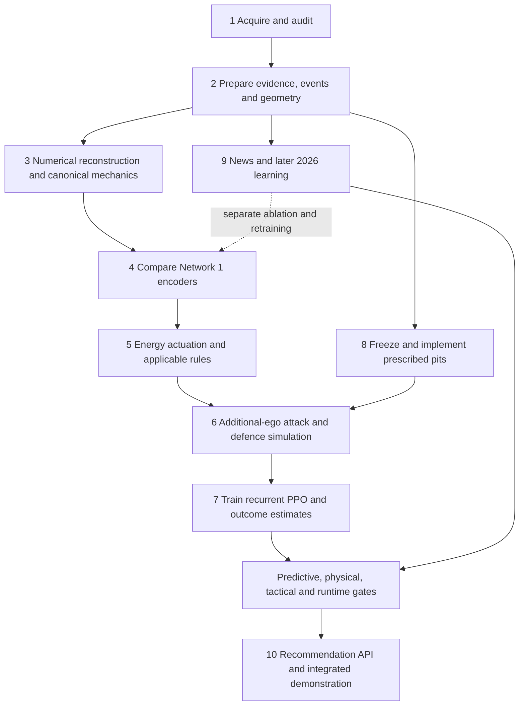
```mermaid
flowchart TB
    P1["1 Acquire and audit"] --> P2["2 Prepare evidence, events and geometry"]
    P2 --> P3["3 Numerical reconstruction and canonical mechanics"]
    P3 --> P4["4 Compare Network 1 encoders"]
    P4 --> P5["5 Energy actuation and applicable rules"]
    P2 --> P8["8 Freeze and implement prescribed pits"]
    P5 --> P6["6 Additional-ego attack and defence simulation"]
    P8 --> P6
    P6 --> P7["7 Train recurrent PPO and outcome estimates"]
    P2 --> P9["9 News and later 2026 learning"]
    P9 -.->|"separate ablation and retraining"| P4
    P7 --> Gate["Predictive, physical, tactical and runtime gates"]
    P9 --> Gate
    Gate --> P10["10 Recommendation API and integrated demonstration"]
```

### Phase 1 | Acquire and audit

**Purpose:** obtain traceable observations, not a trained car.

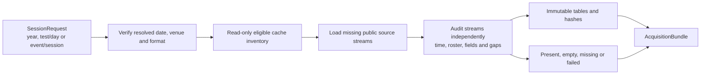
```mermaid
flowchart LR
    Request["SessionRequest<br/>year, test/day or event/session"] --> Identity["Verify resolved date, venue and format"]
    Identity --> Cache["Read-only eligible cache inventory"]
    Cache --> Load["Load missing public source streams"]
    Load --> Audit["Audit streams independently<br/>time, roster, fields and gaps"]
    Audit --> Export["Immutable tables and hashes"]
    Audit --> Missing["Present, empty, missing or failed"]
    Export --> Bundle["AcquisitionBundle"]
    Missing --> Bundle
```

| Contract | Requirement |
|---|---|
| Inputs | Exact session manifest, permitted evidence stage, source-cache path registered internally, parser pin. |
| Outputs | AcquisitionBundle, per-stream manifests and RaceControlCoverageReport. |
| Python requirements | `sources/`, `data/`; FastF1 public interfaces, pandas/PyArrow, JSON, hashing. |
| At inference | Registered adapter releases available records; no bulk acquisition job runs per tick. |
| Exit evidence | Reproducible exports; all requested streams accounted for; usable-entry coverage established or exclusion recorded. |

Reject wrong-season/non-testing sessions for the initial preseason stage. Preserve all available lap classes before eligibility filtering. A successful session load does not prove every stream is present.

### Phase 2 | Prepare evidence, geometry and isolated targets

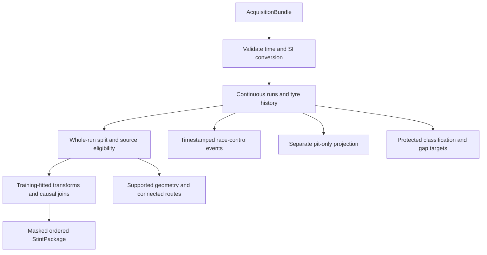
```mermaid
flowchart TB
    Bundle["AcquisitionBundle"] --> Time["Validate time and SI conversion"]
    Time --> Runs["Continuous runs and tyre history"]
    Runs --> Split["Whole-run split and source eligibility"]
    Split --> Transform["Training-fitted transforms and causal joins"]
    Transform --> Stints["Masked ordered StintPackage"]
    Split --> Track["Supported geometry and connected routes"]
    Runs --> Events["Timestamped race-control events"]
    Runs --> Pit["Separate pit-only projection"]
    Runs --> Targets["Protected classification and gap targets"]
```

| Contract | Requirement |
|---|---|
| Inputs | AcquisitionBundle, PreprocessingSpec, EvaluationSpec and permitted map sources. |
| Outputs | StintPackage, TrackProfile, event timeline, TargetBundle and isolated pit-source records. |
| Python requirements | `prepare/`, `geometry/reference.py`, `events/timeline.py`, `information/projector.py`. |
| At inference | Apply the frozen transforms to the admitted prefix; close a stint only after completion. |
| Exit evidence | No future/non-pit leakage, split crossing, fabricated tyre identity or unsupported geometry presented as measured. |

Map tyre labels only with event-specific support. Keep lap-time, race-gap and classification semantics separate. Geometry smoothing/derivative choices are developed before final scoring; algorithmic clamps do not become fitting evidence.

### Phase 3 | Numerical profile and canonical mechanics

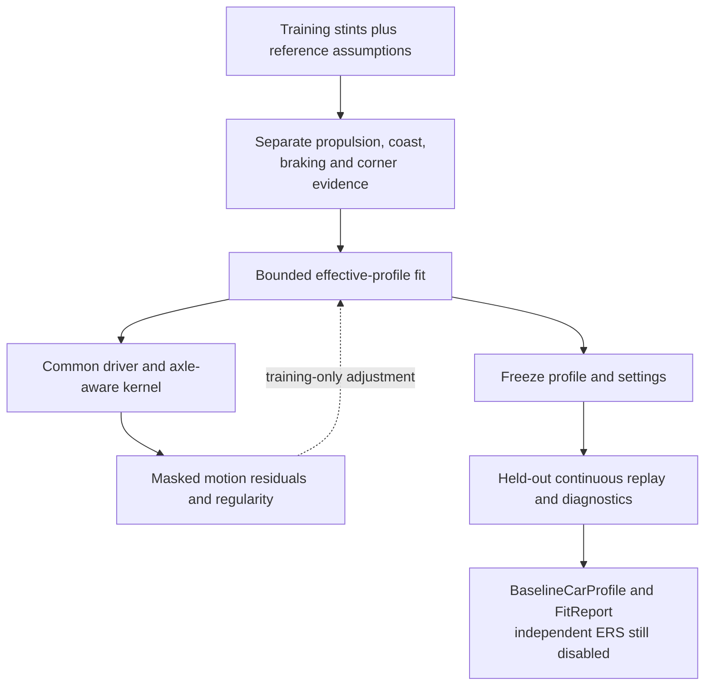
```mermaid
flowchart TB
    Train["Training stints plus reference assumptions"] --> Regimes["Separate propulsion, coast,<br/>braking and corner evidence"]
    Regimes --> Fit["Bounded effective-profile fit"]
    Fit --> Plant["Common driver and axle-aware kernel"]
    Plant --> Residual["Masked motion residuals and regularity"]
    Residual -.->|"training-only adjustment"| Fit
    Fit --> Frozen["Freeze profile and settings"]
    Frozen --> Check["Held-out continuous replay and diagnostics"]
    Check --> Output["BaselineCarProfile and FitReport<br/>independent ERS still disabled"]
```

| Contract | Requirement |
|---|---|
| Inputs | Eligible stints, geometry, reference mass, run-state and driver/tyre assumptions. |
| Outputs | Effective CarProfile, FitReport, held-out traces and unresolved-component flags. |
| Python requirements | SciPy bounded fitting; `reconstruction/`, `physics/`, `driver/`, `tyres/`. |
| At inference | Evaluate frozen maps and state; no numerical fitting on each actor call. |
| Exit evidence | Reproducible baseline, force/mass consistency and numerical convergence; braking/cornering support reported honestly. |

Completion may retain limitations. It does not imply all entries are usable or independent electrical actuation is valid. Synthetic controller development remains segregated from the real-profile claim.

### Phase 4 | Network 1 comparison and entry updates

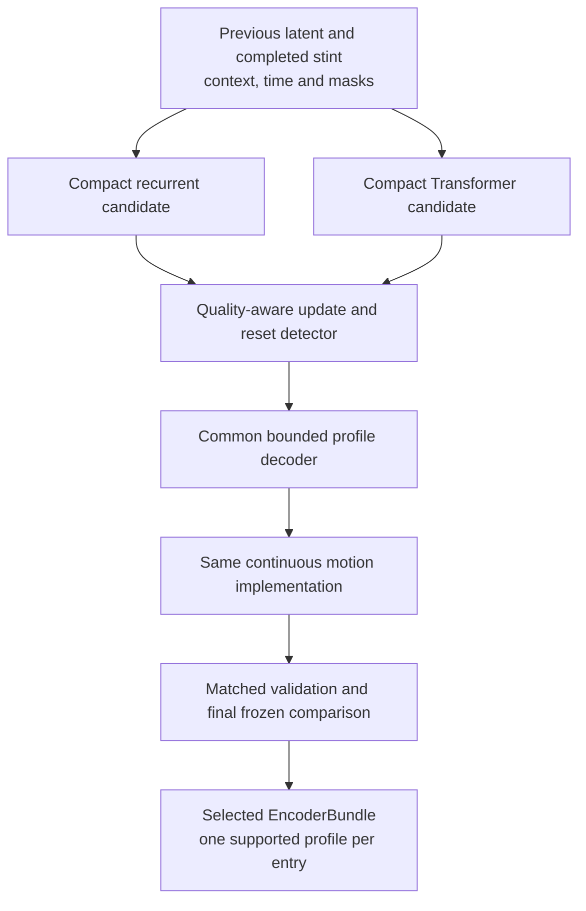
```mermaid
flowchart TB
    Input["Previous latent and completed stint<br/>context, time and masks"] --> GRU["Compact recurrent candidate"]
    Input --> TF["Compact Transformer candidate"]
    GRU --> Update["Quality-aware update and reset detector"]
    TF --> Update
    Update --> Decoder["Common bounded profile decoder"]
    Decoder --> Plant["Same continuous motion implementation"]
    Plant --> Select["Matched validation and final frozen comparison"]
    Select --> Output["Selected EncoderBundle<br/>one supported profile per entry"]
```

| Contract | Requirement |
|---|---|
| Inputs | Prior latent, StintPackage, dynamic/context inputs and baseline-compatible schema. |
| Outputs | EncoderBundle, candidate EntryProfile, update reason and validation evidence. |
| Python requirements | PyTorch `representation/` modules; common physics and target evaluator. |
| At inference | Selected frozen encoder/decoder runs on completed real evidence only. |
| Exit evidence | Neural improvement over equally informed baseline; frozen/sequential results; support, cutoff and ablation checks. |

Full-lap ordering/gap losses require a supported continuous path. If they are not yet enabled, they remain pending; short-window improvements do not silently satisfy later strategy admission.

### Phase 5 | Energy-ready powertrain and rules

```mermaid
flowchart TB
    Profile["Effective profile, stints and named assumptions"] --> Numerical["Numerical ICE-first source model"]
    Numerical --> Response["Algebraic versus finite response comparison"]
    Response --> Neural["Required bounded Neural ODE experiment<br/>one named residual mechanism"]
    Numerical --> Replay["Common speed, fuel and storage replay"]
    Neural --> Replay
    Rules["Historical rule snapshot and line maps"] --> Replay
    Replay --> Gates["Signed accounting, admissibility<br/>and inner-validation gates"]
    Gates --> Output["Compatible EnergyModelBundle<br/>or blocked readiness"]
```

| Contract | Requirement |
|---|---|
| Inputs | Profile, PowertrainMap/ChassisModel, source-response/loss assumptions, training/validation stints and rule sources. |
| Outputs | Selected energy/response/residual model, calibrated-or-assumed maps, readiness and diagnostic reports. |
| Python requirements | `powertrain/`, `energy/`, `rules/`; shared equations and event integration. |
| At inference | Frozen maps and retained residual evaluated within physical substeps. |
| Exit evidence | Required comparison executed; no double propulsion or free energy; supported consumers enforce their rule snapshot. |

A neural residual is not compulsory at deployment. Low-speed, charging and shift modes have explicit support/disable gates. Later rule editions never fill historical gaps silently.

### Phase 6 | Reference world, attack and defence

```mermaid
flowchart TB
    Init["Scenario, bundles and current reference prefix"] --> World["N references plus independent ego"]
    World --> Threat["Ahead and behind target resolution"]
    Threat --> Window["Connected two-corner routes<br/>later four; finite transitions"]
    Window --> Joint["Joint occupancy, wake and grip checks"]
    Joint --> Transition["Execute accepted action with shared physics"]
    Transition --> State["Pass, defence, abort and current classification"]
    State --> World
    Joint -->|"no supported continuation"| Failure["Explicit unsupported interaction"]
```

| Contract | Requirement |
|---|---|
| Inputs | RaceScenario, current ReferenceFrame, TrackProfile, selected bundles, rules and fixed pit manifest. |
| Outputs | Restorable SimulationSnapshot, encounter status and realised DeliveryRecord. |
| Python requirements | `simulation/`, `geometry/templates.py`, `physics/wake.py`, event reducers. |
| At inference | Continuously preserve ego response, battery, tyres and finite route state. |
| Exit evidence | N+1 identity isolation, no opponent reset/hidden slowing, valid defence/abort and retained outcomes across corners. |

Retain the opponent's one-defence counter through the whole encounter. Reference pace limits what defence claims can be made; unsupported cases remain in coverage/error reports.

### Phase 7 | Policy learning and recommendation quality

```mermaid
flowchart TB
    Obs["Profile, power margins, traffic,<br/>corners, rules and fixed stops"] --> Actor["Recurrent hybrid PPO"]
    Actor --> Issued["Eight-way manoeuvre and continuous fraction"]
    Issued --> Env["Shared constrained environment"]
    Env --> Buffer["Recurrent fragments with sampled,<br/>issued and delivered actions"]
    Buffer --> Returns["Local, tail and downside targets"]
    Returns --> Train["Explicit recurrent PPO training surrogate"]
    Train --> Tests["Feasibility, tactical, calibration<br/>and horizon tests"]
    Tests --> Output["PolicyBundle and estimator support report"]
```

| Contract | Requirement |
|---|---|
| Inputs | Environment, FeatureSchema, ActionSchema, RewardSpec, information policy and episode design. |
| Outputs | Actor/critic weights, optional outcome-head weights, action transform and admission report. |
| Python requirements | `policy/`, `simulation/gym_env.py`, `recommendations/`; PyTorch and Gymnasium. |
| At inference | One frozen actor forward pass plus guard; no PPO update or pit/tactical search. |
| Exit evidence | Meaningful energy allocation, two-corner setup/defence, nonzero race consideration, valid calibration/abstention and expanded-schema checks. |

Do not add DP/ECMS as a benchmark or teacher. Use subsystem tests, matched physical interventions, model ablations, temporal evaluation and explicit recommendation-outcome tests. The numerical car reconstruction comparator remains separate and required.

### Phase 8 | Fixed pit manifest and execution

```mermaid
flowchart TB
    Rows["Archived pit and tyre records"] --> Pair["Pair visits and preserve uncertainty"]
    Pair --> Projection["Future-field allowlist projection"]
    Projection --> Hash["Freeze schedule before first recommendation"]
    Hash --> Context["Read-only policy context"]
    Hash --> Mapping["Reference clock and explicit ego mapping"]
    Mapping --> Reach["Current reachable pit event"]
    Reach --> Rule["Permission and schedule-conflict handling"]
    Rule --> Execute["Transit, service and merge<br/>record realised timing"]
```

| Contract | Requirement |
|---|---|
| Inputs | Reported pit times, supported tyre configuration, donor selection, pit geometry and duration assumptions. |
| Outputs | FixedPitSchedule, PitExecutionRecord, timing displacement and conflict record. |
| Python requirements | `pits/` and the information projector; no optimiser module. |
| At inference | Execute the prescribed stop; never compare or choose alternative stops. |
| Exit evidence | No future non-pit fields, incorrect visit pairing, doubled travel delay, unreachable-clock repair or state refill. |

Implement manifest preparation before integrated policy training. The phase number is organisational, not a reason to postpone the required input until after a policy learns the wrong pit semantics.

### Phase 9 | News and later 2026 adaptation

```mermaid
flowchart TB
    News["Available source-attributed article"] --> Review["Extract spans, verify fitment/time and review"]
    Review --> Prior["Bounded NewsPrior"]
    Evidence["Completed authorised real stint"] --> Update["Frozen encoder update after scoring"]
    Prior --> Update
    Update --> Version["Stage compatible candidate profile"]
    Evidence -.-> Train["Separately scheduled weight retraining"]
    Prior -.-> Train
    Train --> Later["Later holdout and matched news ablation"]
    Later --> Admit["Promote or retain zero numerical influence"]
```

| Contract | Requirement |
|---|---|
| Inputs | ArticleSnapshot, earlier permitted model/profile and completed chronological evidence. |
| Outputs | NewsPrior, profile version and ModelPromotion report. |
| Python requirements | `news/`, `learning/`, representation inference and evaluation. |
| At inference | New accepted context affects a permitted completed-stint update, not instant power. |
| Exit evidence | Required integration delivered, no time leakage, fair telemetry-only comparison and compatible latent rebuilds. |

One operational profile does not mean one unchanging profile forever. Adaptation and shared retraining remain distinct experiments. A negative news result is recorded, not converted into an assumed gain.

### Phase 10 | Recommendation API and integrated run

```mermaid
sequenceDiagram
    participant Client as Local client
    participant API as Python API
    participant World as World worker
    participant Infer as Resident actor
    participant Store as Artifact store
    Client->>API: Start registered scenario and fixed schedule
    API->>World: Validated request
    World->>Store: Load compatible pinned artifacts
    World->>Infer: Load policy and initialise inference context
    World-->>API: Ready or explicit startup failure
    loop Until pause, stop or declared termination
        World->>Infer: Current observation and deadline
        Infer-->>World: Tagged recommendation proposal
        World->>World: Guard, fallback and physical advancement
        World-->>API: Advice and linked realised outcome
        API-->>Client: Sequenced read-only stream
        World->>Store: Essential state, action and event audit
    end
    World->>Store: Final report and termination reason
```

| Contract | Requirement |
|---|---|
| Inputs | Registered artifact IDs, immutable scenario/fixed schedule, seed and run mode. |
| Outputs | Job/run records, RecommendationFrame, SimulationSnapshot, delivery/event audit and EvaluationReport. |
| Python requirements | FastAPI/Uvicorn, spawned world/actor processes, bounded IPC and read-only stream. |
| At inference | No fitting, downloading or shared-weight update; physics remains single-owned. |
| Exit evidence | End-to-end runtime, state isolation, fallback and all required predictive/physical/tactical gates demonstrated. |

---

## 18. Verification, release gates and unresolved settings

### 18.1 Separate evidence gates

| Gate | Required evidence | Does not establish |
|---|---|---|
| Source/data readiness | Reproducible coverage, provenance and usable support. | Trained profiles or complete source availability everywhere. |
| Profile prediction | Matched numerical/neural evaluation; frozen and sequential held-out forecasts. | Uniquely identified hidden physical parameters. |
| Full-lap fidelity | Continuous supported dynamics and entry-level ordering/signed-gap results. | Guaranteed real-race strategy accuracy. |
| Independent energy actuation | Correct source split contract, signed ledgers and all stage constraints. | Measured real battery or ICE truth. |
| Tactical quality | Setup, pass retention, defence, abort and fixed-pit local/tail tests. | Validated real-driver response probabilities. |
| News integration | Timestamp-safe pipeline and matched benefit/harm/insufficiency evidence. | Mandatory positive numeric influence. |
| Runtime | Sustained 200 ms cycle tests, memory and failure handling on the target Mac. | Hard-real-time certification or actual live-feed transport readiness. |

Physics readiness, energy readiness, profile validation, estimator calibration and runtime readiness are separate flags. The product may emit a conservative/unsupported status without fabricating precise risk-reward numbers.

### 18.2 Required regression and falsification tests

| ID | Test and required outcome |
|---|---|
| DATA-01 | Reject wrong initial season/session before loading; later-stage authorisation is explicit. |
| DATA-02 | A missing stream does not erase valid exports; verified empty differs from failed. |
| TIME-01 | Future non-pit records cannot change an earlier observation/recommendation. |
| TIME-02 | Discrete channels remain discrete; no interpolation across excluded boundaries. |
| PIT-01 | Only allowlisted future pit fields enter the decision path; whole future lap rows are rejected. |
| PIT-02 | Alter a permitted schedule field and record the changed schedule hash and possible recommendation. |
| PIT-03 | Source entry-to-exit duration is not double-charged with integrated transit. |
| PIT-04 | Unreachable exact-clock stops fail; lap-relative stops preserve timing displacement and independent motion. |
| PIT-05 | Current rule conflict is explicit; no hidden rescheduling or tyre optimisation. |
| PHY-01 | Added unsaturated wheel power gives `Δa=ΔP/(mv)`, not an inverse-cube acceleration law. |
| PHY-02 | Equal total wheel power from different source splits gives equal immediate drive force under matched conditions. |
| PHY-03 | Finite-response demand steps retain response state; zero actor assist does not receive automatic fill. |
| PHY-04 | ICE and motor share rear grip; cornering reduces longitudinal headroom. |
| PHY-05 | Regen and friction share their axle constraints; full storage does not remove all braking. |
| PHY-06 | Engine-driven charging consumes mechanical/fuel input and reduces net available drive. |
| PHY-07 | Fuel mass changes inertia without increasing fitted propulsion to cancel it. |
| PHY-08 | Actual route length/curvature changes motion; no decorative path or duplicated time penalty. |
| PHY-09 | Overspeed is not repaired by clipping lateral demand or jumping to corner speed. |
| PHY-10 | Low-speed and shifts use declared torque/coupling branches; no fictitious P/zero handling. |
| PHY-11 | Losses, DC/shaft/wheel powers, storage and throughput reconcile at their declared boundaries. |
| NUM-01 | Integration-step and geometry refinement are separate; analytic fixtures accompany solver parity. |
| NUM-02 | Storage, pit, shift, aero and rule crossings are handled inside ticks with frozen event precedence. |
| RULE-01 | VSC ending remains distinct; local clear removes only its matching restriction. |
| RULE-02 | Overtake entitlement does not override prohibited passing or create battery energy. |
| MODEL-01 | New decoder/state/action schema rejects old incompatible bundles. |
| MODEL-02 | Changing a future target cannot change an earlier latent; sequential targets are scored before update. |
| MODEL-03 | Neural improvement cannot come from extra evidence or a different integrator versus the numerical baseline. |
| WORLD-01 | Exactly N+1 identities; ego never overwrites donor state or becomes measured donor training evidence. |
| WORLD-02 | No hidden reference slowdown/snapback; impossible joint occupancy is reported unsupported. |
| TACTIC-01 | A first-corner follow can beat an immediate attack through a better second-corner outcome. |
| TACTIC-02 | Rear threats can cause a supported defence; no passing probability is inferred from policy score. |
| TACTIC-03 | Encounter memory and defence count survive corners/retries; cap exhaustion does not guarantee a pass. |
| OBJECTIVE-01 | Normalised local contribution dominates while tail remains nonzero; no duplicate overlapping utility. |
| OBJECTIVE-02 | Computational fragments do not terminate the race or erase remaining energy value. |
| OUTPUT-01 | Forecast/request fields are separate from later realised delivery, all linked to the same request. |
| NEWS-01 | Future/stale/misapplied articles cannot silently change earlier performance; negative ablations are retained. |
| RUNTIME-01 | Late response and candidate memory are discarded together; supported fallback has no new attack. |
| RUNTIME-02 | Deadline/memory tests include stream, logging, full physics and any diagnostic contention. |

These are requirements, not executed results. Tolerances and minimum sample/coverage criteria must be frozen on development evidence before final scoring. Model-conditional time gains are reported separately from real stopwatch discrepancies. Shared equations do not guarantee that model error cancels between different actions or routes.

### 18.3 Remaining settings that must not become silent defaults

| Configuration artifact | Must resolve before the relevant experiment |
|---|---|
| `preprocessing.json` | Gap/staleness limits, smoothing, window length, compound mappings, source availability convention and split policy. |
| `feature_schema.json` | All tensor axes, widths, units, masks, neighbour identity ordering and target resolution. |
| `physics.json` | Force/moment assumptions, engine/loss maps, response constants, gear/radius/CG, tyre/wake/rolling parameters and disabled modes. |
| `numerics.json` | Step sizes, root/closure tolerances, event precedence, consistency-solve convergence and failure treatment. |
| `rules_snapshot.json` | Exact applicable event/date/session documents, field units, maps and unsupported/approximate mode inventory. |
| `fixed_pits.json` | Recorded stops, supported configuration, future-field allowlist, ego mapping and conflict/occupancy treatment. |
| `scenario.json` | Exact reference roster, donor, ego start/end rule, initial state, encounter geometry and information mode. |
| `reward_spec.json` | Local/tail target definitions, normalisation, weights, discounting, downside metric and PPO surrogate/fragment treatment. |
| `model_manifest.json` | Selected encoder, latent/model sizes, residual location, action distribution and checkpoint compatibility. |
| `evaluation.json` | Forecast types, session/segment matching, metrics, grouped resampling, calibration and acceptance thresholds. |
| `runtime.json` | Inference subdeadline, bounded concurrency/queues, stale-plan/result treatment and fallback/suspension rules. |
| `news_sources.json` | Source permissions/allowlist, extractor/reviewer policy, timing and fitment gates, influence bounds. |

**Specific outstanding decisions:** the user-authorised fixed pit strategy still needs its ego mapping chosen explicitly; the local-dominant objective still needs a tested numerical RewardSpec; detailed powertrain/grip/response parameters remain sourced or assumed; actual target-session coverage and Mac runtime remain unmeasured. Those gaps do not reintroduce pit optimisation, DP/ECMS or additional action owners.

### 18.4 Implementation order that limits rework

First establish contracts, the source firewall and numerical fixtures. Acquire/audit the relevant data and fixed pit projection. Implement the smallest axle/energy/route kernel and numerical reconstruction baseline. Compare Network 1 candidates while preparing event rules and independent energy actuation. Build synthetic attack/defence fixtures and the reference-world wrapper; then train the versioned recurrent policy. Integrate news and later learning under separate gates. Finish with the user-facing recommendation stream and end-to-end runtime/coverage admission.

An API shell, synthetic control experiments and source-data work can proceed in parallel. None can bypass the gate for a real-entry performance claim. Build fidelity only when it changes a supported decision or detects a known failure, rather than expanding into a general-purpose full racing simulator.

---

## 19. Research and source register

### 19.1 Project material used for this consolidation

| ID | File / scope |
|---|---|
| **P1** | `TRACKSHIFT_ENERGY_OVERTAKE_BLUEPRINT_v04.md`: current product scope, fixed pits, local-priority objective, defence and Python phase structure. |
| **P2** | `TRACKSHIFT_PHYSICS_SPEC_v02.md`: explicit reduced mechanics, transient response, signed allocation, equations and verification boundaries. |
| **P3** | `TRACKSHIFT_PIT_AND_FLAG_CONTRACT_v01.md`: narrow future-pit exception, ego mapping proposals, source coverage and event handling. |
| **P4** | `TRACKSHIFT_PHYSICS_RESEARCH_REGISTER_v02.md`: primary-paper selection and reviewed scope. |
| **P5** | `TRACKSHIFT_VISION_TECHNICAL_BLUEPRINT_v02.md`: retained inference, schemas, stack and prototype sizes; older pit-search and six-action content is superseded. |

The originals are included unchanged in `source_documents/`, with a source-status README and hashes. Latest explicit user statements remain authoritative. The original master/supporting plans explain historical progression, not current authority for superseded choices.

### 19.2 Primary references retained and checked

These references support the named mechanism or interface only. The detailed TrackShift equations are the reduced modelling conventions from P2; neither paper coefficients nor performance claims are imported. No new comprehensive FIA audit or dependency lock was performed.

| ID | Source | Use in this architecture |
|---|---|---|
| **R1** | Neumann et al., *Low-level Online Control of the Formula 1 Power Unit with Feedforward Cylinder Deactivation*, arXiv:2303.00372v1 (2023). | Motivation for requested-versus-achievable source output and transmission-dependent response; not its older MGU-H or control method. |
| **R2** | van den Eshof et al., *A Sequential Convex Programming Approach to Free-trajectory Minimum-lap-time Optimization of Racing Cars*, arXiv:2511.13522v2. | Vehicle/axle and path modelling context; not convex optimisation or free-trajectory control. |
| **R3** | Fieni et al., *Game Theory in Formula 1: Multi-agent Physical and Strategical Interactions*, arXiv:2503.05421v2. | Position-dependent aero interaction structure; not a game solver or measured 2026 wake map. |
| **R4** | van den Eshof et al., *A Computationally Efficient and Human Implementable Minimum-lap-time Control Policy for Energy-limited Race Cars*, arXiv:2603.02339v1. | Time-distance/kinetic-energy context; not its control policy, costates or energy pricing. |
| **R5** | Rackauckas et al., *Universal Differential Equations for Scientific Machine Learning*, arXiv:2001.04385v4. | General mechanistic-plus-learned-component principle; abstract/version scope, not an adopted full-text implementation. |
| **O1** | NASA Glenn, *Drag Equation*. | Relative-flow drag relation; still-air power scaling follows by multiplying force by vehicle speed. |
| **F1** | FastF1 3.8.3 `_api.py`. | Stream map, status codes and optional message/pit fields. |
| **F2** | FastF1 3.8.3 `core.py`. | Public Session loading, status properties and lap/tyre handling. |

R1: `https://arxiv.org/html/2303.00372v1`  
R2: `https://arxiv.org/html/2511.13522v2`  
R3: `https://arxiv.org/html/2503.05421v2`  
R4: `https://arxiv.org/html/2603.02339v1`  
R5: `https://arxiv.org/abs/2001.04385v4`  
O1: `https://www1.grc.nasa.gov/beginners-guide-to-aeronautics/drag-equation/`  
F1: `https://raw.githubusercontent.com/theOehrly/Fast-F1/v3.8.3/fastf1/_api.py`  
F2: `https://raw.githubusercontent.com/theOehrly/Fast-F1/v3.8.3/fastf1/core.py`

The primary pages/pinned sources above were accessed for this consolidation. Accessing a page is not a new empirical experiment, full reproduction or blanket endorsement of every statement in it. No publisher figures, source code, trained weights or font files are repackaged.

### 19.3 Change summary from the scattered previous documents

This single architecture brings together current product scope, explicit inference ownership, detailed source/state/input/output contracts, the physical model, fixed pits, ego defence, local/tail learning, required news, Python implementation responsibilities and all ten phase flows. It removes contradictory active requirements rather than asking the implementer to reconcile old adaptive-pit and numerical-controller passages.

New explanatory proposals are visible: deterministic target mapping, separation of RecommendationFrame from realised DeliveryRecord, explicit RewardSpec gate for receding local/tail PPO targets, and module/config boundaries. No proposal is labelled a measured result. The original sources remain unchanged for traceability.

**The build target is one clear loop: current evidence plus the permitted fixed strategy → car-conditioned recommendation → physical/rule allocation → independent state evolution → evaluated local and remaining-race consequences.**
