# Power-Shift Training and Inference Summary

## What problem this system addresses

Power-Shift must decide when electrical energy is worth spending, when it should be recovered, and
whether the car should attack, defend or hold. Those decisions depend on the fitted car, current
traffic, remaining race horizon and finite battery state. The implementation makes those choices
auditable without pretending that provisional physics are already validated.

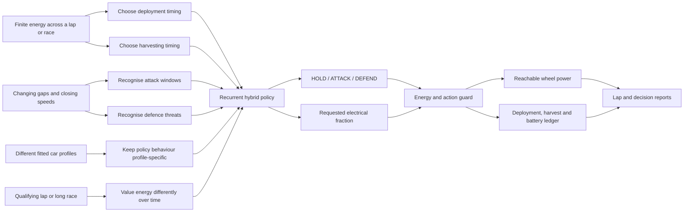

## Evidence and assumption boundary

The current policies are diagnostic. They use a diagnosed percentage assumption rather than the
earlier fixed-power example: electrical wheel power may add up to 20% of the fitted ICE wheel-power
capability. The usable store and fallback per-lap harvest cap are both 5 MJ. Motor and harvesting
efficiencies are 0.95 and 0.8. These assumptions condition the results; they are not measured battery
or power-unit identification.

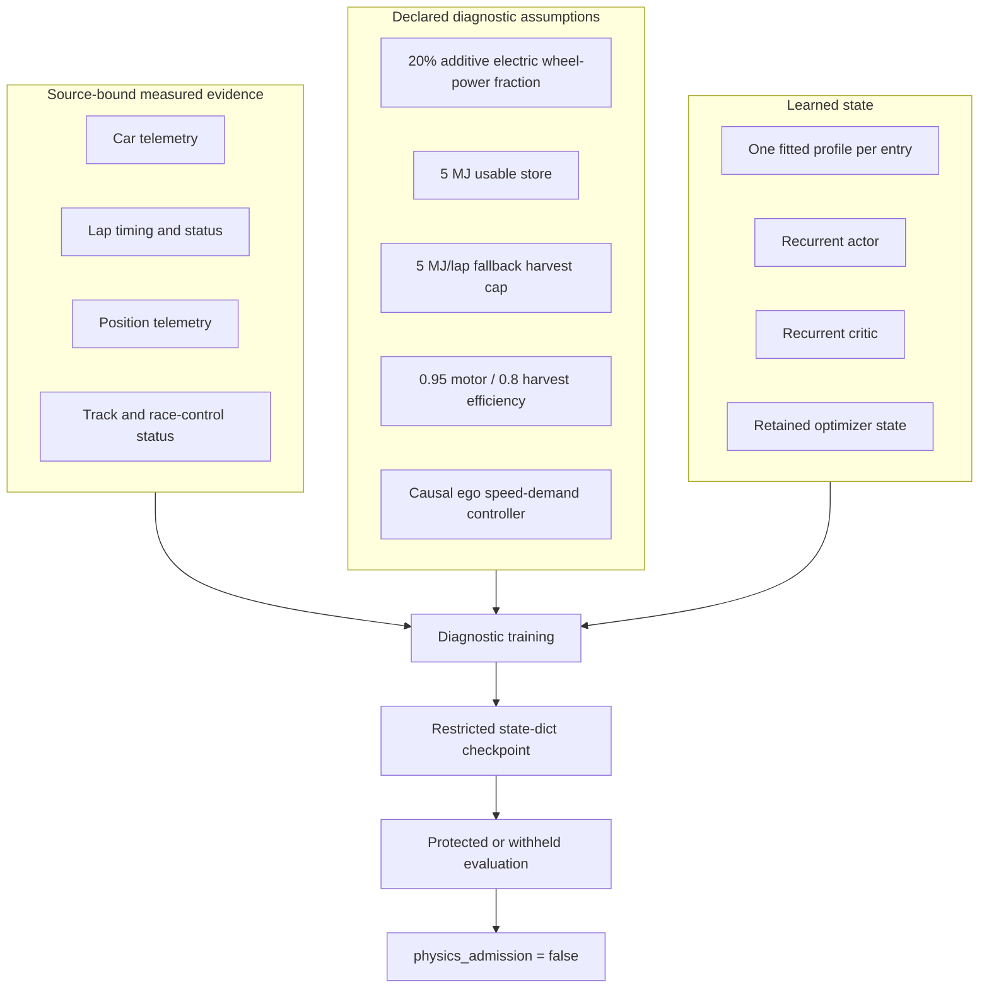

## How training works

Each promoted car profile owns its own policy and optimizer. Sessions run chronologically. Model and
optimizer weights cross session boundaries; recurrent memory and battery state reset at each new
session. Within a session, long-horizon recurrent and energy state continue across laps.

```mermaid
flowchart LR
    Japan["Japan profile checkpoint"] --> MiamiP["Miami practice"]
    MiamiP --> MiamiR["Miami race"]
    MiamiR --> CanadaP["Canada practice"]
    CanadaP --> CanadaR["Canada race"]
    CanadaR --> MonacoP["Monaco practice"]
    MonacoP --> MonacoR["Monaco race"]
    MonacoR --> BarcelonaP["Barcelona practice"]
    BarcelonaP --> BarcelonaR["Barcelona race"]
    BarcelonaR --> AustriaP["Austria practice"]
    AustriaP --> AustriaR["Austria race"]
    AustriaR --> BritainP["Britain practice"]
    BritainP --> BritainR["Britain race"]
    BritainR --> Final["Final per-profile checkpoints"]

    classDef practice fill:#1d4ed8,color:#fff,stroke:#1e3a8a
    classDef race fill:#b45309,color:#fff,stroke:#78350f
    class MiamiP,CanadaP,MonacoP,BarcelonaP,AustriaP,BritainP practice
    class MiamiR,CanadaR,MonacoR,BarcelonaR,AustriaR,BritainR race
```

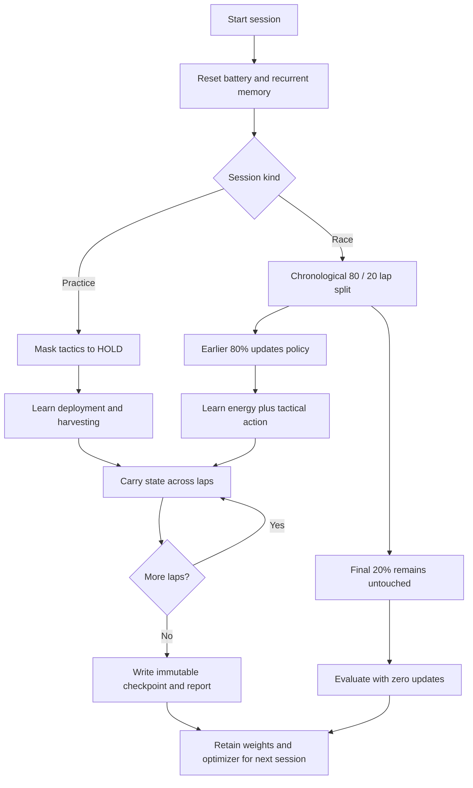

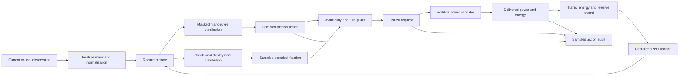

## Why the two clocks matter

Measured inputs arrive at 4 Hz. The decision engine runs at 5 Hz and explicitly marks when a decision
reuses the latest source frame. It does not interpolate a new measured observation.

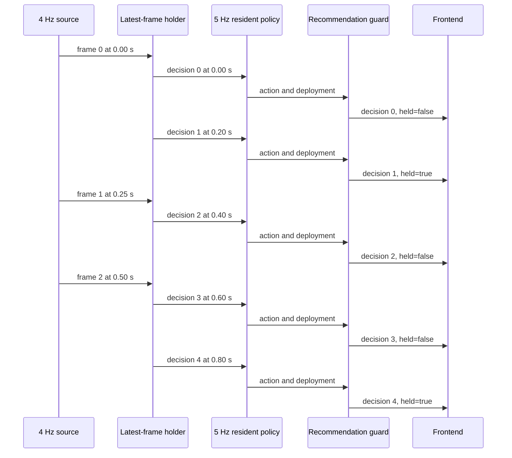

## How runtime inference works

The server accepts registered artifact identities only. Compatibility is checked before checkpoint
loading. Protected targets are referenced but not opened during inference. Recommendations are
sequenced, expiring and auditable. A separate scoring action may open the target after inference has
been frozen.

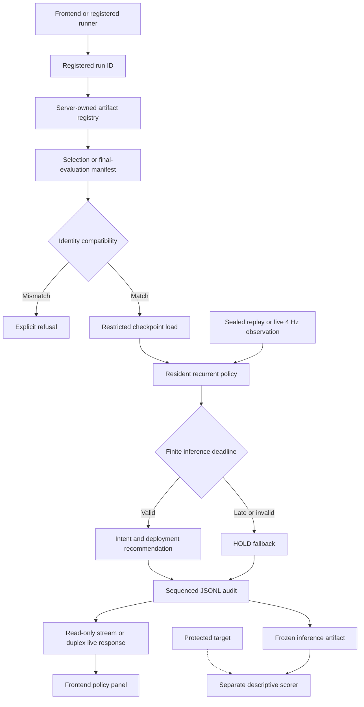

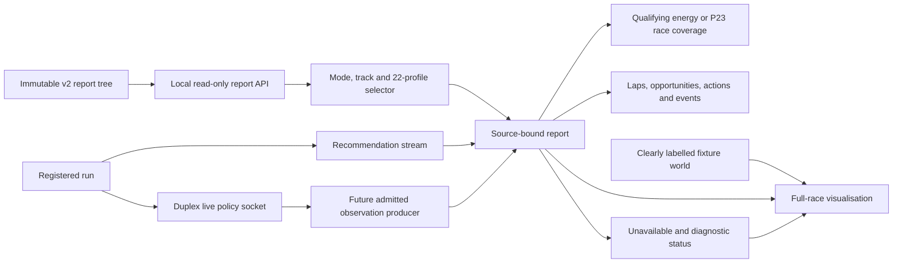

## How P23 isolates overtake intelligence

The evaluation adds one independently controlled ego at grid position 23. The original 22 cars use
their fitted ICE profiles and past-only source controls with no electric deployment or tactical
policy. The ego alone receives the learned energy and tactical policy. This isolates profile-policy
differences while keeping the reference field fixed.

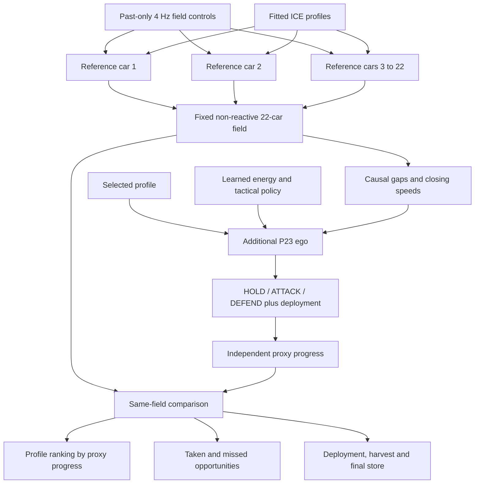

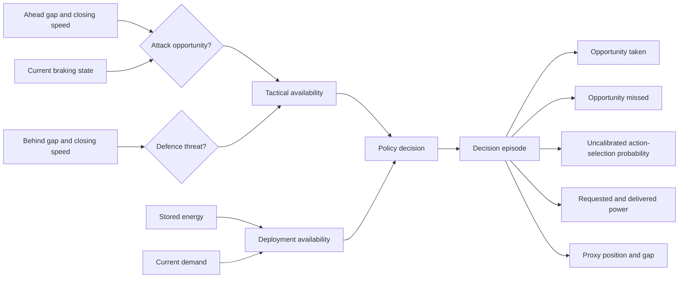

## Measured training and inference results

The six-weekend continuation completed 9,054 cumulative profile updates across 22 policies. Runtime
qualifying reports cover nine training replays plus protected Madring qualifying. Madring supplies
112 accurate laps and 45,426 source ticks for 19 profiles; three profile identities lack complete
accurate laps and produced no substituted data. Its median best idealised additive-power-ratio proxy
is 85.217 seconds. This is not a physical lap-time prediction.

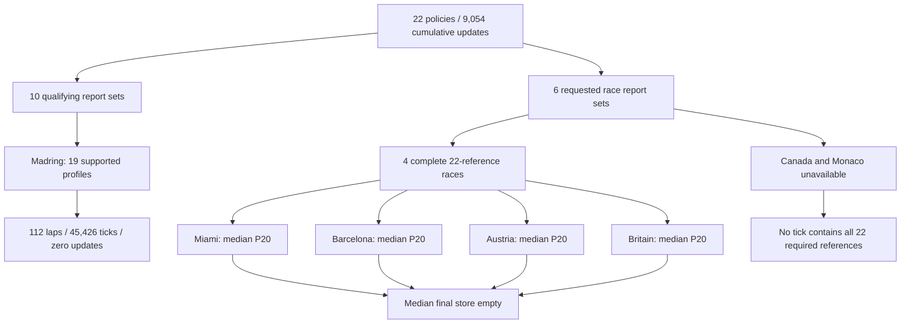

| Race | Attack taken | Defence taken | Mean deployment | Mean harvest | Major events |
|---|---:|---:|---:|---:|---:|
| Miami | 122 / 429 | 1 / 436 | 5.454 MJ | 0.567 MJ | 5 |
| Barcelona | 3 / 435 | 1 / 641 | 5.091 MJ | 0.113 MJ | 6 |
| Austria | 556 / 958 | 88 / 939 | 5.136 MJ | 0.170 MJ | 5 |
| Britain | 146 / 599 | 3 / 558 | 5.267 MJ | 0.333 MJ | 7 |

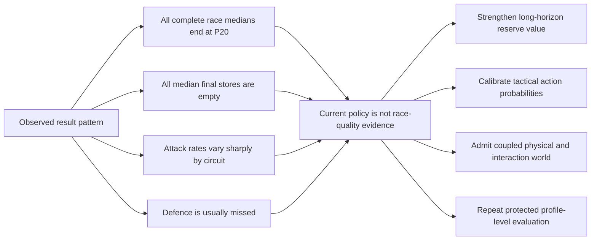

## What is innovative and what is not yet solved

The innovation is the combination of strict causal evidence, profile-specific recurrent learning,
hybrid tactical and continuous energy actions, separate sampled/issued/delivered records, explicit
4 Hz-to-5 Hz clock handling, and an N+1 controlled field comparison. This is an engineering and
evaluation innovation claim, not a claim that PPO, recurrent networks or energy ledgers are new.

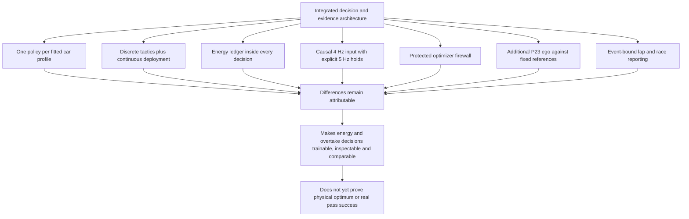

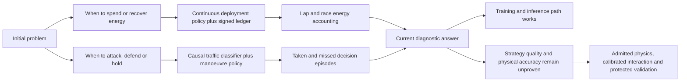

## Current boundary

The software now trains, checkpoints, evaluates, reports and serves frontend-readable diagnostic
results. It does not yet establish battery truth, calibrated pass probability, real-race rank fidelity
or a 200 ms production guarantee. Those claims remain blocked by physical energy admission, a reactive
interaction world and sustained target-hardware validation.

The report entry point is `data/policy_phase8/runtime_inference_reports_v2/index.json`. The backend
suite passes 421 tests with one performance warning. The frontend production build and touched-file
lint pass; the repository-wide frontend lint retains one unrelated pre-existing effect error.
Raw telemetry exports remain local under the repository data policy. Reports retain their hashes and
provenance, but reproducing training elsewhere requires reacquiring those source exports.
